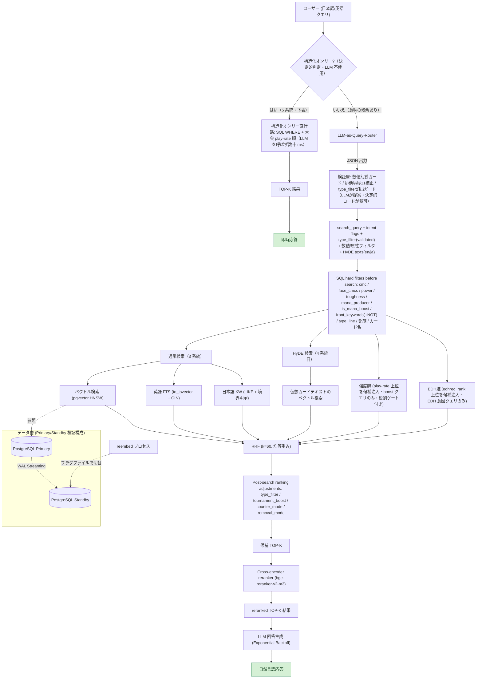
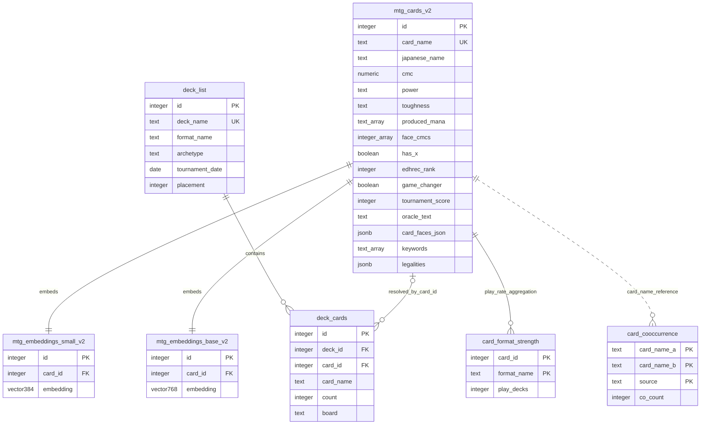

# ARCHITECTURE — 設計判断と技術詳細

本書は「**なぜその設計を選んだか**」を主題にした設計解説である。コードの逐条説明ではなく、検索品質・コスト・可用性の各判断が、どの観測（多くは実測値）から導かれたかを記録する。README を読んでいなくても単体で読めるように書いてある。

**扱う範囲**: 中心は RAG / ハイブリッド検索の設計（本書の分量の大半）。AWS 構成は「どうデプロイするか」ではなく「維持費と可用性の制約からどの構成を選んだか」という判断の記録として扱う。実装の全モジュール網羅・インフラ手順書ではない。

**関連文書**: 現在地の要約は [README](./README.md)、評価スコアの系譜とクエリ別内訳は [EVAL_SCORES.md](./EVAL_SCORES.md)、全テーブルの列・型・索引は [DATA_MODEL.md](./DATA_MODEL.md)、時系列の開発記録は [DEVLOG.md](./DEVLOG.md)。

---

## ハイブリッド経路の詳細フロー

直行路の判定はルーターの**前**に置かれ、該当クエリは LLM を一切呼ばず実測数十 ms で返る（LLM コストとレイテンシの両方をゼロ側に倒す）。ハードフィルタ（数値・属性条件）は検索前に SQL WHERE 句で適用し、ランキング調整（intent flags 等）は検索後に適用する。「意味検索とハード制約の分離」がこの構成の要点。役割ペナルティ（removal / counter）は手書きキーワード規則ではなく、oracle テキストから導出した構造化列（target_types / removal）による判定。reranker は「自分が判定できない上流信号を壊さない」原則で、boost クエリと構造化オンリー直行路には適用しない。

### 決定的ゲート 5 系統（構造化オンリー直行路の入口）

| ゲート | 検出 | SQL |
| --- | --- | --- |
| 生得キーワード 33 語（肯定・否定） | 辞書（最長キー優先・付与/除去の極性ガード） | `front_keywords @> ARRAY[...]` ／ 否定は `NOT (COALESCE(front_keywords,'{}') && ...)`（NULL＝キーワード無しカードこそ「持たない」の主役なので COALESCE が必須） |
| 日本語カードタイプ語 | クエリ末尾＝名詞句主要部の規則（「アーティファクト**を**破壊する」の対象語では発火しない） | `type_line LIKE '%X%'` |
| P/T 列間関係 | 「パワーとタフネスが同じ/大きい/小さい」の正規表現 3 態 | 数値ガード付き `power::int = toughness::int` 等（P/T は `*`/`X` を含む text 列のため） |
| 部族（サブタイプ）65 種 | 日英辞書（全体一致・末尾・「デッキ/統率者」文脈・最長キー優先: 不死鳥→Phoenix が鳥→Bird に勝つ） | `type_line ~ '\mCrab\M'`（単語境界・Tribal 呪文も部族デッキの検索対象のため Creature 限定にしない） |
| カード名部分一致 | 「カード名に X とつく/含む」「X という名前」の正規表現 | `japanese_name LIKE / card_name ILIKE`（ワイルドカードのエスケープ込み） |

多義的な部族語（「人間」「悪魔」= Demon/Devil・「猿」= Ape/Monkey 等）は自動追加せず、人間のレビューを通してから辞書へ昇格させる運用（「システムは質問者の語彙を勝手に訂正しない」を原則とする）。

### LLM 出力の検証層（プロバイダ非依存）

いずれも「LLM ルーターの実測故障」から生まれ、Gemini／ローカル 7B／Nova のどれにも同じ保護が掛かる:

1. **数値幻覚ガード**: クエリ本文に数字が無いのに LLM が数値制約を出したら全部捨てる。プロンプト規則で抑えようとすると別のクエリへ引っ越す「もぐら叩き」を実測したため、機械判定に置換。
2. **排他境界の ±1 補正**: 「9より小さく7より大きい」に対し、LLM が「9より小さい→max=8」の変換に成功しながら同一クエリ内の「7より大きい→min=7」で失敗する片側だけの揺れを実測。排他表現と値が一致するスロットだけをコードが ±1 する（冪等＝正しく変換済みなら触らない）。
3. **type_filter 幻出ガード**: クエリに型を意味する語が無いのに型を出したら捨てる（「カード名にナヒリとつくカード」に Creature が幻出し、プレインズウォーカーが全滅した事故から）。語がある上での誤付与は対象外とする保守的設計。

---

## データモデル

設計が伝わる主要テーブルと関係（評価ログ等は省略）。スキーマは実 DB から確認したもの。

設計判断:

- **1 対 1 属性は列に昇格し、テーブル分割しない**。`produced_mana (text[])` / `face_cmcs (int[])` / `has_x` / `edhrec_rank` / `game_changer` は `mtg_cards_v2` の列として持つ。汎用 key-value（EAV）は複合フィルタで self-JOIN が増えるため採らない。
- **embedding は別テーブルに分離**（`mtg_embeddings_small_v2` / `base_v2`、FK は CASCADE、HNSW 索引）。構造化列は embed_text に含めないため、列の追加・更新で **reembed（全件再ベクトル化）が不要**。
- **デッキとカードの多対多関係は `deck_cards` で正規化**。スクレイプ由来の名前ゆれ（`[]` 接頭辞・分割カードの旧区切り ` / `・両面カードの表面名）を正規化して `card_id` を解決し、紐付け率 51.8% → **99.96%**（残 119 行は Planechase 次元カード等、カード DB の対象外＝正当な未解決を NULL で表現）。
- **生データは JSONB/バルク、検索のホットパスで使う属性だけ列に昇格**（`legalities` / `card_faces_json` は JSONB で保持）。横長スカスカなテーブルを避ける方針。
- **リーガル / 非リーガルを分離**。Vintage 非リーガル（un 系・Alchemy・リバランス版）2,779 枚を `*_nonlegal` テーブルへ退避し、検索対象コア（30,982 枚）をクリーンに保つ。

全テーブルの列・型・索引、`card_id` 紐付け率、非リーガル退避テーブルの詳細は [DATA_MODEL.md](./DATA_MODEL.md) を参照。

---

## AWS 構成の判断と運用詳細

**構成決定の要旨**: クラウド展開の前に、AWS 公式料金表（Bulk Pricing API）から「一切使わず放置した場合の月額」を全構成案について算出した。旧構成案（RDS Proxy + VPC 内 Lambda + Interface エンドポイント）は放置時 ≈ $232/月だったが、2 つの罠——① RDS Proxy は auto-pause と非互換（かつ Serverless v2 へは最低 8 ACU の時間課金）②Interface 型 VPC エンドポイントは稼働と無関係に毎時課金——を特定し、**Lambda を VPC 外に置き RDS Data API で Aurora に入る構成（≈ $0.84/月）**に決定した。費目の内訳:

| 放置時の月額（東京・1 AZ・DB 2GB 想定） | A: Proxy + VPC 内 Lambda | B: 直結 + VPC 内 Lambda | **C: Data API 型（採用）** |
|---|---:|---:|---:|
| Aurora コンピュート | $54.75（Proxy が auto-pause を阻害・0.5 ACU 常時） | $0（auto-pause） | $0（auto-pause） |
| RDS Proxy（最低 8 ACU の課金床） | $146.00 | — | — |
| Interface 型 VPC エンドポイント ×3 | $30.66 | $30.66 | — |
| Aurora ストレージ 2GB | $0.24 | $0.24 | $0.24 |
| Secrets Manager ×1（Data API の認証に必須） | $0.40 | $0.40 | $0.40 |
| ECR（コンテナイメージ 2GB） | $0.20 | $0.20 | $0.20 |
| S3 / CloudFront / API GW / Lambda / CloudWatch | ≈$0.01 | ≈$0.01 | ≈$0.01 |
| **合計/月** | **≈$232** | **≈$31.5** | **≈$0.84** |

単価は AWS Bulk Pricing API（2026-07-10 版・東京）から SKU 直引き（Aurora SLv2 $0.15/ACU-h・ストレージ $0.12/GB-月・RDS Proxy $0.025/ACU-h・Interface EP $0.014/h）。Lambda / API Gateway / CloudFront はリクエストゼロなら $0、バックアップは DB サイズ 100% まで無料（いずれも公式確認）。以下はこの決定を支える運用レベルの詳細。

- **DB アクセス層**: SQL 実行を単一ドライバ層（`db.py`）に集約し、環境変数 `DB_BACKEND` で psycopg2（ローカル TCP）⇔ RDS Data API（HTTPS + IAM）を切替。psycopg2 側は実接続で検証済み（エラー後も接続が生き残る rollback 一元化を含む）。Data API 側は書式変換（`%s`→`:pN`・型タグ・行デコード）を純関数として単体テスト済みだが、**実 Aurora での検証は未実施**——デプロイ時の必須検証項目: 配列パラメータ／`::vector` キャスト／レスポンス 1 MiB 上限（SELECT に embedding 列を含めない実装ルール）／auto-pause 復帰時のリトライ。
- **接続プーリングの判断**: デモ流量では RDS Proxy は不要（Aurora Serverless v2 の min 0–0.5 ACU 時、max_connections はデフォルト 2,000。想定同時接続は数〜数十）。製品流量になった時点で Proxy を再検討するが、**Proxy を入れると auto-pause は失われる**（公式ドキュメント明記の非互換）——この前提ごと記録し、将来の再検討時に参照する。
- **Aurora の復帰特性**: 復帰レイテンシ目安 ~15 秒（24 時間超停止でより深い休止に入り 30 秒以上）。復帰直後はバッファ全冷えで初回 HNSW 検索が遅い（ローカル実測で 30 秒級・`pg_prewarm` で対策可能）。デモ運用は「見せる直前に 1 クエリで温める」か、必要な期間だけ min 0.5 ACU（約 $1.8/日）へ引き上げる。
- **メタデータ定期リフレッシュ（構想・現運用は手動）**: 新セット検知 → 即時更新 → 約 3 週間後の再更新（発売直後は edhrec_rank が不安定）。バルク取り込みは S3 経由（`aws_s3.table_import_from_s3`・S3 Gateway エンドポイントは公式明記で無料＝Interface 型と異なり時間課金なし）。更新 1 回あたりの変動費は「動いた分の ACU + 書き込み I/O」で数十円規模と試算。
- **ローカル運用**: API サーバは systemd user unit（`deploy/mtg-rag-api.service`）で VM 起動時に自動起動・`Restart=on-failure` の死活監視（プロセス kill 後 5 秒で自動復旧を実測）。user unit は system 側 `docker.service` へ `After=` を張れない（黙って無視される）ため、依存待ちは ExecStartPre の待機ループ（共有フォルダのマウント + DB ポート）で実装。

### 検討した代替案: S3 ロード型の軽量デモ（採用せず）

当初、DB の常時課金を避ける目的で「ベクトルとメタデータを S3 にエクスポートし、Lambda が読み込んで総当たり cosine + 簡易字句検索 + RRF を行う DB レス構成」を公開デモ用に検討した。3 万件規模であれば総当たりで十分高速であり、**規模に対して索引（HNSW）が過剰になるケースでは使わない判断もある**、という整理は今も有効である。

ただし採用は見送った。第一に、Data API 型の採用で「DB 常時課金」の問題自体が解消した（放置時 約 $0.84/月）。第二に、DB レス構成でも e5 モデルを積むコンテナ Lambda のコールドスタート（数秒〜十数秒）は残り、「待ちゼロのデモ」にはならない。第三に、pgvector / FTS / RRF の SQL ロジックを Python へ移植した第二のコードパスを維持するコストが見合わない。この判断は後に再浮上した際も、月 30 円差に対して検索ロジックの移植・再検証コストが見合わないとして維持された。

---

## 主な特徴

### 1. 4 系統ハイブリッド検索 + 標準 RRF

ベクトル検索（pgvector HNSW）、英語 FTS（`to_tsvector` + GIN）、日本語 LIKE 検索、HyDE 検索を並列実行し、RRF（k=60, 均等重み）で統合する。重みは経験則ではなくグリッドサーチの実測で決定し、後に腕別アブレーション（6 条件）で「合議の管轄」を確定した（後述のベンチマーク参照）。

### 2. LLM-as-Query-Router（3 回の設計試行を経た最終形）

LLM に JSON で `search_query` と意図フラグ（`tournament_boost` / `counter_mode` / `removal_mode` / `type_filter`）と HyDE テキストを 1 リクエストで抽出させる。`type_filter` はホワイトリスト（Creature / Instant / Sorcery / Enchantment / Artifact / Land / Planeswalker / Battle）で validation し、未知の値は警告ログを残して無視する。

さらにマナ総量・パワー・タフネス等の**数値条件**と、「マナを生み出すカードか」という**機能条件**（`mana_producer` フラグ）を抽出し、SQL のハードフィルタとして適用する（意味検索と構造化フィルタの両輪）。LLM 出力はルーター側で検証した上で、検索器側でも再検証する二重防御とし、SQL に LLM 出力を直接埋め込まない。

cmc 条件は単純なカラム比較ではなく、各面の「実際に撃てるマナ総量」の集合（`face_cmcs` 配列）に対する判定としている。分割カードは合計ではなく面ごとに、X 呪文は X=0 の種火コストで評価され、**ルール上の `mana_value` と実際に支払う castable cost が一致しないケース**を正しく扱う。

### 3. 手書きドメインルールから Scryfall 構造化データへ

「除去」「カウンター呪文」などの機能概念は当初、手書きの定義ファイルで扱っていたが、ルールが増えるほど保守が重くなりスケールしないと判断し、Scryfall の構造化フィールド＋ oracle テキストから自前導出した構造化列（`target_types` / `removal`＝除去メカ種別と恒久性）へ全面的に置き換えた（2026-07 完了・手書き定義ファイルは廃止）。

| フィールド | 内容 | 現在の利用状況 |
| --- | --- | --- |
| `produced_mana` | 生み出すマナの色の配列 | **検索フィルタで使用中**（「マナクリーチャー」系は type_filter と組み合わせ）。生成色による絞り込みは未実装 |
| `edhrec_rank` | EDHREC 由来の人気度ランク | **EDH 意図クエリの候補腕と直行路の並び順で使用中**（EDH 向け評価はトラック立ち上げ中・GT は本線と別立て） |
| `game_changer` | 公式 Commander ブラケットの高影響カードフラグ | **EDH ブラケット 1–2 指定クエリのハードゲートで使用中** |

Scryfall のフィールドだけで足りないときは、**定義を詰めて自前の構造化列を導出する**。例えば「マナクリーチャー」と「マナフィルター」は `produced_mana` が同一で区別できないため、「産出マナ − 支払いマナ（土地は −1）> 0」という net-mana 定義で `is_mana_boost` を事前計算した（「1 マナのマナクリーチャー」NDCG@10 0.42 → 0.66）。曖昧な機能概念をルールでその場凌ぎせず、判定基準を言語化して列に落とす。

### 4. HyDE（Hypothetical Document Embeddings)

抽象クエリに対し、LLM に「理想的なカードテキスト」を生成させ、そのベクトルで検索する。英語 HyDE と日本語 HyDE の 2 文を生成し、HyDE 系の総重みが増えないよう英語/日本語を同じ HyDE 枠の中で融合する。生成失敗時は通常検索に fallback。

### 5. 日英バイリンガル対応

embed_text を日英混合で構築し `multilingual-e5` で embedding。「対抗呪文」と "counter spell" の両方で同一カードがヒットする。公式訳が存在しないカードは英語を日本語フィールドに混ぜず NULL とする（「埋め残し」と「埋めるものが無い」を区別する）。

### 6. reembed 中の読み取り継続（Primary/Standby 検証構成）

reembed（TRUNCATE → 全件再構築）の間も検索を止めないため、Docker 上で PostgreSQL Primary/Standby を構築し、フラグファイルで Standby に切り替える機構を実装。**Read Replica を Zero-downtime Data Refresh に応用したパターンの検証**であり、商用 HA ではない。

### 7. Web UI + API サーバ + 観測基盤

FastAPI の API サーバ（`api_server.py`）と静的 1 ファイル UI（`static/index.html`・ビルド工程ゼロ＝S3 静的配信前提の構成をローカルでそのまま検証）。UI は検索経路（辞書直行/ルーター）とレイテンシを表示する。全クエリは `query_log` テーブル（経路・ルーター解析結果・返答カード・レイテンシ）に記録され、辞書拡張の候補抽出（human-in-the-loop の語彙学習）と直行路率の実測に使う。

---

## 開発アプローチ（AI 支援開発と技術判断）

本プロジェクトは AI コーディング支援を積極的に使って構築している。著者の役割は打鍵量ではなく、**アーキテクチャ選定・評価設計・AI 出力のレビューと意思決定**に置いている。判断例:

- **可用性設計**: reembed 中のダウンタイムという課題から逆算し、Streaming Replication を「読み取り継続のための仕組み」として設計した。
- **Query Rewriting の 3 回試行**: 英語化 → フラグのみ → JSON 出力と作り直し、「変換の粒度を誤ると検索系全体の設計と矛盾する」ことを実体験から得た。
- **手書きルールの放棄**: 機能概念を手書き定義で増やし続ける方式の限界を認め、外部の構造化データ（Scryfall）へ寄せる方針転換を行った。
- **ベクトル検索の限界の確認**: HNSW パラメータを実機ベンチマークし、少数評価セットではベクトル単独の recall が頭打ちになるケースを測定 → ハイブリッド検索が必要な理由を数値で説明できるようにした。
- **経験則の棄却**: Weighted RRF をグリッドサーチで検証し、自分の仮説（英語 FTS の重みを下げる）が実測で支持されないと分かった時点で標準 RRF に戻した。後の腕別アブレーションでも均等重みが局所最適と追認された。
- **骨格への疑いも数字で決着**: 「RRF という仕組み自体が欠陥ではないか」という設計骨格への疑いを、判定基準を事前固定した腕別アブレーション（6 条件・決定的評価）で検証——「合議は曖昧な意味の層で +0.088 を稼ぐ現役・答えが一意に決まる層はゲートで管轄から外す」という管轄の地図に着地した。フレームへの問いは実装の流れの外（人間）から出て、検証は評価装置が担う分業。
- **AI への委任と検収**: ローカル 7B ルーターのプロンプト調整は AI に委ね、著者は失敗様式の特定（抽象クエリへの言い換え返答・few-shot 数値リークの事前予測）と採否判定を担った。
- **代替案の棄却**: S3 ロード型デモ構成を、第二コードパスの維持コストが大きいと判断して採用を見送った（前述）。

---

## 主な設計判断

### RRF の重みはグリッドサーチで決定し、腕別アブレーションで管轄を確定

当初は Weighted RRF（ベクトル 2.0 / 英語 FTS 1.5 / 日本語 FTS 2.0）を採用していたが、定量根拠がなかったため `hybrid_benchmark.py` で 10 パターンを実機検証し、均等重みの標準 RRF を採用。後に現行の厳密な評価系（ルーター経路・決定的・GT 1,114 ペア）で腕別アブレーション 6 条件を実施し、均等重みが試した全方向への変更で悪化する局所最適であることを追認した（数表はベンチマーク節）。

### ハイブリッド検索を選んだ理由

ベクトル検索単体では多義語や完全一致クエリの精度が不安定だった。HNSW パラメータを `ef_search` 10〜500 で実機ベンチマークしたところ、**少数の手動評価セットではベクトル検索単体の recall が約 7.3% で頭打ち**となり、探索パラメータを上げても改善しなかった。原因の断定は統制実験をしていないため避けるが、少なくとも HNSW のチューニングだけでは伸びないことが分かり、語彙検索との組み合わせの必要性を裏付けた。

### HNSW を初期選択にした理由 / パラメータ

約 3 万件規模では HNSW のメモリコストが許容範囲。`m=16`（`m=32` はサイズ約 2 倍・速度 1.5 倍の割に `ef_search>=20` では recall 改善がほぼ無い）、`ef_search=20` を採用。IVFFlat との比較は未実施（この規模では HNSW で足りているため優先度を下げている）。

### HNSW + 選択的フィルタの取りこぼし対策

構造化フィルタの導入時、HNSW 近似検索に選択的な WHERE 句を組み合わせると候補の取りこぼしが発生することを実測した。pgvector 0.8 の `hnsw.iterative_scan = relaxed_order` で、`ef_search` を上げずに解消。近似インデックスとハードフィルタの組み合わせはベクトル DB 運用の実務的な落とし穴であり、パラメータで殴る前に機能で解決できるかを確認する例となった。

### SMALL（384d）を主採用にした理由（暫定比較）

| 指標 | SMALL (384d) | BASE (768d) |
| --- | --- | --- |
| 平均 KW 一致率 | 68.6% | 67.1% |
| 平均 KG 率 | 12.9% | 14.3% |
| 平均実行時間 | 719ms | 1074ms |

精度差は小さく速度差は約 1.5 倍のため SMALL を採用。LARGE（1024d）は初期検証で SMALL を上回らなかったため見送り（この暫定比較は独自指標での測定であり、標準指標での再測定は未実施）。

### ルーター LLM の選定（単一の「正解モデル」ではなく用途別の 3 役）

LLM 呼び出し部はプロバイダ非依存に分離済みで（検証層は共通）、ルーターは用途で使い分ける:

- **評価** = Gemini 2.5 Flash-Lite（無料枠）。ルーター出力を静的キャッシュに固定し、評価を決定的かつ API 消費ゼロで再現する（プロンプト変更時のみ再生成）。
- **開発・ローカル稼働** = ローカル 7B（Ollama・$0・次項）。環境変数 `ROUTER_BACKEND` で切替でき、API サーバのルーターとして稼働中。
- **AWS 本番用** = Bedrock 上の小型モデル（Amazon Nova Micro）。素のままでは意図フラグの過剰発火が残ったが、7B で確立した調整手法（用語辞書・正負対例の few-shot・数値規則）の移植により意図フラグ全系統 30/30・temp=0 反復の完全一致・約 $0.00013/クエリまで検証済み（本番への配線はデプロイ時）。上位モデルへの課金でなくプロンプト設計で仕様を通す方針は 7B と同じ。

回答生成（解説文）用の LLM は現在 Gemini を使用しており、最終選定は未確定。

### ローカル 7B ルーターのプロンプト設計（スキーマを削らず本番仕様のまま通す）

ルーターの外部 API 依存（クォータ・コスト・可用性）を外す選択肢として、ローカル 7B モデル（Ollama / qwen2.5:7b-instruct 量子化版・RTX 2060 クラスの民生 GPU）を、本番ルーターと同一条件（30 クエリ・Gemini の出力を参照）で検証した。プロンプトの設計・調整の実作業は AI が担い、著者は同一条件の比較設計と、出力レビューによる失敗様式の特定・採否判定を担った。

- **素のまま**: JSON 構文は 30/30 で通るが、`tournament_boost` の過剰発火（一致 19/30）と MTG 用語の誤訳（接死 → "dies"）が発生。
- **調整後**: MTG 用語辞書＋全キー必須の完全 few-shot ＋「抽象クエリでの言い換え禁止」規則を追加し、**意図フラグ 4 系統で 30/30**・誤訳も解消。
- 小型モデル特有の失敗も観測: **few-shot の例に入れた数値が無関係なクエリへ漏れ出す**（数値はハードフィルタになるため実害あり）→ 例から数値を外し「数値は明示されない限り null」の規則で解消。この失敗は著者が調整前に予測していたものが、そのまま現れた形。

結論: 「小型モデルの限界」に見えたものの大半はプロンプト設計の問題で、**仕様を削って合わせるのではなく、プロンプトを設計し直すことで本番スキーマのまま通せた**。temp=0 の貪欲デコードで同一クエリ 50 連打の出力完全一致＝構造化抽出の決定性も実測。「Gemini との一致率」はプロキシ指標であり、これ以上参照へ寄せる調整は参照側の癖への過適合（Goodhart の法則）になるため意図的に打ち止め。真の判定は eval（NDCG）で行う。この結果を受けて **GT に触らない開発用途は 7B、評価キャッシュは Gemini 続投**という役割分担にした（7B は API サーバのルーターとしても `ROUTER_BACKEND=ollama` で稼働中・$0）。

---

## パフォーマンスとベンチマーク

> 以下の HNSW / RRF グリッドサーチ / GIN は**開発初期**の少数クエリ（5〜7 件）＋独自指標（KW 率 / KG 率）による**暫定値**。標準指標による現行の評価は「評価フレームワーク」と [EVAL_SCORES.md](./EVAL_SCORES.md) を参照。

### HNSW パラメータ（m=16, 評価 5 クエリ, top_k=10）

| ef_search | recall | avg(ms) | p95(ms) |
| --- | --- | --- | --- |
| 10 | 3.3% | 1.9 | 3.6 |
| 20 | 7.3% | 1.9 | 3.3 |
| 40 | 7.3% | 2.5 | 3.9 |
| 100 | 7.3% | 3.1 | 4.7 |
| 500 | 7.3% | 7.6 | 10.2 |

`ef_search>=20` で recall が頭打ち（評価セットが小さい点に留意）。

### RRF 重みグリッドサーチ（SMALL, 抜粋・暫定指標）

| 重み (vec/en/ja) | KW 率 | KG 率 |
| --- | --- | --- |
| (2.0, 1.5, 2.0) | 60.0% | 15.7% |
| (1.0, 1.0, 1.0) | 61.4% | 17.1% |
| (1.0, 2.0, 1.0) | 64.3% | 15.7% |
| (1.0, 4.0, 1.0) | 58.6% | 11.4% |

### RRF 腕別アブレーション（NDCG@10・ルーター経路・決定的・現行 GT）

「合議（RRF）は本当に必要か」という骨格への問いを、腕の寄与を消す 6 条件で実測した:

| 条件 | 重み (vec/en/ja) | NDCG@10 | Δ | 未ラベル混入 |
| --- | --- | ---: | ---: | ---: |
| **現行（均等）** | 1 / 1 / 1 | **0.811** | — | 0.0% |
| ベクトル単腕 | 1 / 0 / 0 | 0.723 | −0.088 | 14.3% |
| 日本語 FTS 抜き | 1 / 1 / 0 | 0.776 | −0.035 | 6.3% |
| 英語 FTS 抜き | 1 / 0 / 1 | 0.763 | −0.048 | 8.0% |
| ベクトル重み 2 倍 | 2 / 1 / 1 | 0.750 | −0.061 | 8.7% |
| FTS 半減 | 1 / 0.5 / 0.5 | 0.775 | −0.036 | 6.7% |

- **FTS 2 腕の寄与はほぼ加法的**（0.035 + 0.048 ≈ 0.088）＝ 2 腕は重複せず別々のクエリを救う。per-query では英語 FTS はキーワード拡張の受け皿（「マナ加速」+0.53）、日本語 FTS は日本語オラクル定型句の受け皿（「クリーチャーを破壊する除去」+0.27）。
- **均等重みは試した全方向への変更で悪化する局所最適**。
- ベクトル単腕は未ラベル混入が 0% → 14.3% に跳ねる＝ FTS 腕には「候補集合を GT プール内に保つ」働きもある。
- 一方で答えが一意に決まるクエリに合議を使うと「どの腕も正解を知らないまま、複数の腕にそこそこ顔を出す大会実績の高い有名カードが浮上する」人気者バイアスを実測——合議の管轄は曖昧な意味の層に限定し、一意に決まる層は SQL ゲートで管轄から外す役割分担を数字で固定した。

### GIN インデックスの効果（参考・単一クエリ）

英語 FTS で Seq Scan → GIN ビットマップスキャンにより、単一クエリの実測で改善を確認（統制されたベンチマークは未実施のため参考値）。

### 構造化フィルタの効果（制約充足率・決定的テスト）

| クエリ | フィルタなし | フィルタあり |
| --- | --- | --- |
| 1 マナのマナクリーチャー（cmc=1） | 0/10 | 10/10 |
| 2 マナ以下のカウンター（cmc≤2） | 7/10 | 10/10 |
| パワー 5 以上（power≥5） | 1/10 | 10/10 |

これは**ハード制約の充足率であって relevance の改善ではない**。

### 評価フレームワーク（標準指標・ルーター経路・決定的）

recall@k / precision@k / MRR / NDCG@10 と 3 段階 relevance を扱う評価ハーネス。**クエリルーター経路を通した決定的な評価**で、各機能の寄与を同一条件の A/B で測定する（GT は n=30 クエリ・1,114 採点ペア・未ラベル混入率 0.0%）。

構成要素の積み上げ（初期スタック）:

| 構成 | NDCG@10 | precision@5 | MRR |
| --- | --- | --- | --- |
| ベース（英語 FTS + ベクトル + RRF） | 0.574 | 0.787 | 0.894 |
| ＋ 日本語 HyDE | 0.637 | 0.860 | 0.933 |
| ＋ cross-encoder reranker | 0.661 | 0.907 | 0.961 |
| ＋ is_mana_boost 列 | **0.673** | **0.940** | **0.983** |

方法論の要点:

- **GT 拡張の方法論**: 構成を変えると上位に新顔カードが入り「無関連」と「未採点」が混ざる（被覆バイアス）。各段で新規上位を採点して GT を拡張し、**未ラベル混入率を 0% に保ったうえで**比較する。被覆バイアスを放置した初期は日本語 HyDE 追加が一見"悪化"して見えた——GT を英語側の上位で作っていたためで、採点を広げて解消した。
- **採点規約の明文化**: 機能・機構ベース（字面が一致しても機能が違えば部分点を与えない／「破壊する除去」は破壊イベントの発生で判定し追放・置換は別機構として 0／フォーマット条件は DB で検証可能なため 0 か 2 のハードゲート）。
- **大会 play-rate の接続**: 「最強」系の品質ランキング語はカードテキストから答えが決まらないため、大会デッキ 6,990 件のフォーマット別 play-rate を GT の機械採点と検索の候補生成（強度腕）の両方に接続。**循環評価の回避**のため、役割つきクエリには機能判定のゲートを残す（GT を play-rate だけで作ると、検索側のランキング信号と正解の情報源が同一になり NDCG が同語反復化する）。
- **人手採点がデバッグ装置として機能**: クエリ拡張辞書の部分文字列衝突（「ランプ」が「ト*ランプ*ル」に誤一致）・分割カードの日本語テキスト混入・採点の割れを継続的に発見。
- 正準値の系譜（0.574 → … → 0.811）と各区間の変更内容は [EVAL_SCORES.md](./EVAL_SCORES.md)。

---

## Fallback 設計

| ケース | 状況 | 挙動 |
| --- | --- | --- |
| JSON parse 失敗 | 実装済み | 原文クエリ・全フラグ False で通常検索に fallback |
| LLM リトライの上限到達 | 一部実装済み | HTTP ステータス別メッセージを返す。検索結果は出ている |
| 無効な type_filter | 実装済み | ホワイトリストで弾き、警告ログを残してフィルタなしで検索 |
| type_filter の幻出（クエリに型の語が無い） | 実装済み | 検証層で棄却（数値幻覚ガードと同型） |
| HyDE 生成失敗 | 実装済み | 通常検索のみで続行 |
| ルーター LLM 不達（ローカル 7B 停止等） | 実装済み | 素の検索（フラグなし）に fallback・サーバは応答を返す |

異常系の網羅的な整理は進行中。

---

## 対応した技術課題（抜粋）

- **データ品質**: Scryfall の一部セットで日本語フィールドに英語が混入 → `is_japanese()` の文字種チェックで除外。EOE 系では embed_text の日本語スロットに英語が二重化し検索プールを占有していたため、ビルダーを修正・再ベクトル化して過剰出現を解消（特定クエリでのプール占有 14%→2%）。
- **クエリ拡張辞書の部分文字列衝突**: 「トランプル」に辞書キー「ランプ」（土地サーチへ展開）が誤一致し、トランプル検索に土地カードが混入 → 人手採点の違和感から発見し、より長い一致キーを優先する方式へ修正。該当クエリの NDCG@10 は 0.79 → 0.91。
- **分割カードの日本語テキスト混入**: 分割カードの第 2 面に名前のフリガナとマナ表記の化けが混入していた 32 枚を検出・修復し部分 reembed。個別カードの不具合報告 1 件から同型の系統的欠陥を横展開で洗い出した例。
- **大会デッキデータの名寄せ**: スクレイプ由来の名前ゆれで `card_id` 解決が 51.8% に留まり、メタゲーム上重要なカードほど落ちる偏りがあった → 正規化マッチで 99.96% へ。名前文字列を正としてカード ID は NULL 許容で後付けする設計のため、非破壊・可逆に修復できた。
- **両面・分割カードの日本語名欠落**: 本文は `card_faces` を連結するのに名前は top-level のみ参照する非対称 → 外部辞書から面ごとに補填。in-band の番兵値（全角スペース）も廃止し NULL に統一。
- **ソース照合による正確性監査**: 全カードを Scryfall バルクと突き合わせ、`layout` 25 件・`power`/`toughness` 6 件の誤りを発見して修正。過少カウントだった監査自体も再監査した。
- **取り込みの取りこぼしと再設計**: 旧取り込みの `ON CONFLICT(card_name) DO NOTHING` が同名トークン/playtest 版と衝突し本物のカード 50 件が欠落 → `oracle_cards` 起点の冪等同期に再設計。dry-run が「不在の NULL を空配列に書き換える 28,419 件の偽差分」を適用前に捕捉。
- **検索結果の非決定性**: HyDE 融合が Python `set` のハッシュ順に依存し、同点カードの並びが実行ごとにブレて評価が再現しなかった → 名前タイブレーカーで決定化。評価を「実行ごとにブレる」から「決定的に再現可能」に。
- **キーワード境界**: `LIKE '%飛行%'` が「飛行カウンター」等に誤ヒット → パラメータバインディングで境界を明示。
- **多義語**: 護法テキストの「打ち消す」がカウンター呪文クエリに混入 → 本物のカウンターは「呪文を対象に取る」が護法は取らない、という構造上の違いを `target_types` 列で判定。
- **embedding は否定を理解しない**: 「速攻を持たないクリーチャー」に速攻持ちが返る（分布意味論では「持つ」と「持たない」がほぼ同じベクトル）→ 否定は答えが一意に決まる条件なので SQL の `NOT` で解く決定的ゲートへ（`COALESCE(front_keywords,'{}')` が急所——キーワード無しカードこそ「持たない」正解集合の主役で、素の NOT は NULL 落ちで全滅する）。
- **LLM の境界演算の揺れ**: 「9より小さく7より大きい」で min 側だけ ±1 変換に失敗しパワー 7 が混入 → 排他表現と値が一致するスロットだけをコードが補正する冪等な検証層で解消。
- **HNSW × 選択的フィルタの取りこぼし**: `hnsw.iterative_scan = relaxed_order` で解消。
- **psycopg2 の `%` 衝突**: `LIKE '%Instant%'` がプレースホルダと衝突 → `%%` でエスケープ。
- **外部 LLM の信頼性**: 429/503 に Exponential Backoff + Jitter。API キーを含む URL をログに出さない。LLM 出力は検証してから使用し、SQL に直接埋め込まない。
- **DB 認証情報**: 直書きを排除し `db_config.py` + `.env`（gitignore）+ Secrets Manager 想定に外部化。
