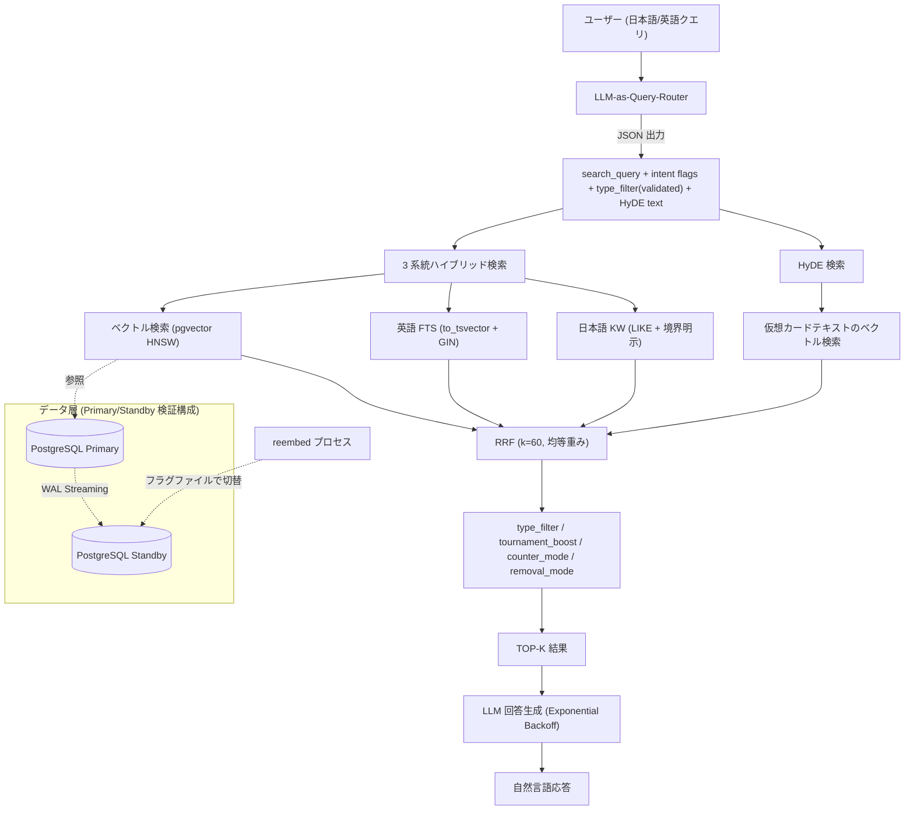

# MTG RAG System

Magic: The Gathering の **33,711 件**のカードデータを対象にした、日英バイリンガル対応の RAG / ハイブリッド検索の**プロトタイプ**。

PostgreSQL + pgvector を中心に、ベクトル検索・全文検索・RRF・HyDE・LLM-as-Query-Router・LLM による回答生成を組み合わせる。単なる LLM チャットラッパーではなく、**検索精度・DB インデックス・評価指標・reembed 中の可用性**を検証することを目的とした個人プロジェクトであり、**検索品質はまだ改善中**である。

---

## Highlights

- 33,711 件の MTG カードを対象にした日英 RAG 検索（pgvector HNSW + 英語 FTS + 日本語 KW + HyDE の 4 系統ハイブリッド + 標準 RRF, k=60）
- RRF の重みを **グリッドサーチで実測**し、経験則だった Weighted RRF を均等重み（標準 RRF）に切り替え
- HNSW パラメータを実機ベンチマークし、**少数の手動評価セットでは `ef_search` を上げてもベクトル検索単体の recall が改善しないケースを確認** → ハイブリッド検索を採用する根拠に
- EXPLAIN ANALYZE で英語 FTS の Seq Scan を特定し、GIN インデックスを追加
- LLM-as-Query-Router（意図解析・HyDE 生成・検索クエリ抽出を 1 リクエストで実施）
- reembed 中も検索を継続するための **PostgreSQL Primary/Standby 検証構成**（Zero-downtime Data Refresh パターンの検証。商用 HA ではない）

---

## プロジェクトステータス

| カテゴリ | 状態 |
|---------|------|
| 4 系統ハイブリッド検索（ベクトル + 英語 FTS + 日本語 KW + HyDE） | プロトタイプ実装済み・評価中 |
| RRF 統合（重みグリッドサーチで決定） | 実装済み |
| LLM-as-Query-Router | 実装済み（数値・属性の構造化フィルタ対応） |
| 構造化メタデータフィルタ（mana_value/power/toughness 等を SQL ハードフィルタ） | 実装済み・効果は評価に未反映 |
| HyDE | 実装済み・効果検証中 |
| HNSW パラメータベンチマーク（ef_search・m） | 完了 |
| LLM 生成レイヤ | 動作（現状 Gemini 2.5 Flash-Lite。AWS 移行時は Bedrock への切り替えを想定） |
| Primary/Standby 検証構成（reembed 中の読み取り継続） | ローカル検証済み |
| fallback（JSON parse / type_filter / HyDE） | 一部実装済み・異常系整理中 |
| EXPLAIN ANALYZE 解析・GIN インデックス | 実施済み（効果は参考値・後述） |
| SMALL / BASE モデルの比較 | 暫定比較・標準指標で再測定予定 |
| 評価フレームワーク（recall@k / precision@k / MRR / NDCG@10） | 実装済み・ベースライン取得済み（n=24・暫定） |
| Cross-encoder reranker | 予定（評価ベースライン取得後に A/B） |
| AWS サーバーレス構成 | 構成案作成済み・未デプロイ |
| IVFFlat と HNSW の実測比較 | 今後の検証項目 |

---

## アーキテクチャ（現行・ローカル）



---

## AWS サーバーレス構成（構想・未デプロイ）

クラウド展開を見据えた**構成案**。**現時点では構想であり、デプロイ・IaC・各種設定の詰めは未実施**。

```mermaid
flowchart TB
    user["ユーザー"] --> cf["CloudFront"]
    cf --> s3f[("S3 / 静的フロント")]
    user -->|検索API| apigw["API Gateway"]
    cognito["Cognito (任意)"] -.認可.-> apigw
    apigw --> lam["Lambda (コンテナ) / e5埋め込み + ハイブリッド検索 orchestration"]
    subgraph vpc["VPC (private)"]
        lam --> proxy["RDS Proxy"]
        proxy --> rds[("RDS PostgreSQL / pgvector")]
    end
    lam -->|VPCエンドポイント(想定)| bedrock["Bedrock / 回答生成"]
    lam -->|VPCエンドポイント(想定)| secrets["Secrets Manager"]
    lam -.ログ/トレース.-> cw["CloudWatch / X-Ray"]
```

構想上のねらい: Lambda の接続枯渇を避ける **RDS Proxy**、埋め込みを自前ホスト・生成を Bedrock にすることで、**NAT Gateway を常設しない低コスト構成を目指す**（Bedrock / Secrets Manager / CloudWatch 等は VPC エンドポイント経由で利用する想定）。常時起動の課金源は RDS のみで、コスト最適化のためにベクトルを S3 にエクスポートして Lambda で読み込む軽量デモ版も別途検討中（こちらは pgvector を使わない別コードパス）。各エンドポイント種別・IAM・コールドスタート等の詰めはこれから。

---

## 主な特徴

### 1. 4 系統ハイブリッド検索 + 標準 RRF
ベクトル検索（pgvector HNSW）、英語 FTS（`to_tsvector` + GIN）、日本語 LIKE 検索、HyDE 検索を並列実行し、RRF（k=60, 均等重み）で統合する。重みは経験則ではなくグリッドサーチの実測で決定した（後述）。

### 2. LLM-as-Query-Router（3 回の設計試行を経た最終形）
LLM に JSON で `search_query` と意図フラグ（`tournament_boost` / `counter_mode` / `removal_mode` / `type_filter`）と HyDE テキストを 1 リクエストで抽出させる。`type_filter` はホワイトリスト（Creature / Instant / Sorcery / Enchantment / Artifact / Land / Planeswalker / Battle）で validation し、未知の値は警告ログを残して無視する。さらにマナ総量・パワー・タフネス等の数値/属性条件を抽出し、SQL のハードフィルタとして適用する（意味検索と構造化フィルタの両輪）。

### 3. HyDE（Hypothetical Document Embeddings）
抽象クエリに対し、LLM に「理想的なカードテキスト」を生成させ、そのベクトルで検索する。通常検索結果と RRF でマージ。生成失敗時は通常検索に fallback。

### 4. 日英バイリンガル対応
embed_text を日英混合で構築し `multilingual-e5` で embedding。「対抗呪文」と "counter spell" の両方で同一カードがヒットする。

### 5. ドメイン知識をコードから分離
「除去」「カウンター呪文」の定義を `mtg_removal_rules.py` / `mtg_counter_rules.py` に外出しし、ルールの追加・修正が中央ロジックに影響しないようにした。

### 6. reembed 中の読み取り継続（Primary/Standby 検証構成）
reembed（TRUNCATE → 全件再構築）の間も検索を止めないため、Docker 上で PostgreSQL Primary/Standby を構築し、フラグファイルで Standby に切り替える機構を実装。これは **Read Replica を Zero-downtime Data Refresh に応用したパターンの検証**であり、障害検知・自動フェイルオーバー・SLA 等を備えた商用 HA ではない。

---

## 開発アプローチ（AI 支援開発と技術判断）

本プロジェクトは AI コーディング支援を積極的に使って構築している。著者の役割は打鍵量ではなく、**アーキテクチャ選定・評価設計・AI 出力のレビューと意思決定**に置いている。判断例:

- **可用性設計**: reembed 中のダウンタイムという課題から逆算し、Streaming Replication を「読み取り継続のための仕組み」として設計した。
- **Query Rewriting の 3 回試行**: 英語化 → フラグのみ → JSON 出力と作り直し、「変換の粒度を誤ると検索系全体の設計と矛盾する」ことを実体験から得た。
- **外部シグナルの統合**: テキスト類似度だけでは拾えない「実環境での使用頻度」を、大会データ由来のスコアとして検索ランキングに加味した。
- **ベクトル検索の限界の確認**: HNSW パラメータを実機ベンチマークし、少数評価セットではベクトル単独の recall が頭打ちになるケースを測定 → ハイブリッド検索が必要な理由を数値で説明できるようにした。
- **経験則の棄却**: Weighted RRF をグリッドサーチで検証し、自分の仮説（英語 FTS の重みを下げる）が実測で支持されないと分かった時点で標準 RRF に戻した。

---

## 主な設計判断

### RRF の重みはグリッドサーチで決定
当初は Weighted RRF（ベクトル 2.0 / 英語 FTS 1.5 / 日本語 FTS 2.0）を採用していたが、英語 FTS の重みを下げていたのは経験則で定量根拠がなかった。`hybrid_benchmark.py` で 10 パターンを実機検証した結果、**均等重み（1.0, 1.0, 1.0）の標準 RRF が KG 率で最良タイ**であり、最もシンプルでスコア正規化バイアスもないため標準 RRF を採用した。

### ハイブリッド検索を選んだ理由
ベクトル検索単体では多義語や完全一致クエリの精度が不安定だった。HNSW パラメータを `ef_search` 10〜500 で実機ベンチマークしたところ、**少数の手動評価セットではベクトル検索単体の recall が約 7.3% で頭打ち**となり、探索パラメータを上げても改善しなかった。原因の断定（モデルの限界か評価設計か等）は統制実験をしていないため避けるが、少なくとも HNSW のチューニングだけでは伸びないことが分かり、語彙検索との組み合わせ（ハイブリッド）の必要性を裏付けた。

### HNSW を初期選択にした理由 / パラメータ
33,711 件規模では HNSW のメモリコストが許容範囲。`m=16`（`m=32` はサイズ約 2 倍・速度 1.5 倍の割に `ef_search>=20` では recall 改善がほぼ無い）、`ef_search=20` を採用。IVFFlat との実測比較は今後の検証項目。

### SMALL（384d）を主採用にした理由（暫定比較）
SMALL と BASE をハイブリッド検索全体で暫定比較した。

| 指標 | SMALL (384d) | BASE (768d) |
|------|--------------|-------------|
| 平均 KW 一致率 | 68.6% | 67.1% |
| 平均 KG 率 | 12.9% | 14.3% |
| 平均実行時間 | 719ms | 1074ms |

精度差は小さく（KG +1.4 ポイント）速度差は約 1.5 倍のため SMALL を採用。LARGE（1024d）は現行の評価ハーネス導入前に初期検証し、当時 SMALL を上回らなかったため見送ったが、再測定可能な結果ファイルは現リポジトリには残していない。これらは標準指標での再測定を予定している。

### LLM の選定
開発フェーズでは無料枠の Gemini 2.5 Flash-Lite を採用（短いクエリ意図解析と RAG 応答という用途に合致）。AWS 移行フェーズでは Bedrock への切り替えと回答品質の比較を想定している。

---

## パフォーマンスとベンチマーク

> いずれも少数の代表クエリ（5〜7 件）＋手動 ground truth による**暫定指標**。標準指標（recall@k / NDCG 等）への移行と再ベースラインは進行中。
> ここでの **KW 率**はキーワード一致系の簡易指標、**KG 率**は手動 ground truth（クエリごとに想定した正解カード集合）に対するヒット率を表す独自の暫定指標である。

### HNSW パラメータ（m=16, 評価 5 クエリ, top_k=10）

| ef_search | recall | avg(ms) | p95(ms) |
|-----------|--------|---------|---------|
| 10 | 3.3% | 1.9 | 3.6 |
| 20 | 7.3% | 1.9 | 3.3 |
| 40 | 7.3% | 2.5 | 3.9 |
| 100 | 7.3% | 3.1 | 4.7 |
| 500 | 7.3% | 7.6 | 10.2 |

`ef_search>=20` で recall が頭打ち（評価セットが小さい点に留意）。`m=32` は `ef_search=10` でのみ改善し、サイズ 2 倍・速度 1.5 倍の不利が大きいため `m=16` を採用。

### RRF 重みグリッドサーチ（SMALL, 抜粋・暫定指標）

| 重み (vec/en/ja) | KW 率 | KG 率 |
|-----------------|-------|-------|
| (2.0, 1.5, 2.0) | 60.0% | 15.7% |
| (1.0, 1.0, 1.0) | 61.4% | 17.1% |
| (1.0, 2.0, 1.0) | 64.3% | 15.7% |
| (1.0, 4.0, 1.0) | 58.6% | 11.4% |

均等重みが KG 率で最良タイ。英語 FTS の重みを上げると KW 率は上がるが KG 率は下がる。

### GIN インデックスの効果（参考・単一クエリ）
英語 FTS が Seq Scan になっていたため `to_tsvector` に GIN インデックスを追加した。単一クエリの全体応答時間で比較すると改善が見られた（例: あるクエリで約 7 倍）。これは FTS 単体を統制したマイクロベンチマークではなく全体応答時間ベースの参考値であり、FTS 単体の before/after の再測定は今後の課題。

### 評価フレームワーク（暫定ベースライン）
recall@k / precision@k / MRR / NDCG@10 と段階 relevance の ground truth を扱う評価ハーネスを実装し、SMALL_V2 で暫定ベースラインを取得した（**n=24 クエリ・10 段階相対ランキング GT**）。

| 指標 | 値 |
|------|----|
| recall@5 | 0.491 |
| precision@5 | 0.725 |
| MRR | 0.799 |
| NDCG@10 | 0.707 |
| recall@10 | 0.954（※下記） |

注意: ground truth を SMALL_V2 の top10 からプールしているため **recall@10 ≈ 0.95 は構造上ほぼ天井で識別力が低く、主指標にしない**（改善を語るなら NDCG@10 / recall@5 / MRR）。これは現状ベースラインであり、**reranker や構造化フィルタによる改善 A/B はまだ実施していない**。評価セットも小さい。

---

## Fallback 設計

| ケース | 状況 | 挙動 |
|--------|------|------|
| JSON parse 失敗 | 実装済み | 原文クエリ・全フラグ False で通常検索に fallback |
| LLM リトライ枯渇 | 暗黙的 | HTTP ステータス別メッセージを返す。検索結果は出ている |
| 無効な type_filter | 実装済み | ホワイトリストで弾き、警告ログを残してフィルタなしで検索 |
| HyDE 生成失敗 | 実装済み | 通常検索のみで続行 |

異常系の網羅的な整理は進行中。

---

## Current Limitations

本プロジェクトは実験段階の RAG / ハイブリッド検索プロトタイプであり、すべての自然言語クエリに対して安定した回答品質を保証するものではない。

特に、**マナ総量・カードタイプ・色・フォーマットなどの構造化条件を含むクエリでは、ベクトル検索のみでは条件が曖昧化する**ことがある。例として「1 マナのクリーチャー」のようなクエリでは、意味的に近い軽量クリーチャーとして 2 マナのカードが混入しうる。

また、**検索結果の関連度が低い場合に LLM がもっともらしいが根拠の弱い回答を生成してしまう**現象も確認している。

この課題への対応として、自然言語クエリから構造化可能な条件（`mana_value`・パワー・タフネス・`type_filter` 等）を LLM クエリプランナーで抽出し、SQL のハードフィルタで厳密に絞り込み、曖昧な意味部分のみをベクトル検索・FTS・HyDE・RRF に委ねる**構造化メタデータフィルタを実装済み**。ただし**その効果はまだ評価ベースラインに反映されていない**（現在の評価ハーネスは検索器を直接呼び、クエリルーター経路を通らないため）。定量的な改善として示すには、評価をルーター経路に通す必要がある。

---

## 対応した技術課題（抜粋）

- **データ品質**: Scryfall の一部セットで日本語フィールドに英語が混入 → `is_japanese()` の文字種チェックで除外。
- **キーワード境界**: `LIKE '%飛行%'` が「飛行カウンター」等に誤ヒット → パラメータバインディングで境界を明示。
- **多義語**: 護法テキストの「打ち消す」がカウンター呪文クエリに混入 → `counter_mode` で動的にペナルティ。
- **psycopg2 の `%` 衝突**: `LIKE '%Instant%'` がプレースホルダと衝突 → `%%` でエスケープ。
- **暗黙概念**: 「最強」「純粋に」をテキスト類似度で拾えない → 大会データの `tournament_boost` で補完を試行中。
- **外部 LLM の信頼性**: 429/503 に Exponential Backoff + Jitter。API キーを含む URL をログに出さない。
- **DB 認証情報**: 直書きを排除し `db_config.py` + `.env`（gitignore）+ Secrets Manager 想定に外部化。

---

## セットアップ（開発者向け・暫定）

> 再現性のあるワンコマンドセットアップは未整備（`docker-compose` / `scripts/` への整理は今後の課題）。Python ライブラリの依存は `requirements.txt` に用意してある。以下は開発中環境の実行手順メモであり、この通りに実行しても環境差で動かない可能性がある。

```bash
# 1. 環境変数
cp .env.example .env   # DB 接続情報を設定（認証情報はコミットしない）

# 2. Python 依存のインストール（venv 推奨）
pip install -r requirements.txt

# 3. データ取り込み（Scryfall 等の公式 API から各自取得）
python import_cards.py
python extract_japanese.py
python rebuild_embed_text.py --reembed

# 4. 検索
python mtg_hybrid_search_v2.py "純粋に強いカウンター呪文"

# 5. LLM 連携
python mtg_rag_agent.py questions.txt
```

カードデータ本体・API キーはリポジトリに含めない。

---

## データ規模

| 指標 | 数値 |
|------|------|
| ユニークカード数 | 33,711 |
| SMALL embedding（384d） | 33,711 件 |
| deck_cards 紐付け率 | 98.5%（149,704 / 151,934） |
| 大会デッキ（MTGTop8, 増加中） | 2,300 件以上 |

---

## 学び

- **検索精度がシステム全体の品質を決める**: 検索が正確なクエリでは LLM の回答品質が高く、弱いクエリでは LLM がこじつける。retrieval の品質が回答品質を規定することを実測で確認した。
- **経験則は実測で検証する**: Weighted RRF の重みを実測で見直し、仮説が支持されない時に仮説を捨てる判断を実践した。
- **定量評価が技術選定の根拠になる**: SMALL/BASE を数値で比較し、トレードオフを根拠を持って選べた（指標は標準化中）。
- **計測してからチューニングする**: EXPLAIN ANALYZE で Seq Scan を特定してから GIN を入れた。

---

## 今後の展望

- 評価セットの拡充（現状 n=24）と標準指標での継続測定
- 構造化メタデータフィルタの効果を評価に反映（評価をクエリルーター/エージェント経路に通して定量化する）
- 検索結果の信頼度が低い場合に LLM が無理に回答しないための **quality gate** の追加（構造化条件に合わない候補の除外、候補数不足時の低信頼判定、根拠不足時の回答抑制）を通じて「もっともらしいが根拠の弱い回答」を減らす
- Cross-encoder reranker の導入と評価ハーネスでの A/B 定量化
- GIN 効果・LARGE 比較の再測定（統制された条件で）
- AWS サーバーレス構成のデプロイ（IaC: Terraform / CDK）と Bedrock への移行

---

## Disclaimer / 免責事項

This project is an unofficial fan-made research and engineering project and is **not affiliated with, endorsed, sponsored, or approved by Wizards of the Coast, Scryfall, MTGJSON, or any tournament data provider**. Magic: The Gathering and related names are trademarks of Wizards of the Coast LLC.

The MIT License in this repository applies only to the source code written for this project, and **does not grant any rights to Magic: The Gathering card data, names, images, mana symbols, trademarks, or third-party datasets**.

本プロジェクトは個人の研究・エンジニアリング目的の非公式ファンプロジェクトであり、Wizards of the Coast 等とは一切の提携・後援関係を持たない。カードデータ・API キーはリポジトリに含まれず、各自が公式 API から取得する。

---

## ライセンス

MIT License - 詳細は `LICENSE` を参照。ライセンスはソースコードにのみ適用され、カードデータ・名称・画像・商標等の権利は別である。
