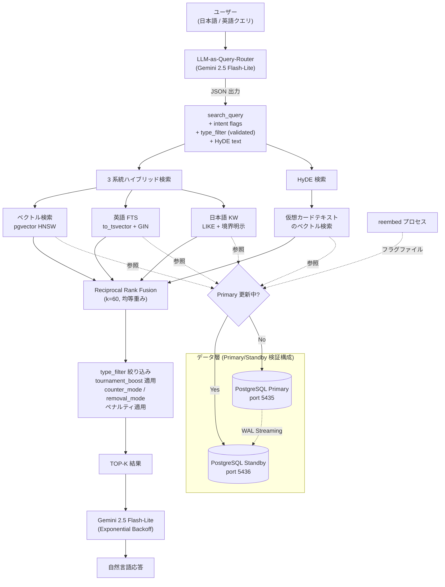

# MTG RAG System

Magic: The Gathering のカードデータを対象にした、日英バイリンガル対応の RAG（Retrieval-Augmented Generation）/ ハイブリッド検索システム。

PostgreSQL + pgvector を中心に、ベクトル検索、PostgreSQL 全文検索、RRF、HyDE、LLM-as-Query-Router、Gemini API による回答生成を組み合わせる。単なる LLM チャットラッパーではなく、**検索精度・DB インデックス・評価指標・reembed 中の可用性まで含めて検証すること**を目的としている。

---

## Highlights

- **33,711 件**の MTG カードを対象にした日英 RAG 検索システム
- pgvector HNSW + PostgreSQL 全文検索 + 日本語 KW 検索 + HyDE の **4 系統ハイブリッド検索 + 標準 RRF（k=60）**
- **RRF の重みをグリッドサーチで実測**し、経験則の Weighted RRF を否定して均等重みに切り替え
- EXPLAIN ANALYZE で英語 FTS の Seq Scan を特定し、**GIN インデックスで最大 7.3 倍高速化**
- LLM-as-Query-Router（Gemini 2.5 Flash-Lite）による意図解析・HyDE テキスト生成・検索クエリ抽出を 1 リクエストで実施
- reembed 中も検索を継続するための **PostgreSQL Primary/Standby 検証構成**（Zero-downtime Data Refresh パターン）

---

## プロジェクトステータス

| カテゴリ | 状態 |
|---------|------|
| 4 系統ハイブリッド検索（ベクトル + 英語 FTS + 日本語 KW + HyDE） | 完了・動作中 |
| RRF 統合（重みグリッドサーチで実証） | 完了・動作中 |
| LLM-as-Query-Router（JSON 出力で search_query + intent flags） | 完了・動作中 |
| HyDE（Hypothetical Document Embeddings） | 完了・動作中 |
| HNSW パラメータベンチマーク（ef_search・m） | 完了 |
| LLM 生成レイヤ（Gemini 2.5 Flash-Lite） | 完了・動作中 |
| Primary/Standby 検証構成（reembed 中の読み取り継続） | 完了・動作中 |
| 各種 fallback（JSON parse / type_filter / HyDE） | 完了・動作中 |
| EXPLAIN ANALYZE 解析・GIN インデックス最適化 | 完了 |
| SMALL / BASE モデルの定量比較 | 完了 |
| 評価フレームワーク（NDCG / MRR / Recall@K 標準化） | 進行中 |
| IVFFlat と HNSW の実測比較 | 今後の検証項目 |
| Cross-encoder reranker（bge-reranker-v2-m3 等） | 予定 |
| Web UI / AWS デプロイ | Coming Soon |

---

## デモ

Web UI とクラウドデプロイは公開準備中。現状の CLI 出力例は以下。

```
$ python mtg_rag_agent.py questions.txt

質問: 純粋に強いカウンター呪文
  意図解析中... [tournament_boost, counter_mode, type:Instant, HyDE]
  vec:30 en_fts:30 ja_fts:30 (94ms)
  5件取得。Gemini に問い合わせ中... 完了
```

ハイブリッド検索の各系統の取得件数と検索時間、Gemini への問い合わせ状況がリアルタイムで表示される。

---

## 目次

- [背景と目的](#背景と目的)
- [アーキテクチャ](#アーキテクチャ)
- [主な特徴](#主な特徴)
- [技術スタック](#技術スタック)
- [主な設計判断](#主な設計判断)
- [パフォーマンスとベンチマーク](#パフォーマンスとベンチマーク)
- [Fallback 設計](#fallback-設計)
- [解決した技術課題](#解決した技術課題)
- [セットアップ](#セットアップ)
- [検索精度の現状](#検索精度の現状)
- [データ規模](#データ規模)
- [学び](#学び)
- [今後の展望](#今後の展望)
- [Disclaimer / 免責事項](#disclaimer--免責事項)
- [ライセンス](#ライセンス)

---

## 背景と目的

Magic: The Gathering（MTG）は長い歴史と大規模なカードプール（約 33,000 種類）を持つトレーディングカードゲームである。日本のプレイヤーが直面する課題として、公式の検索手段が英語テキストに依存しており、日本語による意味的検索の手段が乏しい点がある。

本プロジェクトでは、以下を実現する RAG システムを構築している。

- 日本語・英語の両方の自然言語クエリで意味的に適切なカードを検索する
- 「最強の単体除去」「飛行を持つクリーチャー」「環境で強いクリーチャー」のような、ドメイン特有かつ抽象的な表現を正しく解釈する
- 大会入賞デッキデータと組み合わせて、メタゲームを反映した検索結果を提供する
- LLM による自然言語応答で、カードの使い方や代替案を説明する

将来的にはデッキ構築支援・メタゲーム分析・カード選定支援ツールへの発展を目指している。

---

## アーキテクチャ



---

## 主な特徴

### 1. 4 系統ハイブリッド検索 + 標準 RRF
ベクトル検索（pgvector HNSW）、英語 FTS（PostgreSQL `to_tsvector` + GIN インデックス）、日本語 LIKE 検索、HyDE 検索の 4 系統を並列実行し、Reciprocal Rank Fusion（k=60、均等重み）で統合する。重みは経験則ではなく、グリッドサーチによる実測で決定した。

### 2. LLM-as-Query-Router（3 回の設計試行を経た最終形）
Gemini に JSON 形式で `search_query` と意図フラグ（`tournament_boost`、`counter_mode`、`removal_mode`、`type_filter`）と HyDE テキストを 1 リクエストで抽出させる。`type_filter` はホワイトリスト（Creature / Instant / Sorcery / Enchantment / Artifact / Land / Planeswalker / Battle）で validation し、未知の値は警告ログを残しつつ無視する。

### 3. HyDE（Hypothetical Document Embeddings）
「環境で強いクリーチャー」のような抽象クエリに対して、Gemini に「理想的なカードテキスト」を生成させ、そのベクトルで検索する。通常検索結果と HyDE 検索結果を RRF でマージすることで、抽象表現と具体表現の両方をカバー。生成失敗時は `hyde_text=""` で通常検索に fallback する。

### 4. 日英バイリンガル対応
embed_text を日英混合フォーマットで構築し、`multilingual-e5` モデルで embedding を生成。「対抗呪文」と "counter spell" の両方で同一カードがヒットする。

### 5. ドメイン知識をコードから分離
「除去」「カウンター呪文」のようなドメイン定義を `mtg_removal_rules.py` / `mtg_counter_rules.py` に外出し。ペナルティルールの追加・修正が中央のロジックに影響しない。

### 6. reembed 中の読み取り継続を意識した Primary/Standby 検証構成
Primary + Standby の PostgreSQL レプリケーションを Docker で構築。reembed 中はフラグファイルベースで Standby へ自動切り替えする検証用の仕組みを実装している。これは商用 SLA を満たす完全な HA 構成ではなく、Read Replica を Zero-downtime Data Refresh に応用したパターン検証である。

### 7. LLM 生成レイヤとのシームレス統合
Gemini 2.5 Flash-Lite を Exponential Backoff + Jitter（最大 7 回・最大 60 秒）のリトライ機構で統合。エラー時は HTTP ステータスコード別のメッセージを返し、API キーが含まれる可能性のある URL をログに出力しない設計とした。

---

## 技術スタック

| カテゴリ | 技術 |
|---------|------|
| データベース | PostgreSQL 18 |
| ベクトル拡張 | pgvector（HNSW インデックス、384 / 768 次元） |
| 全文検索 | PostgreSQL `to_tsvector` + GIN |
| Embedding モデル | multilingual-e5-small（384d）、multilingual-e5-base（768d） |
| LLM | Google Gemini 2.5 Flash-Lite |
| 言語 | Python 3.x |
| コンテナ | Docker, Docker Compose |
| OS | Ubuntu 64bit on VirtualBox |
| レプリケーション | PostgreSQL Streaming Replication（WAL） |
| データソース | Scryfall API（カードデータ）、MTGTop8（大会デッキ）、MTGJSON（プリコン） |

---

## 主な設計判断

### RRF の重みは経験則ではなくグリッドサーチで決定

当初は **Weighted RRF**（ベクトル 2.0 / 英語 FTS 1.5 / 日本語 FTS 2.0）を採用していた。英語 FTS の重みを下げていたのは「日本語クエリでは英語 FTS の信頼度が低い」という経験則だったが、定量根拠がなかった。

`hybrid_benchmark.py` に重みのグリッドサーチ機能を実装し、10 パターンの重み組み合わせを実機検証した結果、SMALL_V2 / BASE_V2 ともに **均等重み（1.0, 1.0, 1.0）の標準 RRF が KG 率で最良**であることが判明した。英語 FTS の重みを上げると KW 率（キーワードヒット率）は上がるが KG 率（正解カードヒット率）は下がる現象も発見した。**自分の仮説が実測で否定されたため、標準 RRF に戻す**判断をしている。

### ハイブリッド検索を選んだ理由

ベクトル検索単体では「カウンター」のような多義語（呪文の打ち消し vs +1/+1 カウンター）を区別できず、「対抗呪文」のような完全一致クエリの精度も不安定だった。BM25 系の語彙的検索と組み合わせ、RRF で統合することで両者の弱点を補完する設計とした。

HNSW パラメータの実機ベンチマークでも、`ef_search` を 10 から 500 まで変えても **この評価セットではベクトル検索単体の recall が 7.3% で頭打ち**となった。少なくとも HNSW 側の探索パラメータ調整では改善が見られず、embedding 表現・embed_text 設計・ドメイン知識・語彙検索との組み合わせが検索品質に大きく影響することを確認した。

### HNSW を初期選択にした理由

33,711 件規模では HNSW のメモリコストが許容範囲であり、pgvector における RAG 用途の初期選択として HNSW を採用した。IVFFlat との実測比較は今後の検証項目とし、データ規模が数十万〜数百万件に拡大した時点で再評価する。

### HNSW パラメータの最適値

実機ベンチマークの結果、以下を採用：

- `m = 16`（デフォルト）：`m=32` ではインデックスサイズが約 2 倍、検索速度が 1.5 倍遅くなる割に、`ef_search >= 20` では recall 改善がほぼ無いため
- `ef_search = 20`：これ以上に上げても recall は本評価セットで頭打ち。20 が速度と精度のスイートスポット

### SMALL モデル（384 次元）を主採用にした理由

SMALL と BASE のハイブリッド検索全体での定量比較を実施した結果、以下のトレードオフが明らかになった。

| 指標 | SMALL (384d) | BASE (768d) |
|------|--------------|-------------|
| 平均 KW 一致率 | 68.6% | 67.1% |
| 平均 KG 率 | 12.9% | 14.3%（+1.4%） |
| 平均実行時間 | 719ms | 1074ms（1.5x） |

精度差 +1.4% に対して速度差 1.5 倍・容量差 2 倍。本ユースケースでは SMALL を採用する判断とした。LARGE（1024d）も初期検証したが、SMALL より精度が劣る結果となり採用見送り。

### PostgreSQL Streaming Replication を採用した理由

embedding テーブルの reembed 処理（TRUNCATE → 全件再構築）の間、検索サービスが停止する問題があった。これを避けるため、Docker 上で PostgreSQL Primary / Standby 構成を構築し、reembed 中は Standby を参照する検証用の切り替え機構を実装した。

これは災害復旧や商用 SLA を目的とした完全な HA 構成ではなく、RAG システムにおける「embedding 再構築中も検索を継続する」ための **Zero-downtime Data Refresh パターンの検証**である。商用 HA に必要な障害検知・自動フェイルオーバー・監視・split-brain 対策・SLA 定義などは本プロジェクトの範囲外。

### Query Rewriting の設計を 3 回試行した理由

- **第 1 版（英語化）**：日本語クエリを英語に翻訳して検索 → 日本語 FTS の意味が消える → 設計思想と矛盾 → 廃止
- **第 2 版（フラグ判定のみ）**：意図フラグだけ抽出してクエリは原文を維持 → 長文クエリのノイズ（「強い」「3 枚」等）が embedding に乗る問題が解決できない
- **第 3 版（JSON 出力で search_query + フラグ同時取得）**：採用中。`search_query` はクエリの核を抽出（日本語のまま）、フラグは意図解析、HyDE テキストも同時生成

「transformation の粒度を間違えると検索系全体の設計と矛盾する」ことを 3 回の試行で学んだ。

### Gemini 2.5 Flash-Lite を選定した理由

開発フェーズでのコストを抑えるため、無料枠が寛容な Gemini AI Studio から始めた。複数モデルを試した結果、用途が「短いクエリ意図解析と RAG 応答生成」なので、大型モデルはオーバースペックと判断。Flash-Lite は低遅延・低コスト・JSON mode 対応と、ユースケースに合致している。本番運用フェーズでは Claude Haiku や GPT-4o-mini との比較ベンチマークで再選定する想定。

### ペナルティルールを外部ファイルに分離した理由

「除去」の定義（target creature を destroy か exile）、「カウンター呪文」の定義（呪文を打ち消すが、護法のテキストは除外）など、ドメイン知識は頻繁に更新される。中央のコアロジックから分離することで、知識更新時の影響範囲を最小化できる設計とした。

---

## パフォーマンスとベンチマーク

### HNSW パラメータベンチマーク

**ef_search の影響（m=16 固定）**

| ef_search | recall | avg(ms) | p95(ms) |
|-----------|--------|---------|---------|
| 10        | 3.3%   | 1.9ms   | 3.6ms   |
| 20        | 7.3%   | 1.9ms   | 3.3ms   |
| 40        | 7.3%   | 2.5ms   | 3.9ms   |
| 100       | 7.3%   | 3.1ms   | 4.7ms   |
| 500       | 7.3%   | 7.6ms   | 10.2ms  |

この評価セットでは `ef_search >= 20` で recall が頭打ちになった。少なくとも HNSW 側の探索パラメータ調整では改善が見られず、embedding・embed_text・ground truth 定義・語彙検索との組み合わせなど、上位レイヤでの介入が検索品質に影響することが示唆された。

**m のスイッチング検証**：`m=32` は `ef_search=10` のみで recall が若干改善するが、速度 1.5 倍・インデックスサイズ 2 倍（66MB → 約 130MB）のデメリットが大きい。`ef_search >= 20` を使う運用では `m=16` で十分。

### RRF 重みグリッドサーチ

**SMALL_V2 の結果（KG 率基準・抜粋）**

| 重み (vec/en/ja) | KW 率 | KG 率 | avg 時間 |
|-----------------|-------|-------|---------|
| (2.0, 1.5, 2.0) | 60.0% | 15.7% | 347ms |
| (1.0, 1.0, 1.0) | 61.4% | 17.1% | 382ms |
| (1.0, 2.0, 1.0) | 64.3% | 15.7% | 370ms |
| (1.0, 4.0, 1.0) | 58.6% | 11.4% | 307ms |

均等重み（標準 RRF）が KG 率最良。英語 FTS の重みを上げると KW 率は上がるが KG 率は下がる傾向を発見。

### EXPLAIN ANALYZE による実行計画分析

| 検索系統 | 改善前 | 改善後 | 改善内容 |
|---------|--------|--------|---------|
| ベクトル検索（HNSW） | 1.2ms | 1.2ms | 元から Index Scan が効いており最適 |
| 英語 FTS | 486ms（Parallel Seq Scan） | 数十 ms（Bitmap Index Scan） | GIN インデックス追加 |
| 日本語 LIKE | 129ms（Seq Scan） | 129ms | 改善検討中 |

### GIN インデックス追加の効果

| クエリ | Before | After | 倍率 |
|--------|--------|-------|------|
| 純粋に強いカウンター呪文 | 610ms | 264ms | 2.3x |
| 飛行を持つクリーチャー | 805ms | 110ms | 7.3x |

### ハイブリッド検索全体の性能

SMALL_V2 採用後の平均応答時間: **269ms**（GIN 追加前は 719ms）

---

## Fallback 設計

LLM やパラメータバリデーションは失敗し得る前提で、以下の fallback を実装している。

| ケース | 状況 | 挙動 |
|--------|------|------|
| Gemini が JSON parse できない出力を返した | 実装済み | 原文クエリ・全フラグ False で通常検索に fallback |
| Gemini API が 7 回リトライ後も失敗 | 暗黙的 | HTTP ステータス別のエラーメッセージを返す。カード検索結果は出ている |
| Router が無効な `type_filter` を返した | 実装済み | ホワイトリストで弾き、警告ログを残してフィルタなしで検索 |
| HyDE テキスト生成が失敗 | 実装済み | `hyde_text=""` を返し、通常検索のみで続行 |

---

## 解決した技術課題

### 1. ベクトル検索の recall 上限の定量化
- **問題**: ハイブリッド検索の中でベクトル検索の貢献度を測りたい
- **解決**: HNSW パラメータ全数ベンチマーク（`hnsw_benchmark.py`）を実装。`ef_search` 10〜500、`m` 16/32 で計測
- **学び**: 本評価セットでは HNSW 側のチューニングでは改善せず、上位レイヤ（embedding 設計、embed_text、ground truth）の検討が必要であることが示唆された

### 2. RRF の重みを経験則で決めていた問題
- **問題**: Weighted RRF（2.0/1.5/2.0）に定量根拠がなかった
- **解決**: 重みグリッドサーチ機能を `hybrid_benchmark.py` に実装、10 パターン実機検証
- **学び**: 経験則は実証データで否定される可能性がある。仮説と一致しない結果が出た時に、仮説を捨てる判断ができることがエンジニアリングの本質

### 3. 抽象クエリへの対応（HyDE 導入）
- **問題**: 「環境で強いクリーチャー」のようなクエリで、ベクトル検索では除去呪文等が混入していた
- **解決**: Gemini に仮想カードテキストを生成させ、そのベクトルで検索する HyDE を実装。通常検索と HyDE 検索を RRF でマージ
- **学び**: 抽象的なクエリは、LLM の生成能力で「具体例の embedding 空間」に変換することで解ける

### 4. psycopg2 のパラメータバインディングと LIKE の `%` 衝突
- **問題**: `LIKE '%Instant%'` を含む SQL を `execute(sql, params)` に渡すと、`%` がプレースホルダーとして解釈されエラーになる（`list index out of range`）
- **解決**: `LIKE '%%Instant%%'` のように `%%` でエスケープ
- **学び**: SQL インジェクション対策でパラメータバインディングを使う時の典型的な落とし穴。全検索系（vector / en_fts / ja_fts）の `cur.description is None` チェックも併せて追加した

### 5. eoc セットの日本語フィールドに英語が混入していた
- **問題**: Scryfall の eoc セットで `printed_text` に英語テキストが格納されており、日本語フィールドに英語が混入していた（Farseek 等）
- **解決**: `is_japanese()` による文字種チェックを `extract_japanese.py` に追加し、英語テキストを日本語フィールドから除外
- **学び**: データソース自体の品質を盲信できない。受け入れ時のバリデーションが必須

### 6. `LIKE '%飛行%'` が「飛行カウンター」にもヒットしていた
- **問題**: 部分文字列マッチによりキーワード境界が曖昧になり、「飛行を持つクリーチャー」クエリに飛行カウンター付与カード等が混入
- **解決**: パラメータバインディングで `\n飛行\n` を渡し、キーワード境界を明示
- **学び**: 日本語の文字列マッチでは境界の明示が必須

### 7. 護法持ちカードが「カウンター呪文」クエリに混入
- **問題**: 護法のテキスト内の「打ち消す」が誤ヒットしていた
- **解決**: `counter_mode` フラグを実装し、カウンター呪文クエリの場合のみ護法キーワード持ちにペナルティを適用
- **学び**: クエリ意図に応じてフィルタを動的に切り替える設計が有効

### 8. 暗黙概念（「最強」「純粋に」）の検索
- **問題**: カードテキストに「強い」という概念が存在しないため、ベクトル類似度では拾えない
- **解決**: クエリ修飾語の検出と大会入賞デッキの共起情報による `tournament_boost` を組み合わせ、「最強の単体除去」「純粋に強いカウンター呪文」を正解上位に返せるようにした
- **学び**: 暗黙概念は外部知識（メタゲーム情報）との組み合わせで解く必要がある。Google PageRank がリンク人気度を加味するのと同じ思想

### 9. reembed 中に検索サービスが停止
- **問題**: embedding テーブルの再構築中、TRUNCATE によりサービスが使えなくなる
- **解決**: PostgreSQL Streaming Replication を構築し、フラグファイルベースの切り替え機構を実装。`rebuild_embed_text.py` 開始時に `/mnt/mtg_rag/.primary_updating` を作成、検索エンジンが自動で Standby を参照。完了時は `finally` 句で確実にフラグを削除
- **学び**: レプリケーションは「バックアップ」ではなく「サービスを止めない」ための技術。商用 HA まではいかないが、メンテナンスウィンドウの隠蔽には実用的

### 10. Gemini API のレートリミットと API キー漏洩リスク
- **問題**: 429 / 503 エラーが頻発。さらにエラーログに API キーを含む URL が出力される懸念があった
- **解決**: Exponential Backoff + Jitter（最大 7 回・最大 60 秒）を実装。HTTP ステータスコード別のメッセージに変更し、URL（API キーが含まれる可能性）をエラーログに出さない設計に変更
- **学び**: 外部 LLM API は信頼性のあるリトライ機構と、ログ出力時のセキュリティ配慮が必須

### 11. 英語 FTS のシーケンシャルスキャン
- **問題**: 英語 FTS が 486ms かかっており、ハイブリッド検索全体のボトルネックになっていた
- **解決**: `to_tsvector(oracle_text)` に GIN インデックスを追加。Parallel Seq Scan から Bitmap Index Scan に切り替わり、最大 7 倍高速化
- **学び**: ベクトル検索だけでなく、語彙検索側のインデックス設計も性能に大きく寄与する

### 12. 両面カード・分割カードの oracle_text が NULL
- **問題**: 両面カードのトップレベル `oracle_text` が NULL のことがあり、検索対象から漏れる
- **解決**: `card_faces` からフォールバック取得する `extract_oracle_text()` を実装
- **学び**: 複雑なデータ構造には正規化された取得ロジックが必要

### 13. データの重複（Counterspell が 237 件重複）
- **問題**: 同名カードがセット違いで複数件取り込まれていた
- **解決**: `card_name` に UNIQUE 制約 + `ON CONFLICT DO NOTHING` で対処
- **学び**: ユニーク制約は最初の段階で必ず設計する

---

## セットアップ

### 必要環境
- Docker + Docker Compose
- Python 3.10 以上
- 10GB 以上の空きディスク（embedding データ含む）
- Gemini API キー（LLM 連携を使う場合）

### 環境変数

`.env.example` をコピーして `.env` を作成し、必要な値を設定する。

```bash
cp .env.example .env
# .env を編集して API キーや DB パスワードを設定
```

**実 API キーやパスワードを `.env` に書き、リポジトリにはコミットしない**。`.gitignore` で `.env` は除外している。

### 起動手順

```bash
# 1. リポジトリのクローン
git clone https://github.com/Sakaihashizo/mtg-rag.git
cd mtg-rag

# 2. 環境変数の設定
cp .env.example .env
# .env を編集

# 3. PostgreSQL（Primary + Standby）の起動
docker compose up -d

# 4. Python 環境のセットアップ
python -m venv .venv
source .venv/bin/activate
pip install -r requirements.txt

# 5. Scryfall データのダウンロード
python scripts/download_scryfall.py

# 6. データ取り込み
python scripts/import_cards.py
python scripts/extract_japanese.py
python scripts/rebuild_embed_text.py --reembed

# 7. 大会デッキデータの取り込み（オプション）
python scripts/import_decks.py
python scripts/scrape_mtgtop8.py --format MO --year 2024

# 8. 検索実行
python mtg_hybrid_search_v2.py "純粋に強いカウンター呪文"

# 9. LLM 連携モード
python mtg_rag_agent.py questions.txt
```

**カードデータ本体や API キーはリポジトリには含めない**。データは Scryfall API から取得し、各自の環境に取り込む形式。

---

## 検索精度の現状

### 改善されたクエリ

| クエリ | 結果（上位 3 件） |
|--------|--------------------|
| 純粋に強いカウンター呪文 | Counterspell / Force of Negation / Force of Will |
| 最強の単体除去 | 稲妻 / オークの弓使い / Unholy Heat |
| 飛行を持つクリーチャー | 飛行クリーチャーのみ（飛行カウンター系は排除済み） |
| モダンの最強カウンター呪文 | Force of Negation / Counterspell / Spell Pierce |
| カードを 2 枚引く | Sylvan Library / Steamcore Scholar 等 |
| 対抗呪文 | Counterspell / Force of Negation |
| 環境で強いクリーチャー | クリーチャーのみ（HyDE + type_filter で精度向上） |

### 残課題

| クエリ | 課題 |
|--------|------|
| マナ加速 | 通常土地（魂の洞窟等）が混入。`{T}: add` 等の KW 厳密化で改善予定 |
| デッキテーマ検索（青白コントロール等） | クエリ拡張マップが未対応。デッキ共起データを活用予定 |

---

## データ規模

| 指標 | 数値 |
|------|------|
| ユニークカード数 | 33,711 |
| SMALL embedding（384d） | 33,711 件 |
| BASE embedding（768d） | 33,711 件 |
| 日本語テキスト保有カード | 約 20,000 件 |
| プリコンデッキ（MTGJSON） | 2,734 件 |
| 世界選手権デッキ（WC97〜WC04） | 32 件 |
| 大会デッキ（MTGTop8、増加中） | 2,379 件以上 |
| deck_cards 紐付け率 | 98.5%（149,704 / 151,934） |
| Fatal Push tournament_score | 10,351 |
| Force of Will tournament_score | 1,442 |

---

## 学び

### RAG の検索精度がシステム全体の品質を決定する
LLM との連携検証で実証できた事実。検索結果が正確なクエリ（カウンター呪文・除去）では LLM の回答品質が高く、検索結果が弱いクエリ（マナ加速）では LLM がこじつけた説明をしてしまう。「LLM の回答品質 = retrieval の品質」が成立することを実測で確認した。

### 経験則は実証データで検証されるべき
Weighted RRF の重みを経験則で決めていたが、グリッドサーチで均等重みの方が良いと判明した。「動いているからそのまま」ではなく「この値は本当に最適か？」を問い続け、自分の仮説が実測で否定された時に仮説を捨てる判断ができることがエンジニアリングの本質。

### 定量評価が技術選定の根拠を作る
SMALL vs BASE の比較を「なんとなく BASE の方が精度高そう」ではなく KW 率・KG 率・実行時間という数値で示せたことで、技術選定の根拠を明確に説明できるようになった。「精度 +1.4% のために速度 1.5 倍低下を許容するか」というトレードオフを定量的に判断できることはエンジニアリングの本質。

### EXPLAIN ANALYZE を起点にしたパフォーマンスチューニング
英語 FTS の遅さを EXPLAIN ANALYZE で特定（Parallel Seq Scan）し、GIN インデックスを追加して Bitmap Index Scan に切り替えることで最大 7 倍高速化した。「想像でチューニングしない、計測してから動く」という原則を実装に落とし込めた。

---

## 今後の展望

### 進行中
- 評価フレームワークの整備（NDCG@10 / MRR / Recall@K の標準指標、LLM-as-judge）
- IVFFlat と HNSW の実測比較
- マナ加速クエリの精度改善
- デッキテーマ検索（青白コントロール等）の対応

### Coming Soon
- Cross-encoder reranker（bge-reranker-v2-m3 等）の導入と精度改善の定量化
- pgvector 0.7+ の `halfvec` / binary quantization 試験（メモリ削減と精度のトレードオフ実測）
- 33,000 件 → 33 万件 → 330 万件のスケール検証
- Web UI（Streamlit / Next.js）と Render / AWS へのデプロイ
- AWS RDS for PostgreSQL + pgvector への移行
- AWS Bedrock Knowledge Bases との比較検証
- 技術記事の公開（pgvector + HNSW のパラメータ検証、Weighted RRF から標準 RRF への切り替え、HyDE による抽象クエリ対応、Zero-downtime Data Refresh 等）

---

## Disclaimer / 免責事項

This project is an unofficial fan-made research and engineering project and is **not affiliated with, endorsed, sponsored, or approved by Wizards of the Coast, Scryfall, MTGJSON, or any tournament data provider**.

Magic: The Gathering and related names are trademarks of Wizards of the Coast LLC. Card data and related assets are subject to the terms and policies of their respective rights holders and data providers.

The MIT License in this repository applies only to the source code written for this project, and **does not grant any rights to Magic: The Gathering card data, names, images, mana symbols, trademarks, or third-party datasets**.

---

本プロジェクトは個人の研究・エンジニアリング目的の非公式なファンプロジェクトであり、Wizards of the Coast、Scryfall、MTGJSON、その他大会データ提供者とは一切の提携・後援・承認関係を持たない。

Magic: The Gathering および関連する名称は Wizards of the Coast LLC の商標である。カードデータおよび関連資産は、それぞれの権利者およびデータ提供者の利用規約に従う。

本リポジトリの MIT License は本プロジェクト独自に書かれたソースコードにのみ適用され、Magic: The Gathering のカードデータ、名称、画像、マナシンボル、商標、サードパーティデータセットに対するいかなる権利も付与しない。

データソースについては各サービスの利用規約を遵守すること。本リポジトリには **カードデータ本体や API キーは含まれない**。データは Scryfall 等の公式 API から各自の環境で取得する。

---

## ライセンス

MIT License - 詳細は `LICENSE` ファイルを参照。

ライセンスはソースコードにのみ適用される。Disclaimer 記載の通り、カードデータ・名称・画像・商標等の権利は別である。

---

## 関連リソース

Coming Soon

- 技術記事（Zenn / Qiita）
- Web デモ
- AWS デプロイ版
