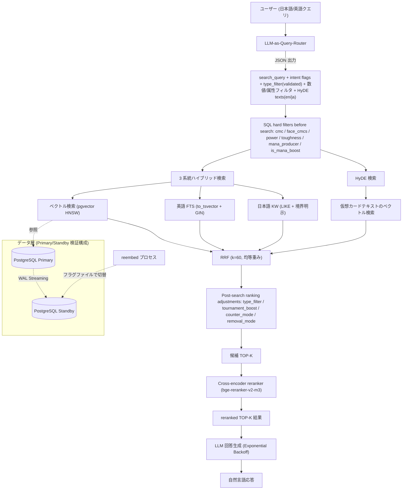
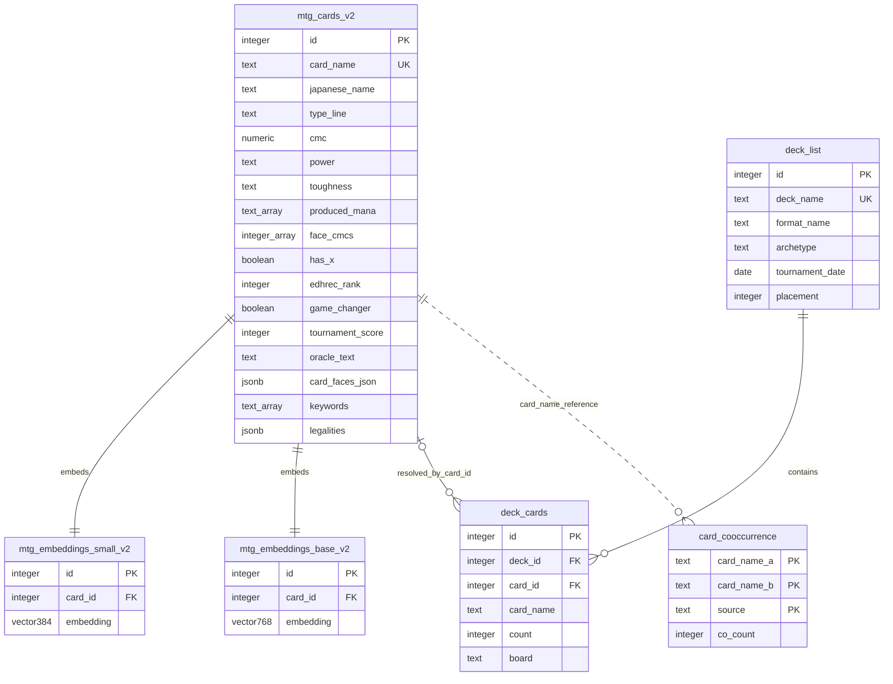

# MTG RAG System

Magic: The Gathering の **33,711 件**のカードデータを対象にした、日英バイリンガル対応の RAG / ハイブリッド検索の**プロトタイプ**。

PostgreSQL + pgvector を中心に、ベクトル検索・全文検索・RRF・HyDE・LLM-as-Query-Router・LLM による回答生成を組み合わせる。単なる LLM チャットラッパーではなく、**検索精度・DB インデックス・評価指標・reembed 中の可用性**を検証することを目的とした個人プロジェクトであり、**検索品質はまだ改善中**である。

---

## Highlights

- 約 33,000 件のカードデータ（うち検索対象 30,982 件・非リーガルは別テーブルに退避）を対象にした日英 RAG 検索（pgvector HNSW + 英語 FTS + 日本語 KW + HyDE の 4 系統ハイブリッド + 標準 RRF, k=60）
- RRF の重みを**グリッドサーチで実測**し、経験則だった Weighted RRF を均等重み（標準 RRF）に切り替え
- ルーター経路・3 段階 GT・決定的評価で、標準構成から日本語 HyDE / reranker / `is_mana_boost` を段階的に A/B し、NDCG@10 0.574 → 0.673、precision@5 0.787 → 0.940 の改善を確認
- HNSW パラメータを実機ベンチマークし、**少数の手動評価セットでは `ef_search` を上げてもベクトル検索単体の recall が改善しないケースを確認** → ハイブリッド検索を採用する根拠に
- LLM-as-Query-Router が数値・属性条件（マナ総量 / パワー / タフネス / マナ生成）を抽出し、**SQL ハードフィルタと意味検索を役割分担**
- 「マナクリーチャー」等の機能概念を手書きルールではなく **Scryfall の構造化データ（produced_mana）**で判定する方式へ転換
- reembed 中も検索を継続するための **PostgreSQL Primary/Standby 検証構成**（Zero-downtime Data Refresh パターンの検証。商用 HA ではない）

---

## プロジェクトステータス

| カテゴリ | 状態 |
| --- | --- |
| 4 系統ハイブリッド検索（ベクトル + 英語 FTS + 日本語 KW + HyDE） | プロトタイプ実装済み・評価中 |
| RRF 統合（重みグリッドサーチで決定） | 実装済み |
| LLM-as-Query-Router | 実装済み（数値・属性の構造化フィルタ対応） |
| 構造化メタデータフィルタ（cmc / face_cmcs / power / toughness / マナ生成 / is_mana_boost） | 実装済み。is_mana_boost はルーター経路評価で改善を確認（NDCG@10 0.661→0.673） |
| Scryfall 構造化メタデータ取り込み（produced_mana / edhrec_rank / game_changer） | DB 取り込み済み。produced_mana はフィルタで使用、edhrec_rank / game_changer は**未使用（検索品質への寄与は未検証）** |
| HyDE | 実装済み（英語＋日本語の 2 文で生成）。ルーター経路 A/B で主要指標改善 |
| HNSW パラメータベンチマーク（ef_search・m） | 完了 |
| LLM 生成レイヤ | 動作（現状 Gemini 2.5 Flash-Lite。AWS 移行時は Bedrock への切り替えを想定） |
| Primary/Standby 検証構成（reembed 中の読み取り継続） | ローカル検証済み |
| fallback（JSON parse / type_filter / HyDE） | 一部実装済み・異常系整理中 |
| EXPLAIN ANALYZE 解析・GIN インデックス | 実施済み（効果は参考値・後述） |
| SMALL / BASE モデルの比較 | 暫定比較・標準指標で再測定予定 |
| 評価フレームワーク（recall@k / precision@k / MRR / NDCG@10） | 実装済み。**ルーター経路・3 段階 GT・決定的**でベースライン取得＋各機能の A/B 済み（n=30・未ラベル混入率 0%） |
| Cross-encoder reranker | **実装済み**（bge-reranker-v2-m3・top-10 並べ替え）。A/B で precision@5 / MRR / NDCG@10 改善 |
| AWS サーバーレス構成 | 構成案作成済み・未デプロイ |
| メタデータ定期リフレッシュ（新セット検知・自動更新） | 設計のみ（構想）。現運用は手動更新 |
| IVFFlat と HNSW の実測比較 | 今後の検証項目 |

---

## アーキテクチャ（現行・ローカル）



ハードフィルタ（数値・属性条件）は検索前に SQL WHERE 句で適用し、ランキング調整（intent flags 等）は検索後に適用する。「意味検索とハード制約の分離」がこの構成の要点。

---

## データモデル

設計が伝わる主要テーブルと関係（評価ログ等は省略）。スキーマは実 DB から確認したもの。



設計判断:

- **1 対 1 属性は列に昇格し、テーブル分割しない**。`produced_mana (text[])` / `face_cmcs (int[])` / `has_x` / `edhrec_rank` / `game_changer` は `mtg_cards_v2` の列として持つ。汎用 key-value（EAV）は複合フィルタで self-JOIN が増えるため採らない。
- **embedding は別テーブルに分離**（`mtg_embeddings_small_v2` / `base_v2`、FK は CASCADE、HNSW 索引）。構造化列は embed_text に含めないため、列の追加・更新で **reembed（全件再ベクトル化）が不要**。
- **デッキとカードの多対多関係は `deck_cards` で正規化**。ただし `deck_cards.card_id` の backfill は道半ば（51.8%）で、検索・共起は `card_name` 基準のため read path 外（カタログ名一致は 97.3%）。「ほぼ全リンク」ではない点は正直に記す。
- **生データは JSONB/バルク、検索のホットパスで使う属性だけ列に昇格**（`legalities` / `card_faces_json` は JSONB で保持）。横長スカスカなテーブルを避ける方針。
- **リーガル / 非リーガルを分離**。vintage 非リーガル（un 系・Alchemy・リバランス版）約 2,700 枚を `*_nonlegal` テーブルへ退避し、検索対象コア（30,982 枚）をクリーンに保つ。

全テーブルの列・型・索引、`card_id` 紐付け率、非リーガル退避テーブルの詳細は [DATA_MODEL.md](./DATA_MODEL.md) を参照。

---

## AWS サーバーレス構成（構想・未デプロイ）

クラウド展開を見据えた**構成案**。**現時点では構想であり、デプロイ・IaC・各種設定の詰めは未実施。本 README に掲載している成果・評価値はすべてローカル PostgreSQL 環境で取得したものである。**


構想上のねらい:

- **ベクトル DB は Aurora serverless（旧 Aurora Serverless v2）+ pgvector を想定**。scale-to-zero（最小 0 ACU の auto-pause）によりアイドル時のコンピュート課金を抑えられる可能性がある（ストレージ課金は継続）。ただし、**Aurora クラスターに RDS Proxy を関連付けると、Proxy が DB インスタンスへの接続を維持するため、AWS ドキュメント上 Aurora serverless インスタンスは auto-pause しない**（RDS Proxy 自体にも時間課金がある）。そのため、**RDS Proxy による接続管理と scale-to-zero によるアイドル時コスト最適化は同時に成立しない前提**で、RDS Proxy を使う構成と使わない構成（直接接続＋接続数制御、Data API 等）を分けて比較検証する。停止からの復帰レイテンシ（目安 ~15 秒）・対応リージョン・pgvector との組み合わせも未実測・要確認。
- 埋め込みは自前ホスト（e5）、生成は Bedrock。Bedrock / Secrets Manager / CloudWatch 等は VPC エンドポイント経由とし、**NAT Gateway を常設しない**構成を目指す。図中の RDS Proxy は Lambda の接続枯渇対策としての配置案であり、前述の通り auto-pause との相性を含めて構成比較の対象。
- **メタデータ定期リフレッシュは構想段階**。edhrec_rank のような時間で変動するデータは取り込んで終わりにできないため、新セット検知 → 即時更新 → 約 3 週間後の再更新（発売直後はランクが不安定なため）という更新スケジュールを設計した。Scryfall は VPC エンドポイントを持たない外部サービスなので、**VPC 外の Lambda で取得し S3 を橋にして VPC 内から読む**ことで NAT Gateway を回避する。**現運用は手動更新**（新セットは 2〜3 ヶ月に 1 回であり、自動化インフラの構築労力に対して現段階では見合わないと判断）。

### 検討した代替案: S3 ロード型の軽量デモ（採用せず）

当初、DB の常時課金を避ける目的で「ベクトルとメタデータを S3 にエクスポートし、Lambda が読み込んで総当たり cosine + 簡易字句検索 + RRF を行う DB レス構成」を公開デモ用に検討した。33,711 件規模であれば総当たりで十分高速であり、**規模に対して索引（HNSW）が過剰になるケースでは使わない判断もある**、という整理は今も有効である。

ただし採用は見送った。理由は、(1) scale-to-zero を使う構成では DB 常時課金を抑えられる可能性があり（RDS Proxy を使う構成では接続管理を優先する）、アイドル時コストの問題はまず本番構成候補同士の比較検証で扱う方針としたこと、(2) DB レス構成でも e5 モデルを積むコンテナ Lambda のコールドスタート（数秒〜十数秒）は残り、「待ちゼロのデモ」にはならないこと、(3) pgvector / FTS / RRF の SQL ロジックを Python へ移植した第二のコードパスを維持するコストが見合わないこと。

---

## 主な特徴

### 1. 4 系統ハイブリッド検索 + 標準 RRF

ベクトル検索（pgvector HNSW）、英語 FTS（`to_tsvector` + GIN）、日本語 LIKE 検索、HyDE 検索を並列実行し、RRF（k=60, 均等重み）で統合する。重みは経験則ではなくグリッドサーチの実測で決定した（後述）。

### 2. LLM-as-Query-Router（3 回の設計試行を経た最終形）

LLM に JSON で `search_query` と意図フラグ（`tournament_boost` / `counter_mode` / `removal_mode` / `type_filter`）と HyDE テキストを 1 リクエストで抽出させる。`type_filter` はホワイトリスト（Creature / Instant / Sorcery / Enchantment / Artifact / Land / Planeswalker / Battle）で validation し、未知の値は警告ログを残して無視する。

さらにマナ総量・パワー・タフネス等の**数値条件**と、「マナを生み出すカードか」という**機能条件**（`mana_producer` フラグ）を抽出し、SQL のハードフィルタとして適用する（意味検索と構造化フィルタの両輪）。LLM 出力はルーター側で検証した上で、検索器側でも再検証する二重防御とし、SQL に LLM 出力を直接埋め込まない。

なお cmc 条件は単純なカラム比較ではなく、各面の「実際に撃てるマナ総量」の集合（`face_cmcs` 配列）に対する判定としている。分割カードは合計ではなく面ごとに、X 呪文は X=0 の種火コストで評価され、**ルール上の `mana_value` と実際に支払う castable cost が一致しないケース**を正しく扱う。X を持つカードは `has_x` フラグで識別し、列として保持するが自動フィルタには使わない（reranker・対話用）。

### 3. 手書きドメインルールから Scryfall 構造化データへ

「除去」「カウンター呪文」などの機能概念は当初、手書きの定義ファイル（`mtg_removal_rules.py` / `mtg_counter_rules.py`）で扱っていた。この方式はルールが増えるほど保守が重くなり、概念ごとに人手の定義を書き続けるのはスケールしないと判断した。

そこで、Scryfall が既に構造化して提供しているメタデータを利用する方向へ転換した。`enrich_scryfall_meta.py` で Scryfall バルクデータから 3 フィールドを DB に取り込んでいる:

| フィールド | 内容 | 現在の利用状況 |
| --- | --- | --- |
| `produced_mana` | そのカードが生み出すマナの色の配列 | **検索フィルタで使用中**。「マナクリーチャー」系クエリでは `type_filter=Creature` と produced_mana の存在判定を**組み合わせて**判定する（produced_mana 単独では土地・アーティファクトも含まれるため）。現状は「マナを生み出すか否か」の判定のみで、生成色による絞り込みは未実装 |
| `edhrec_rank` | EDHREC 由来の人気度ランク | 取り込みのみ。**ランキング・フィルタには未使用（検索品質への寄与は未検証）** |
| `game_changer` | 公式 Commander ブラケットの高影響カードフラグ | 取り込みのみ。**未使用（同上）** |

データモデリングは「生データはバルクファイル、検索のホットパスで使うものだけ列に昇格、1 対 1 属性をテーブル分割しない」方針とした。また、これらの列は embedding 対象テキストに含めないため、**追加・更新しても reembed（全件再ベクトル化）が不要**であり、検索を止めずにメタデータだけ更新できる。

なお、シングルトン構築の EDH（統率者戦）は「広大なカードプールから条件に合う 1 枚を探す」というこのシステムの検索特性と相性がよいと考えており、上記フィールドの選定もそれを意識しているが、**EDH 向けの有効性はまだ何も検証していない**。

Scryfall のフィールドだけで足りないときは、**定義を詰めて自前の構造化列を導出する**。例えば「マナクリーチャー（タダでマナを増やすランプ）」と「マナフィルター（マナを払って別のマナに変換）」は `produced_mana` の色配列が同一になり区別できない。そこで「産出マナ − 支払いマナ（土地は −1）> 0」という net-mana の定義でオラクルテキストを解析し、`is_mana_boost`（boolean）として事前計算した。これにより評価で最下位だった「1 マナのマナクリーチャー」が NDCG@10 0.42 → 0.66 に改善した。曖昧な機能概念をルールでその場凌ぎするのではなく、判定基準を言語化して列に落とす、という設計の実例。

### 4. HyDE（Hypothetical Document Embeddings）

抽象クエリに対し、LLM に「理想的なカードテキスト」を生成させ、そのベクトルで検索する。現行では英語 HyDE と日本語 HyDE の 2 文を生成し、HyDE 系の総重みが増えないよう英語/日本語を同じ HyDE 枠の中で融合する。通常検索結果と RRF でマージし、生成失敗時は通常検索に fallback する。

### 5. 日英バイリンガル対応

embed_text を日英混合で構築し `multilingual-e5` で embedding。「対抗呪文」と "counter spell" の両方で同一カードがヒットする。日本語オラクルは公式日本語版が存在するカードはほぼ充足しており、公式訳が存在しないカード（一部の特殊セット等）は英語を日本語フィールドに混ぜず NULL とする方針（「埋め残し」ではなく「埋めるものが無い」を区別する）。

### 6. reembed 中の読み取り継続（Primary/Standby 検証構成）

reembed（TRUNCATE → 全件再構築）の間も検索を止めないため、Docker 上で PostgreSQL Primary/Standby を構築し、フラグファイルで Standby に切り替える機構を実装。これは **Read Replica を Zero-downtime Data Refresh に応用したパターンの検証**であり、障害検知・自動フェイルオーバー・SLA 等を備えた商用 HA ではない。

---

## 開発アプローチ（AI 支援開発と技術判断）

本プロジェクトは AI コーディング支援を積極的に使って構築している。著者の役割は打鍵量ではなく、**アーキテクチャ選定・評価設計・AI 出力のレビューと意思決定**に置いている。判断例:

- **可用性設計**: reembed 中のダウンタイムという課題から逆算し、Streaming Replication を「読み取り継続のための仕組み」として設計した。
- **Query Rewriting の 3 回試行**: 英語化 → フラグのみ → JSON 出力と作り直し、「変換の粒度を誤ると検索系全体の設計と矛盾する」ことを実体験から得た。
- **手書きルールの放棄**: 機能概念を手書き定義で増やし続ける方式の限界を認め、外部の構造化データ（Scryfall）へ寄せる方針転換を行った。
- **ベクトル検索の限界の確認**: HNSW パラメータを実機ベンチマークし、少数評価セットではベクトル単独の recall が頭打ちになるケースを測定 → ハイブリッド検索が必要な理由を数値で説明できるようにした。
- **経験則の棄却**: Weighted RRF をグリッドサーチで検証し、自分の仮説（英語 FTS の重みを下げる）が実測で支持されないと分かった時点で標準 RRF に戻した。
- **代替案の棄却**: S3 ロード型デモ構成を、DB レス化の利点よりも pgvector / FTS / RRF の第二コードパスを維持するコストが大きいと判断して採用見送りとした（前述）。

---

## 主な設計判断

### RRF の重みはグリッドサーチで決定

当初は Weighted RRF（ベクトル 2.0 / 英語 FTS 1.5 / 日本語 FTS 2.0）を採用していたが、英語 FTS の重みを下げていたのは経験則で定量根拠がなかった。`hybrid_benchmark.py` で 10 パターンを実機検証した結果、**均等重み（1.0, 1.0, 1.0）の標準 RRF が KG 率で最良タイ**であり、最もシンプルでスコア正規化バイアスもないため標準 RRF を採用した。

### ハイブリッド検索を選んだ理由

ベクトル検索単体では多義語や完全一致クエリの精度が不安定だった。HNSW パラメータを `ef_search` 10〜500 で実機ベンチマークしたところ、**少数の手動評価セットではベクトル検索単体の recall が約 7.3% で頭打ち**となり、探索パラメータを上げても改善しなかった。原因の断定（モデルの限界か評価設計か等）は統制実験をしていないため避けるが、少なくとも HNSW のチューニングだけでは伸びないことが分かり、語彙検索との組み合わせ（ハイブリッド）の必要性を裏付けた。

### HNSW を初期選択にした理由 / パラメータ

約 3 万件規模では HNSW のメモリコストが許容範囲。`m=16`（`m=32` はサイズ約 2 倍・速度 1.5 倍の割に `ef_search>=20` では recall 改善がほぼ無い）、`ef_search=20` を採用。IVFFlat との実測比較は今後の検証項目。

### HNSW + 選択的フィルタの取りこぼし対策

構造化フィルタの導入時、HNSW 近似検索に選択的な WHERE 句を組み合わせると候補の取りこぼしが発生することを実測した（フィルタ通過行が少ないほど顕著）。pgvector 0.8 の `hnsw.iterative_scan = relaxed_order` を有効化することで、`ef_search` を上げずに解消した。近似インデックスとハードフィルタの組み合わせはベクトル DB 運用の実務的な落とし穴であり、パラメータで殴る前に機能で解決できるかを確認する例となった。

### SMALL（384d）を主採用にした理由（暫定比較）

SMALL と BASE をハイブリッド検索全体で暫定比較した。

| 指標 | SMALL (384d) | BASE (768d) |
| --- | --- | --- |
| 平均 KW 一致率 | 68.6% | 67.1% |
| 平均 KG 率 | 12.9% | 14.3% |
| 平均実行時間 | 719ms | 1074ms |

精度差は小さく（KG +1.4 ポイント）速度差は約 1.5 倍のため SMALL を採用。LARGE（1024d）は現行の評価ハーネス導入前に初期検証し、当時 SMALL を上回らなかったため見送ったが、再測定可能な結果ファイルは現リポジトリには残していない。これらは標準指標での再測定を予定している。

### LLM の選定

開発フェーズでは無料枠の Gemini 2.5 Flash-Lite を採用（短いクエリ意図解析と RAG 応答という用途に合致）。AWS 移行フェーズでは Bedrock への切り替えと回答品質の比較を想定している。LLM 呼び出し部はプロバイダ非依存に分離する方針で、ルーターのプロンプトと filters 抽出・検証ロジックは移行時にそのまま再利用できる構造を目指している。

---

## パフォーマンスとベンチマーク

> 以下の HNSW / RRF / GIN は**開発初期**の少数クエリ（5〜7 件）＋独自指標（KW 率 / KG 率）による**暫定値**。標準指標（recall@k / NDCG 等・n=30・ルーター経路）による現行の評価は末尾「評価フレームワーク」を参照。
> ここでの **KW 率**はキーワード一致系の簡易指標、**KG 率**は手動 ground truth（クエリごとに想定した正解カード集合）に対するヒット率を表す独自の暫定指標である。

### HNSW パラメータ（m=16, 評価 5 クエリ, top_k=10）

| ef_search | recall | avg(ms) | p95(ms) |
| --- | --- | --- | --- |
| 10 | 3.3% | 1.9 | 3.6 |
| 20 | 7.3% | 1.9 | 3.3 |
| 40 | 7.3% | 2.5 | 3.9 |
| 100 | 7.3% | 3.1 | 4.7 |
| 500 | 7.3% | 7.6 | 10.2 |

`ef_search>=20` で recall が頭打ち（評価セットが小さい点に留意）。`m=32` は `ef_search=10` でのみ改善し、サイズ 2 倍・速度 1.5 倍の不利が大きいため `m=16` を採用。

### RRF 重みグリッドサーチ（SMALL, 抜粋・暫定指標）

| 重み (vec/en/ja) | KW 率 | KG 率 |
| --- | --- | --- |
| (2.0, 1.5, 2.0) | 60.0% | 15.7% |
| (1.0, 1.0, 1.0) | 61.4% | 17.1% |
| (1.0, 2.0, 1.0) | 64.3% | 15.7% |
| (1.0, 4.0, 1.0) | 58.6% | 11.4% |

均等重みが KG 率で最良タイ。英語 FTS の重みを上げると KW 率は上がるが KG 率は下がる。

### GIN インデックスの効果（参考・単一クエリ）

英語 FTS が Seq Scan になっていたため `to_tsvector` に GIN インデックスを追加した。単一クエリの全体応答時間で比較すると改善が見られた（例: あるクエリで約 7 倍）。これは FTS 単体を統制したマイクロベンチマークではなく全体応答時間ベースの参考値であり、FTS 単体の before/after の再測定は今後の課題。

### 構造化フィルタの効果（制約充足率・決定的テスト）

数値・属性条件を含むクエリについて、上位 10 件が制約を満たす割合（constraint satisfaction）をフィルタ有無で比較した（filters を直接指定する決定的テスト・LLM 不使用）。ここでは LLM ルーターの抽出精度は評価しておらず、**正しい filter が与えられた場合に検索器が制約を守れるか**だけを検証している。

| クエリ条件 | フィルタなし | フィルタあり |
| --- | --- | --- |
| 1 マナのマナクリーチャー（cmc=1） | 0/10 | 10/10 |
| 2 マナ以下のカウンター（cmc≤2） | 7/10 | 10/10 |
| パワー 5 以上（power≥5） | 1/10 | 10/10 |

これは**ハード制約の充足率であって relevance（NDCG 等）の改善ではない**。relevance への効果は本表ではなく、後述のルーター経路評価で一部確認している（is_mana_boost 列の寄与など）。

### 評価フレームワーク（標準指標・ルーター経路・決定的）

recall@k / precision@k / MRR / NDCG@10 と 3 段階の relevance（`human_grade` 0/1/2）を扱う評価ハーネスを実装。**クエリルーター経路を通した決定的な評価**で、各機能の寄与を同一条件の A/B で測定している（GT は n=30 クエリ・714 採点ペア。**未ラベル混入率 0%**＝評価が信頼できる状態）。

各構成要素を積み上げたときの指標の推移（すべてルーター経路・同一拡張 GT・決定的）:

| 構成 | NDCG@10 | precision@5 | MRR |
| --- | --- | --- | --- |
| ベース（英語 FTS + ベクトル + RRF） | 0.574 | 0.787 | 0.894 |
| ＋ 日本語 HyDE | 0.637 | 0.860 | 0.933 |
| ＋ cross-encoder reranker（bge-reranker-v2-m3） | 0.661 | 0.907 | 0.961 |
| ＋ is_mana_boost 列（マナ加速の構造化判定） | **0.673** | **0.940** | **0.983** |

各段で指標が単調に改善している。注意点（盛り抑制）:

- **GT 拡張の方法論**: 構成を変えると上位に新顔カードが入り「無関連」と「未採点」が混ざる（被覆バイアス）。各段で新規上位を採点して GT を拡張し、**未ラベル混入率を 0% に保ったうえで**比較している。被覆バイアスを放置した初期は日本語 HyDE 追加が一見"悪化"して見えたが、これは GT を英語側の上位で作っていたためで、採点を広げて解消した（この方法論自体が評価設計の要点）。
- **recall の絶対値は GT 規模に依存する**ため主指標にしない（順位の質を測る NDCG@10 / precision@5 / MRR で判断）。reranker は候補集合を変えない「top-10 並べ替え」モードのため recall@10 は不変。
- 旧版の暫定ベースライン（searcher 直呼び・10 段階 GT）とは GT・embedding・経路が異なるため直接比較しない。

---

## Fallback 設計

| ケース | 状況 | 挙動 |
| --- | --- | --- |
| JSON parse 失敗 | 実装済み | 原文クエリ・全フラグ False で通常検索に fallback |
| LLM リトライ枯渇 | 暗黙的 | HTTP ステータス別メッセージを返す。検索結果は出ている |
| 無効な type_filter | 実装済み | ホワイトリストで弾き、警告ログを残してフィルタなしで検索 |
| HyDE 生成失敗 | 実装済み | 通常検索のみで続行 |

異常系の網羅的な整理は進行中。

---

## Current Limitations

本プロジェクトは実験段階の RAG / ハイブリッド検索プロトタイプであり、すべての自然言語クエリに対して安定した回答品質を保証するものではない。

特に、**マナ総量・カードタイプ・色・フォーマットなどの構造化条件を含むクエリでは、ベクトル検索のみでは条件が曖昧化する**ことがある。この課題への対応として、自然言語クエリから構造化可能な条件（`mana_value`・パワー・タフネス・`type_filter`・マナ生成の有無）を LLM クエリプランナーで抽出し、SQL のハードフィルタで厳密に絞り込み、曖昧な意味部分のみをベクトル検索・FTS・HyDE・RRF に委ねる**構造化メタデータフィルタを実装済み**。ルーター経路での評価で is_mana_boost 列の寄与（NDCG@10 等の改善）は確認済みだが、構造化フィルタ全体の網羅的な効果測定は途上である。

また、**検索結果の関連度が低い場合に LLM がもっともらしいが根拠の弱い回答を生成してしまう**現象も確認している。

取り込み済みの Scryfall メタデータのうち、edhrec_rank / game_changer はまだ検索に使われておらず、produced_mana フィルタも色指定の絞り込みには未対応である。

---

## 対応した技術課題（抜粋）

- **データ品質**: Scryfall の一部セットで日本語フィールドに英語が混入 → `is_japanese()` の文字種チェックで除外。EOE 系では embed_text の日本語スロットに英語が二重化し検索プールを占有していたため、ビルダーを修正・再ベクトル化して過剰出現を解消（特定クエリでのプール占有 14%→2%）。
- **両面・分割カードの日本語名欠落**: 本文は `card_faces` を連結するのに、名前は top-level のみ参照する非対称があり、両面系（transform / adventure / split / modal_dfc / flip）の `japanese_name` が空になっていた → 外部辞書から面ごとに補填（例: `Wear // Tear → 摩耗 // 損耗`）。in-band の番兵値（全角スペース）も廃止し NULL に統一した。
- **ソース照合による正確性監査**: 全カードを Scryfall バルクデータと突き合わせ、`layout` 25 件・`power`/`toughness` 6 件の誤り（Eternalize の同名トークンを誤参照していた等）を発見して正準値へ修正。さらに、過少カウントだった自前の監査自体を再監査し、単面カードの英語名残りの取りこぼしを補足した（日本語版が存在しないカードは英語を残さず NULL に統一）。
- **取り込みの取りこぼしと再設計**: 旧取り込みが `ON CONFLICT(card_name) DO NOTHING` を使っていたため、同名のトークン/playtest 版に本物のカードが弾かれて 50 件欠落していた → `oracle_cards`（名前単位）起点で本物カードを解決する冪等同期 `sync_oracle_cards.py` に再設計。dry-run が「不在の NULL を空配列に書き換える 28,419 件の偽差分」を適用前に捕捉し、正規化比較（NULL/`''`/`[]` を等価扱い）で解消した。正準ソースとの冪等同期＋ dry-run レビューの実例。
- **検索結果の非決定性**: HyDE 検索の結果融合が Python の `set` のハッシュ順に依存し、同点カードの並びが実行ごとにブレて評価が再現しなかった → 名前をタイブレーカーにして決定化（`sort(key=(-score, name))`）。FTS 側の `c.id` 同点処理に続く 2 件目の決定性修正で、評価が「実行ごとにブレる」から「決定的に再現可能」になった。
- **キーワード境界**: `LIKE '%飛行%'` が「飛行カウンター」等に誤ヒット → パラメータバインディングで境界を明示。
- **多義語**: 護法テキストの「打ち消す」がカウンター呪文クエリに混入 → `counter_mode` で動的にペナルティ。
- **HNSW × 選択的フィルタの取りこぼし**: 近似検索＋WHERE 句で候補が欠落 → `hnsw.iterative_scan = relaxed_order` で解消。
- **psycopg2 の `%` 衝突**: `LIKE '%Instant%'` がプレースホルダと衝突 → `%%` でエスケープ。
- **外部 LLM の信頼性**: 429/503 に Exponential Backoff + Jitter。API キーを含む URL をログに出さない。LLM 出力は検証してから使用し、SQL に直接埋め込まない。
- **DB 認証情報**: 直書きを排除し `db_config.py` + `.env`（gitignore）+ Secrets Manager 想定に外部化。

---

## セットアップ（開発者向け・暫定）

> Python ライブラリの依存は `requirements.txt`、PostgreSQL（Primary/Standby）は `docker-compose.yml` で起動できる（`docker compose up -d`）。ただし `scripts/` へのファイル整理や、clone してそのまま全工程が通るワンコマンド化までは未整備。以下は開発中環境の実行手順メモであり、この通りに実行しても環境差で動かない可能性がある。

```bash
# 1. 環境変数
cp .env.example .env   # DB 接続情報を設定（認証情報はコミットしない）

# 2. PostgreSQL（Primary/Standby）を docker-compose で起動
docker compose up -d

# 3. Python 依存のインストール（venv 推奨）
pip install -r requirements.txt

# 4. データ取り込み（Scryfall 等の公式 API から各自取得）
python sync_oracle_cards.py        # 英語カードを oracle_cards 起点で冪等同期（dry-run レビュー付き。旧 import_cards.py は embedding 修復用途で残置）
python extract_japanese.py         # 日本語テキストの別パイプライン（whisper 等）
python rebuild_embed_text.py --reembed
python enrich_scryfall_meta.py     # Scryfall 構造化メタデータの付与（reembed 不要）

# 5. 検索
python mtg_hybrid_search_v2.py "純粋に強いカウンター呪文"

# 6. LLM 連携
python mtg_rag_agent.py questions.txt
```

カードデータ本体・API キーはリポジトリに含めない。

---

## データ規模

| 指標 | 数値 |
| --- | --- |
| 検索対象カード（リーガル・embedding 済み） | 30,982（mtg_cards_v2 / SMALL / BASE の三表一致） |
| 非リーガル（un 系 / Alchemy 等・別テーブルに退避・検索対象外） | 約 2,700 |
| SMALL / BASE embedding | 各 30,982 件（vector 384 / 768 次元） |
| デッキ内カードのカタログ名一致率（card_name） | 97.3%（280,399 / 288,054） |
| 大会デッキ（MTGTop8, 増加中） | 2,300 件以上 |

---

## 学び

- **検索精度がシステム全体の品質を決める**: 検索が正確なクエリでは LLM の回答品質が高く、弱いクエリでは LLM がこじつける。retrieval の品質が回答品質を規定することを実測で確認した。
- **経験則は実測で検証する**: Weighted RRF の重みを実測で見直し、仮説が支持されない時に仮説を捨てる判断を実践した。
- **評価はまず再現性を疑う**: HyDE 融合後の実行間ブレを調査し、Python `set` の非決定的な順序と RRF 同点処理を原因として特定した。A/B 評価の前に、評価結果が決定的に再現できる状態を作る重要性を確認した。
- **意味検索とハード制約は別物**: dense retrieval は「1 マナ」のような厳密な数値条件を表現できない。構造化フィルタとの役割分担が必要であることを評価の失敗ケース（rel=0 クエリ）から学んだ。
- **手書きルールはスケールしない**: 機能概念の定義を人手で増やし続けるより、外部の構造化データに寄せる方が保守可能性が高い。
- **計測してからチューニングする**: EXPLAIN ANALYZE で Seq Scan を特定してから GIN を入れた。

---

## 今後の展望

- 評価セットを Easy / Medium / Hard に層化し、クエリ難度別の NDCG@10 / precision@5 を測定する（難クエリと簡単クエリを分けて管理する）。
- reranker の候補生成上限を確認するため、top-50 / top-100 の oracle NDCG（理想的な並べ替えでの上限値）を測り、「候補生成の不足」か「並べ替えの不足」かを切り分ける。
- 取り込み済みメタデータの活用検証（produced_mana の生成色指定対応、edhrec_rank / game_changer の検索品質への寄与測定）。
- 検索結果の信頼度が低い場合に LLM が無理に回答しないための **quality gate** の追加（構造化条件に合わない候補の除外、候補数不足時の低信頼判定、根拠不足時の回答抑制）。
- GIN 効果・LARGE 比較の再測定（統制された条件で）。
- 公開デモ方針の整理（ローカル PC / Tunnel による限定公開と、AWS 版デプロイの段階分け）。AWS 版では Aurora Serverless v2 / Bedrock / API Gateway + Lambda / Cognito / S3 + CloudFront を段階的に検証する。

---

## Disclaimer / 免責事項

This project is an unofficial fan-made research and engineering project and is **not affiliated with, endorsed, sponsored, or approved by Wizards of the Coast, Scryfall, MTGJSON, or any tournament data provider**. Magic: The Gathering and related names are trademarks of Wizards of the Coast LLC.

The MIT License in this repository applies only to the source code written for this project, and **does not grant any rights to Magic: The Gathering card data, names, images, mana symbols, trademarks, or third-party datasets**.

本プロジェクトは個人の研究・エンジニアリング目的の非公式ファンプロジェクトであり、Wizards of the Coast 等とは一切の提携・後援関係を持たない。カードデータ・API キーはリポジトリに含まれず、各自が公式 API から取得する。

---

## ライセンス

MIT License - 詳細は `LICENSE` を参照。ライセンスはソースコードにのみ適用され、カードデータ・名称・画像・商標等の権利は別である。
