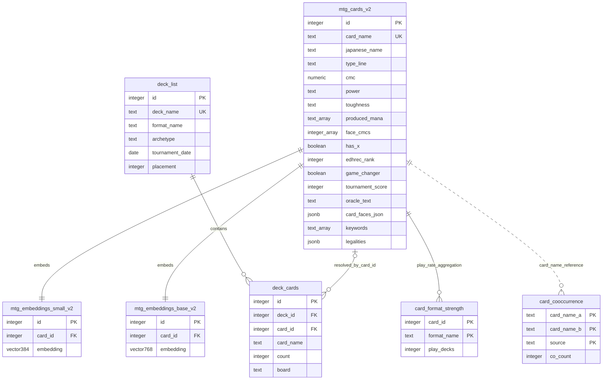
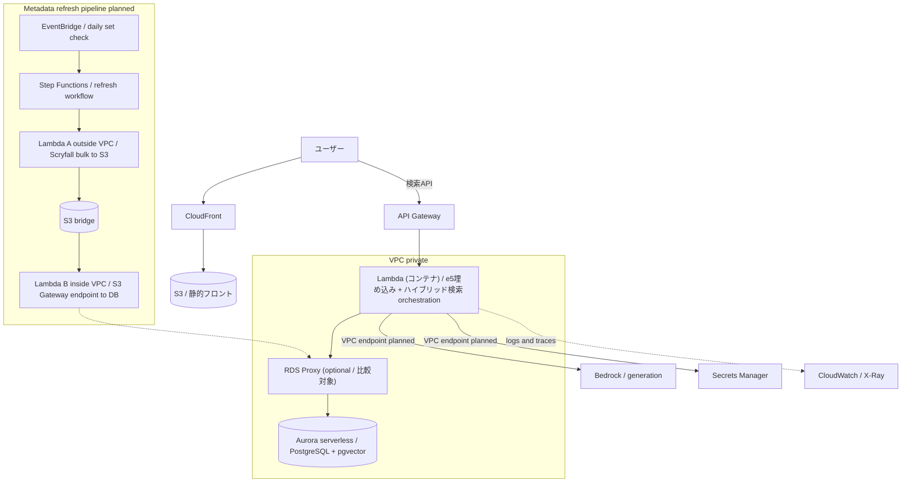

# MTG RAG System

Magic: The Gathering の **約 34,000 件**のカードデータ（うち検索対象コア **30,982 件**）を対象にした、日英バイリンガル対応の RAG / ハイブリッド検索の**プロトタイプ**。

PostgreSQL + pgvector を中心に、ベクトル検索・全文検索・RRF・HyDE・LLM-as-Query-Router・LLM による回答生成を組み合わせる。単なる LLM チャットラッパーではなく、**検索精度・DB インデックス・評価指標・reembed 中の可用性**を検証することを目的とした個人プロジェクトであり、**検索品質はまだ改善中**である。

---

## Highlights

- 約 34,000 件のカードデータ（うち検索対象 30,982 件・非リーガル 2,779 は別テーブルに退避）を対象にした日英 RAG 検索（pgvector HNSW + 英語 FTS + 日本語 KW + HyDE の 4 系統ハイブリッド + 標準 RRF, k=60）
- RRF の重みを**グリッドサーチで実測**し、経験則だった Weighted RRF を均等重み（標準 RRF）に切り替え
- ルーター経路・3 段階 GT・決定的評価で、標準構成から日本語 HyDE / reranker / `is_mana_boost` を段階的に A/B し、NDCG@10 0.574 → 0.673、precision@5 0.787 → 0.940 の改善を確認
- その後**採点規約を明文化して GT を厳格化**（R1〜R12・「最強」系は大会 play-rate 機械採点）、さらに**大会 play-rate を検索ランキングと候補生成へ接続**（play-rate 上位を候補に加える「強度腕」＝「純粋に強いカード」を 0.36→0.82 に）し、oracle テキストから導出した**除去の役割列**で強度腕に役割ゲートを実装（「最強の単体除去」0.33→0.78）。**現行の正準値は NDCG@10 0.760 / precision@5 0.933 / MRR 0.983（未ラベル混入 0.0%・GT 1,060 採点ペア）**。ただしこの区間は採点基準そのものも厳密化しているため、過去値との単純な差分では読まない（詳細と正準の系譜は [EVAL_SCORES.md](./EVAL_SCORES.md)）
- **人手採点が検索実装の実バグを発見**: クエリ拡張辞書の部分文字列衝突（「ランプ」が「ト*ランプ*ル」に誤一致し土地サーチを注入）を採点中の違和感から特定・修正 → 該当クエリ NDCG@10 0.79 → 0.91。評価を「スコア測定」でなくデバッグ装置として機能させた実例
- MTGTop8 の**大会デッキ 6,990 件**を取り込み、名寄せ（card_id 解決 99.96%）の上でカード×フォーマット別の採用デッキ数（play-rate）を事前集計。「最強」「環境」系クエリの接地に使用（**GT の機械採点と、検索の候補生成・ランキングの両方へ接続済み**）
- HNSW パラメータを実機ベンチマークし、**少数の手動評価セットでは `ef_search` を上げてもベクトル検索単体の recall が改善しないケースを確認** → ハイブリッド検索を採用する根拠に
- LLM-as-Query-Router が数値・属性条件（マナ総量 / パワー / タフネス / マナ生成）を抽出し、**SQL ハードフィルタと意味検索を役割分担**
- ルーターの外部 API 依存を外す検証として、**ローカル 7B モデル（Ollama / qwen2.5:7b 量子化版・民生 GPU）を本番スキーマ（15 フィールド）のままプロンプト調整**し、意図フラグ 4 系統（tournament_boost / removal / counter / format）で Gemini 参照と **30/30 一致**。「小型モデルにはスキーマを削って合わせる」という初期試作の前提を覆した（詳細は「主な設計判断」）
- 「マナクリーチャー」等の機能概念を手書きルールではなく **Scryfall の構造化データ（produced_mana）**で判定する方式へ転換
- reembed 中も検索を継続するための **PostgreSQL Primary/Standby 検証構成**（Zero-downtime Data Refresh パターンの検証。商用 HA ではない）

---

## プロジェクトステータス

| カテゴリ | 状態 |
| --- | --- |
| 4 系統ハイブリッド検索（ベクトル + 英語 FTS + 日本語 KW + HyDE） | プロトタイプ実装済み・評価中 |
| RRF 統合（重みグリッドサーチで決定） | 実装済み |
| LLM-as-Query-Router | 実装済み（数値・属性の構造化フィルタ対応） |
| 構造化メタデータフィルタ（cmc / face_cmcs / power / toughness / マナ生成 / is_mana_boost） | 実装済み。is_mana_boost はルーター経路評価で改善を確認（NDCG@10 0.661→0.673） |
| Scryfall 構造化メタデータ取り込み（produced_mana / edhrec_rank / game_changer） | DB 取り込み済み。produced_mana はフィルタで使用、edhrec_rank / game_changer は**未使用（検索品質への寄与は未検証）** |
| HyDE | 実装済み（英語＋日本語の 2 文で生成）。ルーター経路 A/B で主要指標改善 |
| HNSW パラメータベンチマーク（ef_search・m） | 完了 |
| LLM 生成レイヤ | 動作（現状 Gemini 2.5 Flash-Lite。AWS 移行時は Bedrock への切り替えを想定） |
| ローカル 7B ルーター（Ollama / qwen2.5:7b） | 本番スキーマのまま 30 クエリ検証済み（プロンプト調整で意図フラグ 4 系統 30/30）。GT に触らない開発用途に採用可・評価キャッシュは Gemini 続投 |
| Primary/Standby 検証構成（reembed 中の読み取り継続） | ローカル検証済み |
| fallback（JSON parse / type_filter / HyDE） | 一部実装済み・異常系整理中 |
| EXPLAIN ANALYZE 解析・GIN インデックス | 実施済み（効果は参考値・後述） |
| SMALL / BASE モデルの比較 | 暫定比較・標準指標で再測定予定 |
| 評価フレームワーク（recall@k / precision@k / MRR / NDCG@10） | 実装済み。**ルーター経路・3 段階 GT・決定的**でベースライン取得＋各機能の A/B 済み（n=30・GT 1,060 採点ペア・未ラベル混入率 0.0%）。採点規約（機能・機構ベース）を明文化して運用。「最強」系は大会 play-rate による機械採点（循環評価の回避策込み） |
| 大会 play-rate のランキング接続（強度腕） | 実装済み。play-rate 上位を候補生成に加える第4の検索腕＋GT の機械採点。「純粋に強いカード」0.36→0.82。役割つきクエリ向けの役割ゲート（除去/カウンターの構造化判定）も実装済み＝「最強の単体除去」0.33→0.78 |
| Cross-encoder reranker | **実装済み**（bge-reranker-v2-m3・top-10 並べ替え）。A/B で precision@5 / MRR / NDCG@10 改善 |
| 大会デッキデータ（MTGTop8） | 6,990 デッキ取り込み・名寄せ済み（card_id 解決 99.96%）・フォーマット別 play-rate 事前集計済み。**検索への接続済み**（強度腕＋play-rate ブースト） |
| AWS サーバーレス構成 | 構成案作成済み・未デプロイ |
| メタデータ定期リフレッシュ（新セット検知・自動更新） | 設計のみ（構想）。現運用は手動更新 |
| IVFFlat と HNSW の実測比較 | 今後の検証項目 |

---

## アーキテクチャ（現行・ローカル）


ハードフィルタ（数値・属性条件）は検索前に SQL WHERE 句で適用し、ランキング調整（intent flags 等）は検索後に適用する。「意味検索とハード制約の分離」がこの構成の要点。

---

## データモデル

設計が伝わる主要テーブルと関係（評価ログ等は省略）。スキーマは実 DB から確認したもの。



設計判断:

- **1 対 1 属性は列に昇格し、テーブル分割しない**。`produced_mana (text[])` / `face_cmcs (int[])` / `has_x` / `edhrec_rank` / `game_changer` は `mtg_cards_v2` の列として持つ。汎用 key-value（EAV）は複合フィルタで self-JOIN が増えるため採らない。
- **embedding は別テーブルに分離**（`mtg_embeddings_small_v2` / `base_v2`、FK は CASCADE、HNSW 索引）。構造化列は embed_text に含めないため、列の追加・更新で **reembed（全件再ベクトル化）が不要**。
- **デッキとカードの多対多関係は `deck_cards` で正規化**。スクレイプ由来の名前ゆれ（`[]` 接頭辞・分割カードの旧区切り ` / `・両面カードの表面名）を正規化して `card_id` を解決し、紐付け率 51.8% → **99.96%**（残 119 行は Planechase 次元カード等、カード DB の対象外＝正当な未解決を NULL で表現）。
- **生データは JSONB/バルク、検索のホットパスで使う属性だけ列に昇格**（`legalities` / `card_faces_json` は JSONB で保持）。横長スカスカなテーブルを避ける方針。
- **リーガル / 非リーガルを分離**。Vintage 非リーガル（un 系・Alchemy・リバランス版）約 2,700 枚を `*_nonlegal` テーブルへ退避し、検索対象コア（30,982 枚）をクリーンに保つ。

全テーブルの列・型・索引、`card_id` 紐付け率、非リーガル退避テーブルの詳細は [DATA_MODEL.md](./DATA_MODEL.md) を参照。

---

## AWS サーバーレス構成（構想・未デプロイ）

クラウド展開を見据えた**構成案**。**現時点では構想であり、デプロイ・IaC・各種設定の詰めは未実施。本 README に掲載している成果・評価値はすべてローカル PostgreSQL 環境で取得したものである。**



構想上のねらい:

- **ベクトル DB は Aurora serverless（2026 年 4 月に「Aurora Serverless v2」から改称）+ pgvector を想定**。scale-to-zero（最小 0 ACU の auto-pause）によりアイドル時のコンピュート課金を抑えられる可能性がある（ストレージ課金は継続）。ただし、**Aurora クラスターに RDS Proxy を関連付けると、Proxy が DB インスタンスへの接続を維持するため、AWS ドキュメント上 Aurora serverless インスタンスは auto-pause しない**（RDS Proxy 自体にも時間課金がある）。そのため、**RDS Proxy による接続管理と scale-to-zero によるアイドル時コスト最適化は同時に成立しない前提**で、RDS Proxy を使う構成と使わない構成（直接接続＋接続数制御、Data API 等）を分けて比較検証する。停止からの復帰レイテンシ（目安 ~15 秒。24 時間以上停止するとより深い休止に入り 30 秒以上）・対応リージョン・pgvector との組み合わせも未実測・要確認。
- 埋め込みは自前ホスト（e5）、生成は Bedrock。Bedrock / Secrets Manager / CloudWatch 等は VPC エンドポイント経由とし、**NAT Gateway を常設しない**構成を目指す。図中の RDS Proxy は Lambda の接続数枯渇対策としての配置案であり、前述の通り auto-pause との相性を含めて構成比較の対象。
- **メタデータ定期リフレッシュは構想段階**。edhrec_rank のような時間で変動するデータは取り込んで終わりにできないため、新セット検知 → 即時更新 → 約 3 週間後の再更新（発売直後はランクが不安定なため）という更新スケジュールを設計した。Scryfall は VPC エンドポイントを持たない外部サービスなので、**VPC 外の Lambda で取得し S3 を橋にして VPC 内から読む**ことで NAT Gateway を回避する。**現運用は手動更新**（新セットは 2〜3 ヶ月に 1 回であり、自動化インフラの構築労力に対して現段階では見合わないと判断）。

### 検討した代替案: S3 ロード型の軽量デモ（採用せず）

当初、DB の常時課金を避ける目的で「ベクトルとメタデータを S3 にエクスポートし、Lambda が読み込んで総当たり cosine + 簡易字句検索 + RRF を行う DB レス構成」を公開デモ用に検討した。33,711 件規模であれば総当たりで十分高速であり、**規模に対して索引（HNSW）が過剰になるケースでは使わない判断もある**、という整理は今も有効である。

ただし採用は見送った。理由は 3 点ある。第一に、scale-to-zero を使う構成では DB 常時課金を抑えられる可能性があり（RDS Proxy を使う構成では接続管理を優先する）、アイドル時コストの問題はまず本番構成候補同士の比較検証で扱う方針とした。第二に、DB レス構成でも e5 モデルを積むコンテナ Lambda のコールドスタート（数秒〜十数秒）は残り、「待ちゼロのデモ」にはならない。第三に、pgvector / FTS / RRF の SQL ロジックを Python へ移植した第二のコードパスを維持するコストが見合わない。

---

## 主な特徴

### 1. 4 系統ハイブリッド検索 + 標準 RRF

ベクトル検索（pgvector HNSW）、英語 FTS（`to_tsvector` + GIN）、日本語 LIKE 検索、HyDE 検索を並列実行し、RRF（k=60, 均等重み）で統合する。重みは経験則ではなくグリッドサーチの実測で決定した（後述）。

### 2. LLM-as-Query-Router（3 回の設計試行を経た最終形）

LLM に JSON で `search_query` と意図フラグ（`tournament_boost` / `counter_mode` / `removal_mode` / `type_filter`）と HyDE テキストを 1 リクエストで抽出させる。`type_filter` はホワイトリスト（Creature / Instant / Sorcery / Enchantment / Artifact / Land / Planeswalker / Battle）で validation し、未知の値は警告ログを残して無視する。

さらにマナ総量・パワー・タフネス等の**数値条件**と、「マナを生み出すカードか」という**機能条件**（`mana_producer` フラグ）を抽出し、SQL のハードフィルタとして適用する（意味検索と構造化フィルタの両輪）。LLM 出力はルーター側で検証した上で、検索器側でも再検証する二重防御とし、SQL に LLM 出力を直接埋め込まない。

なお cmc 条件は単純なカラム比較ではなく、各面の「実際に撃てるマナ総量」の集合（`face_cmcs` 配列）に対する判定としている。分割カードは合計ではなく面ごとに、X 呪文は X=0 の種火コストで評価され、**ルール上の `mana_value` と実際に支払う castable cost が一致しないケース**を正しく扱う。X を持つカードは `has_x` フラグで識別し、列として保持するが自動フィルタには使わない（reranker・対話用）。

### 3. 手書きドメインルールから Scryfall 構造化データへ

「除去」「カウンター呪文」などの機能概念は当初、手書きの定義ファイル（キーワードの AND/NOT 条件でペナルティを掛ける方式）で扱っていた。この方式はルールが増えるほど保守が重くなり、概念ごとに人手の定義を書き続けるのはスケールしないと判断した。この移行は 2026-07 に完了している——役割判定は、Scryfall の構造化フィールドに加えて、oracle テキストから自前で導出した構造化列（`target_types`＝何を対象に取るか / `removal`＝除去メカ種別と恒久性。ブリンクのような「追放してすぐ戻す＝除去でない」も恒久性フラグで機械判定できる）へ全面的に置き換え、手書き定義ファイルは廃止した。

そこで、Scryfall が既に構造化して提供しているメタデータを利用する方向へ転換した。`enrich_scryfall_meta.py` で Scryfall バルクデータから 3 フィールドを DB に取り込んでいる:

| フィールド | 内容 | 現在の利用状況 |
| --- | --- | --- |
| `produced_mana` | そのカードが生み出すマナの色の配列 | **検索フィルタで使用中**。「マナクリーチャー」系クエリでは `type_filter=Creature` と produced_mana の存在判定を**組み合わせて**判定する（produced_mana 単独では土地・アーティファクトも含まれるため）。現状は「マナを生み出すか否か」の判定のみで、生成色による絞り込みは未実装 |
| `edhrec_rank` | EDHREC 由来の人気度ランク | 取り込みのみ。**ランキング・フィルタには未使用（検索品質への寄与は未検証）** |
| `game_changer` | 公式 Commander ブラケットの高影響カードフラグ | 取り込みのみ。**未使用（同上）** |

データモデリングは「生データはバルクファイル、検索のホットパスで使うものだけ列に昇格、1 対 1 属性をテーブル分割しない」方針とした。また、これらの列は embedding 対象テキストに含めないため、**追加・更新しても reembed（全件再ベクトル化）が不要**であり、検索を止めずにメタデータだけ更新できる。

なお、シングルトン構築の EDH（統率者戦）は「広大なカードプールから条件に合う 1 枚を探す」というこのシステムの検索特性と相性がよいと考えており、上記フィールドの選定もそれを意識しているが、**EDH 向けの有効性はまだ何も検証していない**。

Scryfall のフィールドだけで足りないときは、**定義を詰めて自前の構造化列を導出する**。例えば「マナクリーチャー（タダでマナを増やすランプ）」と「マナフィルター（マナを払って別のマナに変換）」は `produced_mana` の色配列が同一になり区別できない。そこで「産出マナ − 支払いマナ（土地は −1）> 0」という net-mana の定義でオラクルテキストを解析し、`is_mana_boost`（boolean）として事前計算した。これにより評価で最下位だった「1 マナのマナクリーチャー」が NDCG@10 0.42 → 0.66 に改善した。曖昧な機能概念をルールでその場凌ぎするのではなく、判定基準を言語化して列に落とす、という設計の実例。

### 4. HyDE（Hypothetical Document Embeddings）

抽象クエリに対し、LLM に「理想的なカードテキスト」を生成させ、そのベクトルで検索する。現行では英語 HyDE と日本語 HyDE の 2 文を生成し、HyDE 系の総重みが増えないよう英語/日本語を同じ HyDE 枠の中で融合する。通常検索結果と RRF でマージし、生成失敗時は通常検索に fallback する。

### 5. 日英バイリンガル対応

embed_text を日英混合で構築し `multilingual-e5` で embedding。「対抗呪文」と "counter spell" の両方で同一カードがヒットする。日本語オラクルは公式日本語版が存在するカードはほぼ充足しており、公式訳が存在しないカード（一部の特殊セット等）は英語を日本語フィールドに混ぜず NULL とする方針（「埋め残し」ではなく「埋めるものが無い」を区別する）。

### 6. reembed 中の読み取り継続（Primary/Standby 検証構成）

reembed（TRUNCATE → 全件再構築）の間も検索を止めないため、Docker 上で PostgreSQL Primary/Standby を構築し、フラグファイルで Standby に切り替える機構を実装。これは **Read Replica を Zero-downtime Data Refresh に応用したパターンの検証**であり、障害検知・自動フェイルオーバー・SLA 等を備えた商用 HA ではない。

---

## 開発アプローチ（AI 支援開発と技術判断）

本プロジェクトは AI コーディング支援を積極的に使って構築している。著者の役割は打鍵量ではなく、**アーキテクチャ選定・評価設計・AI 出力のレビューと意思決定**に置いている。判断例:

- **可用性設計**: reembed 中のダウンタイムという課題から逆算し、Streaming Replication を「読み取り継続のための仕組み」として設計した。
- **Query Rewriting の 3 回試行**: 英語化 → フラグのみ → JSON 出力と作り直し、「変換の粒度を誤ると検索系全体の設計と矛盾する」ことを実体験から得た。
- **手書きルールの放棄**: 機能概念を手書き定義で増やし続ける方式の限界を認め、外部の構造化データ（Scryfall）へ寄せる方針転換を行った。
- **ベクトル検索の限界の確認**: HNSW パラメータを実機ベンチマークし、少数評価セットではベクトル単独の recall が頭打ちになるケースを測定 → ハイブリッド検索が必要な理由を数値で説明できるようにした。
- **経験則の棄却**: Weighted RRF をグリッドサーチで検証し、自分の仮説（英語 FTS の重みを下げる）が実測で支持されないと分かった時点で標準 RRF に戻した。
- **AI への委任と検収**: ローカル 7B ルーターのプロンプト調整は AI（初期版 = ChatGPT 5.5 / Claude Opus 4.8、本番スキーマ版 = Claude Fable 5）に委ね、著者は失敗様式の特定（抽象クエリへの言い換え返答・few-shot 数値リークの事前予測）と採否判定を担った。世代の異なる複数の AI に同じ課題を任せ、成果物を同一条件で比較・検収する運用の実例（詳細は「主な設計判断」）。
- **代替案の棄却**: S3 ロード型デモ構成を、DB レス化の利点よりも pgvector / FTS / RRF の第二コードパスを維持するコストが大きいと判断して採用を見送った（前述）。

---

## 主な設計判断

### RRF の重みはグリッドサーチで決定

当初は Weighted RRF（ベクトル 2.0 / 英語 FTS 1.5 / 日本語 FTS 2.0）を採用していたが、英語 FTS の重みを下げていたのは経験則で定量根拠がなかった。`hybrid_benchmark.py` で 10 パターンを実機検証した結果、**均等重み（1.0, 1.0, 1.0）の標準 RRF が KG 率で最良同率**であり、最もシンプルでスコア正規化バイアスもないため標準 RRF を採用した。

### ハイブリッド検索を選んだ理由

ベクトル検索単体では多義語や完全一致クエリの精度が不安定だった。HNSW パラメータを `ef_search` 10〜500 で実機ベンチマークしたところ、**少数の手動評価セットではベクトル検索単体の recall が約 7.3% で頭打ち**となり、探索パラメータを上げても改善しなかった。原因の断定（モデルの限界か評価設計か等）は統制実験をしていないため避けるが、少なくとも HNSW のチューニングだけでは伸びないことが分かり、語彙検索との組み合わせ（ハイブリッド）の必要性を裏付けた。

### HNSW を初期選択にした理由 / パラメータ

約 3 万件規模では HNSW のメモリコストが許容範囲。`m=16`（`m=32` はサイズ約 2 倍・速度 1.5 倍の割に `ef_search>=20` では recall 改善がほぼ無い）、`ef_search=20` を採用。IVFFlat との実測比較は今後の検証項目。

### HNSW + 選択的フィルタの取りこぼし対策

構造化フィルタの導入時、HNSW 近似検索に選択的な WHERE 句を組み合わせると候補の取りこぼしが発生することを実測した（フィルタ通過行が少ないほど顕著）。pgvector 0.8 の `hnsw.iterative_scan = relaxed_order` を有効化することで、`ef_search` を上げずに解消した。近似インデックスとハードフィルタの組み合わせはベクトル DB 運用の実務的な落とし穴であり、パラメータで殴る前に機能で解決できるかを確認する例となった。

### SMALL（384d）を主採用にした理由（暫定比較）

SMALL と BASE をハイブリッド検索全体で暫定比較した。

| 指標 | SMALL (384d) | BASE (768d) |
| --- | --- | --- |
| 平均 KW 一致率 | 68.6% | 67.1% |
| 平均 KG 率 | 12.9% | 14.3% |
| 平均実行時間 | 719ms | 1074ms |

精度差は小さく（KG +1.4 ポイント）速度差は約 1.5 倍のため SMALL を採用。LARGE（1024d）は現行の評価ハーネス導入前に初期検証し、当時 SMALL を上回らなかったため見送ったが、再測定可能な結果ファイルは現リポジトリには残していない。これらは標準指標での再測定を予定している。

### LLM の選定

開発フェーズでは無料枠の Gemini 2.5 Flash-Lite を採用（短いクエリ意図解析と RAG 応答という用途に合致）。AWS 移行フェーズでは Bedrock への切り替えと回答品質の比較を想定している。LLM 呼び出し部はプロバイダ非依存に分離する方針で、ルーターのプロンプトと filters 抽出・検証ロジックは移行時にそのまま再利用できる構造を目指している。

### ローカル 7B ルーターのプロンプト設計（スキーマを削らず本番仕様のまま通す）

ルーターの外部 API 依存（クォータ・コスト・可用性）を外す選択肢として、ローカル 7B モデル（Ollama / qwen2.5:7b-instruct 量子化版・RTX 2060 クラスの民生 GPU）を、本番ルーターと同一条件（30 クエリ・Gemini の出力を参照）で検証した。

なお、プロンプトの設計・調整の実作業は AI が担っている。初期の簡易スキーマ版は ChatGPT 5.5 と Claude Opus 4.8、本番スキーマ版の調整は **Claude Fable 5**。著者の役割は同一条件の比較設計と、出力レビューによる失敗様式の特定・採否判定である（後述）。

**初期の試作では「7B 級に本番スキーマは無理」という前提**で、スキーマを 7 フィールドに縮小した簡易版プロンプトを別途用意していた（意図フラグ・フォーマット・数値レンジをすべて落とす＝モデルに合わせて仕様を削る方向）。今回は逆に、本番プロンプト（15 フィールド）をそのまま与える A/B から始めた:

- **素のまま**: JSON 構文は 30/30 で通るが、`tournament_boost` の過剰発火（一致 19/30・除去系クエリで誤発火）と MTG 用語の誤訳（接死 → "dies"）が発生。
- **調整後**: MTG 用語辞書＋全キー必須の完全 few-shot ＋「抽象クエリでの言い換え禁止（ゲーム機構で具体化する）」規則を追加し、**意図フラグ 4 系統（tournament_boost / removal / counter / format）で 30/30**・誤訳も解消。改善サイクルの起点は人手レビューで、「抽象クエリに対して HyDE がクエリの言い換えを返すだけ」という失敗様式の特定から、「HyDE の文体はクエリの抽象度の層に合わせる（キーワード層は裸の定義文・抽象層は機構で具体化）」という設計原則に落とした。
- 途中で小型モデル特有の失敗も観測した: **few-shot の例に入れた数値が無関係なクエリへ漏れ出す**（数値はハードフィルタになるため実害あり）→ 例から数値を外し「数値は明示されない限り null」の規則を追加して解消。この失敗は著者が調整前に「例の数値に引っ張られそうだ」と予測していたものが、そのまま現れた形。

結論: 「小型モデルの限界」に見えたものの大半はプロンプト設計の問題で、**仕様を削って合わせるのではなく、プロンプトを設計し直すことで本番スキーマのまま通せた**。残る差分は `type_filter` の一致率（24/30。ただし不一致の過半は参照側 Gemini の判定が怪しいケース）と、レイテンシ（平均 7 秒強＝ライブ用途には重い）。この結果を受けて、**GT に触らない開発用途の実験は 7B、評価キャッシュは Gemini 続投**という役割分担にした。なお「Gemini との一致率」はあくまでプロキシ指標であり、これ以上参照へ寄せる調整は参照側の癖への過適合（Goodhart の法則）になるため意図的に打ち止めている。真の判定は eval（NDCG）で行う。

---

## パフォーマンスとベンチマーク

> 以下の HNSW / RRF / GIN は**開発初期**の少数クエリ（5〜7 件）＋独自指標（KW 率 / KG 率）による**暫定値**。標準指標（recall@k / NDCG 等・n=30・ルーター経路）による現行の評価は末尾「評価フレームワーク」を参照。
> ここでの **KW 率**はキーワード一致系の簡易指標、**KG 率**は手動 ground truth（クエリごとに想定した正解カード集合）に対するヒット率を表す独自の暫定指標である。

### HNSW パラメータ（m=16, 評価 5 クエリ, top_k=10）

| ef_search | recall | avg(ms) | p95(ms) |
| --- | --- | --- | --- |
| 10 | 3.3% | 1.9 | 3.6 |
| 20 | 7.3% | 1.9 | 3.3 |
| 40 | 7.3% | 2.5 | 3.9 |
| 100 | 7.3% | 3.1 | 4.7 |
| 500 | 7.3% | 7.6 | 10.2 |

`ef_search>=20` で recall が頭打ち（評価セットが小さい点に留意）。`m=32` は `ef_search=10` でのみ改善し、サイズ 2 倍・速度 1.5 倍の不利が大きいため `m=16` を採用。

### RRF 重みグリッドサーチ（SMALL, 抜粋・暫定指標）

| 重み (vec/en/ja) | KW 率 | KG 率 |
| --- | --- | --- |
| (2.0, 1.5, 2.0) | 60.0% | 15.7% |
| (1.0, 1.0, 1.0) | 61.4% | 17.1% |
| (1.0, 2.0, 1.0) | 64.3% | 15.7% |
| (1.0, 4.0, 1.0) | 58.6% | 11.4% |

均等重みが KG 率で最良同率。英語 FTS の重みを上げると KW 率は上がるが KG 率は下がる。

### GIN インデックスの効果（参考・単一クエリ）

英語 FTS が Seq Scan になっていたため `to_tsvector` に GIN インデックスを追加した。単一クエリの全体応答時間で比較すると改善が見られた（例: あるクエリで約 7 倍）。これは FTS 単体を統制したマイクロベンチマークではなく全体応答時間ベースの参考値であり、FTS 単体の before/after の再測定は今後の課題。

### 構造化フィルタの効果（制約充足率・決定的テスト）

数値・属性条件を含むクエリについて、上位 10 件が制約を満たす割合（constraint satisfaction）をフィルタ有無で比較した（filters を直接指定する決定的テスト・LLM 不使用）。ここでは LLM ルーターの抽出精度は評価しておらず、**正しい filter が与えられた場合に検索器が制約を守れるか**だけを検証している。

| クエリ条件 | フィルタなし | フィルタあり |
| --- | --- | --- |
| 1 マナのマナクリーチャー（cmc=1） | 0/10 | 10/10 |
| 2 マナ以下のカウンター（cmc≤2） | 7/10 | 10/10 |
| パワー 5 以上（power≥5） | 1/10 | 10/10 |

これは**ハード制約の充足率であって relevance（NDCG 等）の改善ではない**。relevance への効果は本表ではなく、後述のルーター経路評価で一部確認している（is_mana_boost 列の寄与など）。

### 評価フレームワーク（標準指標・ルーター経路・決定的）

recall@k / precision@k / MRR / NDCG@10 と 3 段階の relevance（`human_grade` 0/1/2）を扱う評価ハーネスを実装。**クエリルーター経路を通した決定的な評価**で、各機能の寄与を同一条件の A/B で測定している（GT は n=30 クエリ・1,060 採点ペア・未ラベル混入率 0.0%）。

各構成要素を積み上げたときの指標の推移（すべてルーター経路・同一拡張 GT・決定的）:

| 構成 | NDCG@10 | precision@5 | MRR |
| --- | --- | --- | --- |
| ベース（英語 FTS + ベクトル + RRF） | 0.574 | 0.787 | 0.894 |
| ＋ 日本語 HyDE | 0.637 | 0.860 | 0.933 |
| ＋ cross-encoder reranker（bge-reranker-v2-m3） | 0.661 | 0.907 | 0.961 |
| ＋ is_mana_boost 列（マナ加速の構造化判定） | **0.673** | **0.940** | **0.983** |

各段で指標が単調に改善している。注意点（盛り抑制）:

- **GT 拡張の方法論**: 構成を変えると上位に新顔カードが入り「無関連」と「未採点」が混ざる（被覆バイアス）。各段で新規上位を採点して GT を拡張し、**未ラベル混入率を 0% に保ったうえで**比較している。被覆バイアスを放置した初期は日本語 HyDE 追加が一見"悪化"して見えたが、これは GT を英語側の上位で作っていたためで、採点を広げて解消した（この方法論自体が評価設計の要点）。
- **recall の絶対値は GT 規模に依存する**ため主指標にしない（順位の質を測る NDCG@10 / precision@5 / MRR で判断）。reranker は候補集合を変えない「top-10 並べ替え」モードのため recall@10 は不変。
- 旧版の暫定ベースライン（searcher 直呼び・10 段階 GT）とは GT・embedding・経路が異なるため直接比較しない。

#### 採点規約による GT 厳格化＋大会 play-rate の接続（現行の正準値・eval_runs id=37）

上記スタックの後、採点のブレを潰すために**採点規約を明文化**した（機能・機構ベース。例: 字面が一致しても機能が違えば部分点を与えない／「破壊する除去」は破壊イベントの発生で判定し追放・置換は別機構として 0／フォーマット条件は DB で検証可能なため 0 か 2 のハードゲート）。この規約で GT を再採点・拡張（714 → 1,017 採点ペア）した時点の値は NDCG@10 0.682 / precision@5 0.920。

さらに「最強」「純粋に強い」等の品質ランキング語は、カードテキストを読んでも答えが決まらない（メタゲームでの実績の話）ため、**大会デッキ 6,990 件から集計したフォーマット別 play-rate** を評価と検索の両方に接続した。(1) GT の機械採点（役割つきクエリは「機能判定 AND play-rate 閾値」・データ単独ではど真ん中に昇格させない——play-rate は「カードの強さ」であって「役割としての強さ」ではない）。(2) **検索の候補生成に play-rate 上位を第4の腕として追加**（「強度腕」）。ベクトル検索は「"強い"とは書いていないが実際に強いカード」を連れて来ないため、"強いカードを探して"に対して候補プールが飢える問題があり、強度腕がこれを解消する（候補生成＝recall 装置と、判定＝融合・機能フィルタの分離）。この一連を経て「純粋に強いカード」は 0.36→0.82 に回復した。さらに強度腕には、oracle テキストから導出した**除去の役割列**（target_types / removal_types 等の構造化 4 列）による**役割ゲート**を実装し、役割つきクエリ（「最強の"単体除去"」）に打ち消し・手札破壊などフォーマット全体の強カードが混入する問題を修復した（0.33→0.78）。カウンター系の減点判定も手書きの護法キーワード規則から構造化判定（「呪文を対象に取るか」）へ置換している——点数が同水準でも、間違えない構造化判定を手書きルールより優先する方針（正しさ＞点数）。**現行の正準値は NDCG@10 0.760 / precision@5 0.933 / MRR 0.983（未ラベル混入 0.0%・GT 1,060 採点ペア）**。

- **正準の系譜（品質と評価方法論の変遷）**: 0.673(id=24) → 0.682(規約厳格化) → 0.673(play-rate 機械採点) → 0.749(play-rate のランキング接続＋採点整合) → **0.760(除去の役割列による役割ゲート)**。区間ごとに採点基準そのものが動いているため、単純な差分では読まない（正確な内訳と系譜表は [EVAL_SCORES.md](./EVAL_SCORES.md)）。
- **循環評価の回避**: GT を play-rate だけで作ると、検索側のランキング信号（同じ大会データ由来）と正解の情報源が同一になり NDCG が同語反復化する。役割つきクエリに機能判定のゲートを残すのはこのため。機械採点行には集計スナップショット日付を記録している。
- **既知の弱点（隠さず指標に残す）**: 無修飾の除去クエリが低い（モダンの単体除去 0.33・スタンダードの単体除去 0.32・クリーチャーを追放する除去 0.26）。これらは boost クエリではないため強度腕・役割ゲートの経路を通らず、通常検索の除去判定と順位づけの質がそのまま出ている。緩い採点なら高く出るが、その数字に意味はないと判断している。次の改修対象。
- この一連の過程で、**人手採点が実装バグ・採点の割れを継続的に発見**している（クエリ拡張の部分文字列衝突／分割カードの日本語テキスト混入／同一クエリ内で生得キーワードの grade が 1/2 に割れる不整合の是正）。数字を取るための評価が、実際にはデバッグ・品質保証装置として機能している。
- クエリ別の内訳は [EVAL_SCORES.md](./EVAL_SCORES.md) を参照（キーワード系は構造化フィルタで解けて 1.0 近くに飽和する一方、除去・「順位の質」を競うクエリが改善の主戦場）。

---

## Fallback 設計

| ケース | 状況 | 挙動 |
| --- | --- | --- |
| JSON parse 失敗 | 実装済み | 原文クエリ・全フラグ False で通常検索に fallback |
| LLM リトライの上限到達 | 一部実装済み | HTTP ステータス別メッセージを返す。検索結果は出ている |
| 無効な type_filter | 実装済み | ホワイトリストで弾き、警告ログを残してフィルタなしで検索 |
| HyDE 生成失敗 | 実装済み | 通常検索のみで続行 |

異常系の網羅的な整理は進行中。

---

## Current Limitations

本プロジェクトは実験段階の RAG / ハイブリッド検索プロトタイプであり、すべての自然言語クエリに対して安定した回答品質を保証するものではない。

特に、**マナ総量・カードタイプ・色・フォーマットなどの構造化条件を含むクエリでは、ベクトル検索のみでは条件が曖昧化する**ことがある。この課題への対応として、自然言語クエリから構造化可能な条件（`mana_value`・パワー・タフネス・`type_filter`・マナ生成の有無）を LLM クエリプランナーで抽出し、SQL のハードフィルタで厳密に絞り込み、曖昧な意味部分のみをベクトル検索・FTS・HyDE・RRF に委ねる**構造化メタデータフィルタを実装済み**。ルーター経路での評価で is_mana_boost 列の寄与（NDCG@10 等の改善）は確認済みだが、構造化フィルタ全体の網羅的な効果測定は途上である。

また、**検索結果の関連度が低い場合に LLM がもっともらしいが根拠の弱い回答を生成してしまう**現象も確認している。

取り込み済みの Scryfall メタデータのうち、edhrec_rank / game_changer はまだ検索に使われておらず、produced_mana フィルタも色指定の絞り込みには未対応である。

---

## 対応した技術課題（抜粋）

- **データ品質**: Scryfall の一部セットで日本語フィールドに英語が混入 → `is_japanese()` の文字種チェックで除外。EOE 系では embed_text の日本語スロットに英語が二重化し検索プールを占有していたため、ビルダーを修正・再ベクトル化して過剰出現を解消（特定クエリでのプール占有 14%→2%）。
- **クエリ拡張辞書の部分文字列衝突**: 日本語クエリ拡張が単純な部分一致だったため、「トランプル」に辞書キー「ランプ」（土地サーチへ展開）が誤一致し、トランプル検索に土地カードが混入していた。人手採点で「このクエリで 0 はおかしい」という違和感から発見し、より長い一致キーを優先する方式へ修正（全 30 クエリで衝突ゼロ・正当な拡張は不変を確認）。該当クエリの NDCG@10 は 0.79 → 0.91。
- **分割カードの日本語テキスト混入**: 外部ソース由来の日本語オラクルで、分割カード（`A // B`）の第 2 面に名前のフリガナとマナ表記の化け（`o3oUoB` 等）が混入していた 32 枚を検出・修復し部分 reembed。個別カードの不具合報告 1 件から同型の系統的欠陥を横展開で洗い出した例。
- **大会デッキデータの名寄せ**: スクレイプ由来の名前ゆれ（`[]` 接頭辞・分割カードの旧区切り ` / `・両面カードの表面名が DB の `A // B` 形式と不一致）で、デッキ内カードの `card_id` 解決が 51.8% に留まり、しかもメタゲーム上重要なカード（両面カード等）ほど落ちる偏りがあった → 正規化マッチで 99.96% へ。名前文字列を正としてカード ID は NULL 許容で後付けする設計のため、非破壊・可逆に修復できた。
- **両面・分割カードの日本語名欠落**: 本文は `card_faces` を連結するのに、名前は top-level のみ参照する非対称があり、両面系（transform / adventure / split / modal_dfc / flip）の `japanese_name` が空になっていた → 外部辞書から面ごとに補填（例: `Wear // Tear → 摩耗 // 損耗`）。in-band の番兵値（全角スペース）も廃止し NULL に統一した。
- **ソース照合による正確性監査**: 全カードを Scryfall バルクデータと突き合わせ、`layout` 25 件・`power`/`toughness` 6 件の誤り（Eternalize の同名トークンを誤参照していた等）を発見して正準値へ修正。さらに、過少カウントだった自前の監査自体を再監査し、単面カードの英語名残りの取りこぼしを補足した（日本語版が存在しないカードは英語を残さず NULL に統一）。
- **取り込みの取りこぼしと再設計**: 旧取り込みが `ON CONFLICT(card_name) DO NOTHING` を使っていたため、同名のトークン/playtest 版に本物のカードが弾かれて 50 件欠落していた → `oracle_cards`（名前単位）起点で本物カードを解決する冪等同期 `sync_oracle_cards.py` に再設計。dry-run が「不在の NULL を空配列に書き換える 28,419 件の偽差分」を適用前に捕捉し、正規化比較（NULL/`''`/`[]` を等価扱い）で解消した。正準ソースとの冪等同期＋ dry-run レビューの実例。
- **検索結果の非決定性**: HyDE 検索の結果融合が Python の `set` のハッシュ順に依存し、同点カードの並びが実行ごとにブレて評価が再現しなかった → 名前をタイブレーカーにして決定化（`sort(key=(-score, name))`）。FTS 側の `c.id` 同点処理に続く 2 件目の決定性修正で、評価が「実行ごとにブレる」から「決定的に再現可能」になった。
- **キーワード境界**: `LIKE '%飛行%'` が「飛行カウンター」等に誤ヒット → パラメータバインディングで境界を明示。
- **多義語**: 護法テキストの「打ち消す」がカウンター呪文クエリに混入 → 本物のカウンターは「呪文を対象に取る」が護法は取らない（誘発型）、という構造上の違いを `target_types` 列で判定して減点（当初の手書きキーワード減点から置換済み）。
- **HNSW × 選択的フィルタの取りこぼし**: 近似検索＋WHERE 句で候補が欠落 → `hnsw.iterative_scan = relaxed_order` で解消。
- **psycopg2 の `%` 衝突**: `LIKE '%Instant%'` がプレースホルダと衝突 → `%%` でエスケープ。
- **外部 LLM の信頼性**: 429/503 に Exponential Backoff + Jitter。API キーを含む URL をログに出さない。LLM 出力は検証してから使用し、SQL に直接埋め込まない。
- **DB 認証情報**: 直書きを排除し `db_config.py` + `.env`（gitignore）+ Secrets Manager 想定に外部化。

---

## セットアップ（開発者向け・暫定）

> Python ライブラリの依存は `requirements.txt`、PostgreSQL（Primary/Standby）は `docker-compose.yml` で起動できる（`docker compose up -d`）。ただし `scripts/` へのファイル整理や、clone してそのまま全工程が通るワンコマンド化までは未整備。以下は開発中環境の実行手順メモであり、この通りに実行しても環境差で動かない可能性がある。

```bash
# 1. 環境変数
cp .env.example .env   # DB 接続情報を設定（認証情報はコミットしない）

# 2. PostgreSQL（Primary/Standby）を docker-compose で起動
docker compose up -d

# 3. Python 依存のインストール（venv 推奨）
pip install -r requirements.txt

# 4. データ取り込み（Scryfall 等の公式 API から各自取得）
python sync_oracle_cards.py        # 英語カードを oracle_cards 起点で冪等同期（dry-run レビュー付き。旧 import_cards.py は embedding 修復用途で残置）
python extract_japanese.py         # 日本語テキストの別パイプライン（Whisper 等）
python rebuild_embed_text.py --reembed
python enrich_scryfall_meta.py     # Scryfall 構造化メタデータの付与（reembed 不要）

# 5. 検索
python mtg_hybrid_search_v2.py "純粋に強いカウンター呪文"

# 6. LLM 連携
python mtg_rag_agent.py questions.txt
```

カードデータ本体・API キーはリポジトリに含めない。

---

## データ規模

| 指標 | 数値 |
| --- | --- |
| 検索対象カード（リーガル・embedding 済み） | 30,982（mtg_cards_v2 / SMALL / BASE の三表一致） |
| 非リーガル（un 系 / Alchemy 等・別テーブルに退避・検索対象外） | 2,779 |
| 新セット取り込み（Marvel Super Heroes・英語） | 653 件（embedding 未付与のため検索対象外。デッキデータとの名寄せ用に先行投入） |
| SMALL / BASE embedding | 各 30,982 件（vector 384 / 768 次元） |
| 大会デッキ（MTGTop8・Legacy / Modern / Pioneer / Standard） | 6,990 件（デッキ内カード 214,192 行。ほかに構築済み precon 2,731 デッキ・106,371 行） |
| デッキ内カードの card_id 解決率（大会＋構築済み precon 計） | 99.96%（320,444 / 320,563・残 119 行は次元カード等の対象外） |
| カード×フォーマット別 play-rate 集計（card_format_strength） | 4,281 行（2,930 カード × 4 フォーマット・土地除外） |
| 評価 GT（3 段階 relevance・人手採点＋「最強」系は play-rate 機械採点） | 1,060 採点ペア / 30 クエリ |

---

## 学び

- **検索精度がシステム全体の品質を決める**: 検索が正確なクエリでは LLM の回答品質が高く、弱いクエリでは LLM がこじつける。retrieval の品質が回答品質を規定することを実測で確認した。
- **経験則は実測で検証する**: Weighted RRF の重みを実測で見直し、仮説が支持されない時に仮説を捨てる判断を実践した。
- **評価はまず再現性を疑う**: HyDE 融合後の実行間ブレを調査し、Python `set` の非決定的な順序と RRF 同点処理を原因として特定した。A/B 評価の前に、評価結果が決定的に再現できる状態を作る重要性を確認した。
- **意味検索とハード制約は別物**: dense retrieval は「1 マナ」のような厳密な数値条件を表現できない。構造化フィルタとの役割分担が必要であることを評価の失敗ケース（rel=0 クエリ）から学んだ。
- **手書きルールはスケールしない**: 機能概念の定義を人手で増やし続けるより、外部の構造化データに寄せる方が保守可能性が高い。
- **計測してからチューニングする**: EXPLAIN ANALYZE で Seq Scan を特定してから GIN を入れた。

---

## 今後の展望

- クエリ層化の運用を進める。層化自体は実施済み（簡単/中級/難に加え、「構造化フィルタで解けて 1.0 近くに飽和する層」と「順位の質を競う層」の軸を導入済み）。今後は飽和層を混ぜた平均でなく、**ランキング層（除去・ドロー等）の NDCG@10 改善に焦点を絞る**。
- **ランキング信号の配線替え（実装済み・2026-07-05）**: 旧 tournament_boost は古い事前集計列に依存しており「純粋に強いカード」低迷の主因だった。フォーマット別 play-rate 集計（card_format_strength）への接続に置き換え、さらに play-rate 上位を候補生成に加える「強度腕」を追加（0.36→0.82）。**boost 系クエリは reranker を通さない**（reranker が自分では判定できない上流のランキング信号を並べ替えで壊すため。他の 25 クエリでは reranker が NDCG@10 を +0.02 稼ぐので全体では維持）。
- **役割つき superlative への機能ゲート（次の最優先）**: 現状の強度腕は「最強の単体除去」等でフォーマット全体の強カードを候補に注入し、除去でないカードが混じる（0.33 に低迷）。強度腕にも removal / counter 判定を噛ませ、GT の「機能判定 AND play-rate」（R11）を検索側でも成立させる。**play-rate（人気）とクエリ意図の品質が乖離する事例を実データで確認済み**のため、盲目的なブーストにしない方針は維持する。
- プレイヤー・順位などデッキ/大会の構造化ルックアップ（例: 特定プレイヤーの優勝デッキ一覧）は、意味検索でなく**パラメータ化 SQL の別経路**へルーティングする設計を検討中（ベクトル検索を使うべきでない問いの見極め）。
- reranker の候補生成上限を確認するため、top-50 / top-100 の oracle NDCG（理想的な並べ替えでの上限値）を測り、「候補生成の不足」か「並べ替えの不足」かを切り分ける。
- 取り込み済みメタデータの活用検証（produced_mana の生成色指定対応、edhrec_rank / game_changer の検索品質への寄与測定）。
- 検索結果の信頼度が低い場合に LLM が無理に回答しないための **quality gate** の追加（構造化条件に合わない候補の除外、候補数不足時の低信頼判定、根拠不足時の回答抑制）。
- GIN 効果・LARGE 比較の再測定（統制された条件で）。
- 公開デモ方針の整理（ローカル PC / Tunnel による限定公開と、AWS 版デプロイの段階分け）。AWS 版では Aurora Serverless v2 / Bedrock / API Gateway + Lambda / Cognito / S3 + CloudFront を段階的に検証する。

---

## Disclaimer / 免責事項

This project is an unofficial fan-made research and engineering project and is **not affiliated with, endorsed, sponsored, or approved by Wizards of the Coast, Scryfall, MTGJSON, or any tournament data provider**. Magic: The Gathering and related names are trademarks of Wizards of the Coast LLC.

The MIT License in this repository applies only to the source code written for this project, and **does not grant any rights to Magic: The Gathering card data, names, images, mana symbols, trademarks, or third-party datasets**.

本プロジェクトは個人の研究・エンジニアリング目的の非公式ファンプロジェクトであり、Wizards of the Coast 等とは一切の提携・後援関係を持たない。カードデータ・API キーはリポジトリに含まれず、各自が公式 API から取得する。

---

## ライセンス

MIT License - 詳細は `LICENSE` を参照。ライセンスはソースコードにのみ適用され、カードデータ・名称・画像・商標等の権利は別である。
