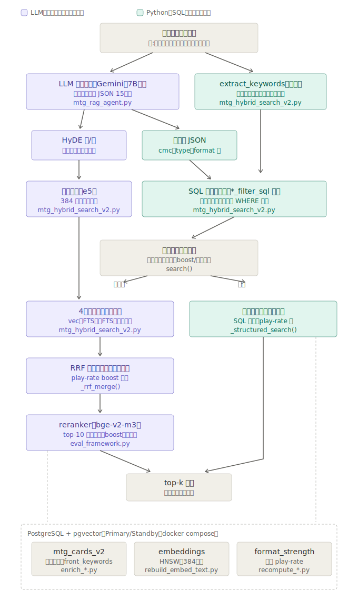
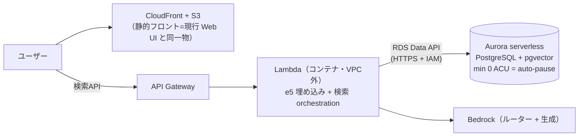

# MTG RAG System

Magic: The Gathering の **約 34,000 件**のカードデータ（うち検索対象コア **30,982 件**）を対象にした、日英バイリンガル対応の RAG / ハイブリッド検索の**プロトタイプ**。

PostgreSQL + pgvector を中心に、ベクトル検索・全文検索・RRF・HyDE・LLM-as-Query-Router・LLM による回答生成を組み合わせる。単なる LLM チャットラッパーではなく、**検索精度・DB インデックス・評価指標・reembed 中の可用性**を検証することを目的とした個人プロジェクトであり、**検索品質はまだ改善中**である。

| ドキュメント | 内容 |
| --- | --- |
| README（本書） | 現在地のスナップショット: 何ができるか・品質・構成の要点 |
| [ARCHITECTURE.md](./ARCHITECTURE.md) | 設計判断・検索フロー詳細・ベンチマーク・技術課題の全記録 |
| [EVAL_SCORES.md](./EVAL_SCORES.md) | 評価スコアの系譜とクエリ別内訳 |
| [DATA_MODEL.md](./DATA_MODEL.md) | 全テーブルの列・型・索引 |
| [DEVLOG.md](./DEVLOG.md) | 時系列の開発記録（週次）・ブログ記事化キュー |

---

## Highlights

- **検索品質（正準値）**: NDCG@10 **0.811** / precision@5 0.967 / MRR 1.000（n=30 クエリ・GT 1,114 採点ペア・未ラベル混入率 0.0%・ルーター経路・決定的評価）。0.574 からの改善系譜と方法論——被覆バイアス対策・採点規約の明文化・大会 play-rate 接続・循環評価の回避——は [EVAL_SCORES.md](./EVAL_SCORES.md) と [ARCHITECTURE.md](./ARCHITECTURE.md) 参照
- **crisp な条件は SQL の門で解き、意味検索は曖昧な意味にだけ使う**: 構造化列だけで答えが完全に定義できるクエリは、LLM もベクトル検索も通らない SQL 直行路（決定的・数十 ms）で返す。決定的ゲートは 5 系統——生得キーワード 33 語の肯定・否定（「速攻を**持たない**」を `NOT` の門で解く——embedding は否定文を原理的に理解しない）・日本語タイプ語・P/T 列間関係・部族 65 種（「蟹」2/10 → 5/5）・カード名部分一致（「ナヒリとつく」1/10 → 10/10）。誤発動ゼロを必須とする非対称の安全試験 5 スイート付き
- **LLM の出力は信用せず、決定的コードが裁可する**: 数値幻覚ガード・排他境界の ±1 補正（LLM が「9より小さい→max=8」に成功しつつ同一クエリの「7より大きい→min=7」で失敗する揺れを実測）・type_filter 幻出ガードの 3 段検証層。Gemini／ローカル 7B／Nova のどのルーターにも同じ保護が掛かる
- **RRF の管轄を腕別アブレーション（6 条件）で実測**: FTS 2 腕は fuzzy 層で +0.088 の相補寄与（英=キーワード拡張・日=日本語オラクル定型句の受け皿・寄与はほぼ加法的）、均等重みは局所最適、crisp 層に合議を使うと人気者バイアス——「合議は fuzzy 層・crisp はゲート」の役割分担を数字で固定
- **大会デッキ 6,990 件**の play-rate を GT の機械採点と検索の候補生成（強度腕・役割ゲート付き）の両方に接続（「純粋に強いカード」0.36→0.82・「最強の単体除去」0.33→0.78）
- **ローカル 7B ルーター**（Ollama / qwen2.5:7b・民生 GPU）を本番スキーマのままプロンプト調整で通し、意図フラグ 4 系統 30/30・temp=0 で 50 連打完全一致（決定性）。開発用途と API サーバのルーター（$0）として稼働中
- **Web UI + API サーバ + 観測基盤**: FastAPI + 静的 1 ファイル UI（S3 配信前提の構成をローカルでそのまま検証・経路バッジとレイテンシ表示）。全クエリを query_log に記録し、辞書拡張の候補抽出と直行路率の実測に使用
- **reembed 中も検索を継続する PostgreSQL Primary/Standby 検証構成**（Zero-downtime Data Refresh パターンの検証。商用 HA ではない）

---

## アーキテクチャ（現行・ローカル）

クエリが「誰に渡され、どの経路で DB に到達するか」の行先マップ（紫 = LLM・意味検索が担う曖昧な仕事 ／ 緑 = Python・SQL が担う決定的な仕事）:



設計の要点は 2 つ。(1) **LLM は SQL を書かない** — LLM の出力は常に「データ」（JSON）として扱い、3 段の検証層と許可リストを通した決定的な Python コードだけが SQL を生成する。(2) **crisp な条件は SQL の門で解き、意味検索は曖昧な意味にだけ使う** — 本線評価 30 クエリ中 5 本が LLM ゼロ経路（NDCG@10 1.000・数十 ms）で、実ユーザー分布での直行路率は query_log で観測を継続中。

検索フローの詳細（mermaid）・決定的ゲート 5 系統の仕様・検証層・データモデルは [ARCHITECTURE.md](./ARCHITECTURE.md) を参照。

---

## AWS サーバーレス構成（構成決定済み・未デプロイ）

**デプロイ・IaC は未実施。本 README の成果・評価値はすべてローカル PostgreSQL 環境で取得したもの。** 構成は「放置時維持費を AWS 公式料金表から全案分算出して」Data API 型に決定した（2026-07-11）:



| 放置時の月額（東京・1 AZ） | A: Proxy + VPC 内 Lambda | B: 直結 + VPC 内 Lambda | **C: Data API 型（採用）** |
|---|---:|---:|---:|
| 合計 | ≈ $232 | ≈ $31.5 | **≈ $0.84** |

判断の分岐点は 2 つ——①**RDS Proxy は auto-pause と非互換**（公式明記）な上に Serverless v2 へは最低 8 ACU 分の時間課金（Proxy 単体で月 $146）②**Interface 型 VPC エンドポイントは稼働状態と無関係に毎時課金**。Lambda を VPC 外に置き Data API（$0.35/100 万リクエスト・アイドル $0）で入ることで、繋ぎ装置由来の固定費をゼロにした。コード側の受け皿（psycopg2 ⇔ Data API のドライバ切替層）は実装・検証済み。費目の内訳・運用詳細・検討済み代替案は [ARCHITECTURE.md](./ARCHITECTURE.md) 参照。

---

## プロジェクトステータス

| カテゴリ | 状態 |
| --- | --- |
| 4 系統ハイブリッド検索 + RRF（均等重み） | 実装済み。腕別アブレーションで管轄を実測（均等重みは局所最適） |
| LLM-as-Query-Router + 3 段検証層 | 実装済み（Gemini / ローカル 7B を環境変数で切替） |
| 構造化オンリー直行路（決定的ゲート 5 系統） | 実装済み。安全試験 5 スイート・誤発動ゼロ |
| 構造化メタデータフィルタ（cmc / P/T / マナ生成 / is_mana_boost 等） | 実装済み |
| HyDE（英+日 2 文生成） | 実装済み |
| Cross-encoder reranker（bge-reranker-v2-m3） | 実装済み（boost・直行路クエリには適用しない） |
| 大会 play-rate のランキング接続（強度腕＋役割ゲート） | 実装済み |
| EDH（統率者戦）対応 | 色ゲート・ブラケットゲート・EDH 腕は実装済み。EDH 専用 GT・評価は立ち上げ中 |
| 評価フレームワーク（決定的・ルーター経路・GT 1,114 ペア） | 実装済み・運用中 |
| Web UI + API サーバ + query_log | 実装済み（ローカル・systemd 自動起動） |
| DB アクセス層（psycopg2 ⇔ Aurora Data API） | 実装済み（Data API 側は実 Aurora 未検証） |
| Primary/Standby 検証構成 | ローカル検証済み |
| ローカル 7B ルーター（Ollama） | 検証済み・API サーバで稼働中（開発用途・$0） |
| AWS サーバーレス構成 | Data API 型に決定・維持費算出済み・**未デプロイ** |
| メタデータ定期リフレッシュ | 設計のみ（現運用は手動。カードデータは 2025-08 EOE + Marvel セットまで） |

---

## Current Limitations

本プロジェクトは実験段階のプロトタイプであり、すべての自然言語クエリに対して安定した回答品質を保証するものではない。

- **既知の弱点（隠さず指標に残す）**: 除去ファミリー（クリーチャーを追放する除去 0.48・スタンダードの単体除去 0.40）とドロー系（0.47〜0.61）。候補生成（recall）と機構内の順位づけが残る課題。緩い採点なら高く出るが、その数字に意味はないと判断している。
- **検索結果の関連度が低い場合、LLM がもっともらしいが根拠の弱い回答を生成する**現象を確認している（quality gate は今後の課題）。
- **ドメイン外クエリに「該当なし」と言えない**: ベクトル検索は距離がどれだけ遠くても top-k を返す。MTG スラングは日常語彙と重なるため（「釣り上げる」「サクる」等）、素朴なドメイン判定は正当クエリを誤爆するリスクがあり未対応。
- 多義的な部族語（「人間」「悪魔」= Demon/Devil 等）は誤爆リスクがあるため辞書に未登録（人間のレビューを通して追加する運用——「システムは質問者の語彙を勝手に訂正しない」を原則とする）。
- produced_mana の生成色による絞り込みは未実装。カードデータは 2025-08（EOE）+ Marvel セットまでで、以降の新セットは未取り込み。

---

## セットアップ（開発者向け・暫定）

> Python 依存は `requirements.txt`、PostgreSQL（Primary/Standby）は `docker-compose.yml`。clone してそのまま全工程が通るワンコマンド化は未整備。カードデータ本体・API キーはリポジトリに含めない。

```bash
cp .env.example .env               # DB 接続情報（認証情報はコミットしない）
docker compose up -d               # PostgreSQL Primary/Standby
pip install -r requirements.txt

# データ取り込み（Scryfall 等の公式 API から各自取得）
python sync_oracle_cards.py
python extract_japanese.py
python rebuild_embed_text.py --reembed
python enrich_scryfall_meta.py

# 検索（CLI）
python mtg_hybrid_search_v2.py "純粋に強いカウンター呪文"

# Web UI + API サーバ（http://localhost:8000）
uvicorn api_server:app --host 127.0.0.1 --port 8000
#   ローカル 7B ルーター使用時: ROUTER_BACKEND=ollama / systemd 例は deploy/ 参照

# LLM 連携（CLI）
python mtg_rag_agent.py questions.txt
```

---

## データ規模

| 指標 | 数値 |
| --- | --- |
| 検索対象カード（リーガル・embedding 済み） | 30,982（SMALL 384d / BASE 768d の embedding 各同数） |
| 非リーガル（un 系 / Alchemy 等・別テーブルに退避） | 2,779 |
| 大会デッキ（MTGTop8・4 フォーマット） | 6,990 件（＋構築済み precon 2,731）・card_id 解決率 99.96% |
| カード×フォーマット別 play-rate 集計 | 4,281 行 |
| 評価 GT（3 段階 relevance） | 1,114 採点ペア / 30 クエリ |

---

## 今後の展望

- **AWS デプロイ（次段階）**: Web UI・API サーバ・DB ドライバ層まで実装済み。残りは Lambda コンテナ化と実デプロイ（Data API 実物での検証項目は [ARCHITECTURE.md](./ARCHITECTURE.md) に明記）。
- **ランキング層の改善**: 飽和層でなく、除去・ドロー等「順位の質を競う層」の NDCG@10 に焦点（候補生成 recall と機構内順位づけ）。
- **語彙学習の運用ループ**: query_log から辞書化候補を抽出 → 人間がレビュー → 決定的ゲートへ昇格（human-in-the-loop・自動追加はしない）。
- **EDH トラック**: 専用 GT の整備と統率者コンテキスト検索（共起データ接続）。
- 検索の信頼度が低い場合に LLM が無理に回答しない quality gate。
- 詳細な技術解説のブログ記事化（キューは [DEVLOG.md](./DEVLOG.md) 末尾）。

---

## Disclaimer / 免責事項

This project is an unofficial fan-made research and engineering project and is **not affiliated with, endorsed, sponsored, or approved by Wizards of the Coast, Scryfall, MTGJSON, or any tournament data provider**. Magic: The Gathering and related names are trademarks of Wizards of the Coast LLC.

The MIT License in this repository applies only to the source code written for this project, and **does not grant any rights to Magic: The Gathering card data, names, images, mana symbols, trademarks, or third-party datasets**.

本プロジェクトは個人の研究・エンジニアリング目的の非公式ファンプロジェクトであり、Wizards of the Coast 等とは一切の提携・後援関係を持たない。カードデータ・API キーはリポジトリに含まれず、各自が公式 API から取得する。

---

## ライセンス

MIT License - 詳細は `LICENSE` を参照。ライセンスはソースコードにのみ適用され、カードデータ・名称・画像・商標等の権利は別である。
