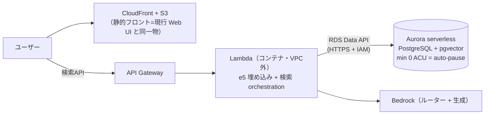

# MTG RAG System

**日本語で聞ける Magic: The Gathering のカード検索エンジン。**「速攻を持たないクリーチャー」「パワーとタフネスが同じクリーチャー」「モダンの単体除去」——こうした条件を、AI の柔軟さと SQL の正確さを使い分けて、約 3.1 万枚のカードから正確に探す。

技術的には、PostgreSQL + pgvector を中心にベクトル検索・全文検索・LLM クエリルーターを組み合わせたハイブリッド RAG のプロトタイプで、**検索精度を人手採点の評価基盤で測りながら改善していく過程**そのものを主題にした個人プロジェクト。

| ドキュメント | 内容 |
| --- | --- |
| README（本書） | 現在地のスナップショット |
| [ARCHITECTURE.md](./ARCHITECTURE.md) | 設計判断・検索フロー詳細・ベンチマーク・技術課題の全記録 |
| [EVAL_SCORES.md](./EVAL_SCORES.md) | 評価スコアの系譜とクエリ別内訳 |
| [DATA_MODEL.md](./DATA_MODEL.md) | 全テーブルの列・型・索引 |
| [DEVLOG.md](./DEVLOG.md) | 時系列の開発記録（週次） |

---

## 一番見てほしい 3 つ

### 1. 評価方法論 — 検索品質 NDCG@10 **0.811** を、緩い採点で盛らずに出す

30 クエリ・1,114 の人手採点ペアによる**決定的な評価基盤**を先に作り、検索のあらゆる変更を同一条件の A/B で判定してきた（初期ベースラインは 0.574）。採点基準は明文化し、構成変更のたびに現れる未採点カードは採点を広げて混入率 0% を維持する。**「緩い採点なら高く出るが、その数字に意味はない」**が運用原則で、弱点クエリのスコアも隠さず記録している。系譜と内訳は [EVAL_SCORES.md](./EVAL_SCORES.md)。

### 2. 設計思想 — 答えが一意に決まる条件は SQL で解き、曖昧な意味にだけ AI を使う

答えが一意に決まる条件（キーワード能力の有無・「持たない」の否定・カードタイプ・部族・P/T の関係・カード名）は、LLM もベクトル検索も通さず**決定的な SQL ゲートで解く**（誤発動ゼロを必須とする安全試験付き。embedding は否定文を原理的に理解できない、が出発点）。LLM の出力は「提案」として扱い、数値の幻覚・境界演算の揺れ・型の幻出を**コード側の検証層が裁可してから**使う。詳細は [ARCHITECTURE.md](./ARCHITECTURE.md)。

### 3. コスト設計 — 放置時 $232/月の構成案を、デプロイ前に $0.84/月へ再設計

クラウド展開の前に AWS 公式料金表から全構成案の「放置時維持費」を算出し、2 つの罠——RDS Proxy は auto-pause と非互換（かつ最低 8 ACU 課金）・Interface VPC エンドポイントは稼働と無関係に毎時課金——を特定。Lambda を VPC 外に置き Data API で Aurora に入る構成へ再設計した（下表）。**作る前に、料金表で潰した。**

---

## その他の特徴

- 4 系統ハイブリッド検索（ベクトル + 英語 FTS + 日本語 KW + HyDE）+ RRF。**腕別アブレーションで「合議の管轄」を実測**し、均等重みが局所最適であることを確認
- 大会デッキの採用実績（play-rate）を、評価の機械採点と検索の候補生成の**両方**に接続（循環評価の回避策込み）
- ローカル 7B モデル（民生 GPU・$0）を本番スキーマのままルーターとして通し、開発と API サーバで稼働中
- Web UI + API サーバ + 全クエリの観測ログ（検索経路とレイテンシを記録・辞書拡張の候補抽出に使用）
- reembed 中も検索を止めない PostgreSQL Primary/Standby 検証構成
- 日英バイリンガル（「対抗呪文」と "counter spell" が同じカードに当たる）

---

## アーキテクチャ

クエリが「誰に渡され、どの経路で DB に到達するか」の行先マップ（紫 = LLM・意味検索が担う曖昧な仕事 ／ 緑 = Python・SQL が担う決定的な仕事）:


設計の要点は 2 つ。(1) **LLM は SQL を書かない**——LLM の出力は常に「データ」として扱い、検証層を通した決定的なコードだけが SQL を生成する。(2) **答えが一意に決まる条件は SQL の門で解く**——該当クエリは LLM を一切呼ばず数十 ms で返る。検索フローの全体・ゲートと検証層の仕様は [ARCHITECTURE.md](./ARCHITECTURE.md)。

---

## AWS サーバーレス構成（構成決定済み・未デプロイ）

評価値はすべてローカル PostgreSQL 環境で取得したもの。構成は放置時維持費の算出に基づいて Data API 型に決定済みで、コード側の受け皿（psycopg2 ⇔ Data API のドライバ切替層）まで実装してある:



| 放置時の月額（東京・1 AZ） | A: Proxy + VPC 内 Lambda | B: 直結 + VPC 内 Lambda | **C: Data API 型（採用）** |
|---|---:|---:|---:|
| 合計 | ≈ $232 | ≈ $31.5 | **≈ $0.84** |

費目の内訳・判断根拠・運用詳細（復帰レイテンシ対策等）・検討済み代替案は [ARCHITECTURE.md](./ARCHITECTURE.md) 参照。

---

## プロジェクトステータス

| カテゴリ | 状態 |
| --- | --- |
| ハイブリッド検索 + RRF / LLM ルーター + 検証層 / HyDE / reranker | 実装済み |
| 構造化オンリー直行路（決定的ゲート 5 系統） | 実装済み（安全試験・誤発動ゼロ） |
| 評価フレームワーク（決定的・人手採点 GT） | 実装済み・運用中 |
| 大会 play-rate のランキング接続（強度腕＋役割ゲート） | 実装済み |
| EDH（統率者戦）対応 | 色・ブラケットゲートは実装済み。専用の評価は立ち上げ中 |
| Web UI + API サーバ + 観測ログ | 実装済み（ローカル・systemd 自動起動） |
| DB アクセス層（psycopg2 ⇔ Aurora Data API） | 実装済み（Data API 側は実環境未検証） |
| Primary/Standby 検証構成 | ローカル検証済み |
| AWS デプロイ | 構成決定・維持費算出済み・未デプロイ（次段階） |
| メタデータ定期リフレッシュ | 設計のみ（現運用は手動） |

---

## Current Limitations

実験段階のプロトタイプであり、すべてのクエリに安定した品質を保証するものではない。

- **既知の弱点クエリ（隠さず指標に残す）**: 除去系（0.40〜0.48）とドロー系（0.47〜0.61）。候補生成と機構内の順位づけが残る課題。緩い採点なら高く出るが、その数字に意味はないと判断している。
- 検索結果の関連度が低い場合、LLM がもっともらしいが根拠の弱い回答を生成することがある（quality gate は今後の課題）。
- **ドメイン外クエリに「該当なし」と言えない**: ベクトル検索は距離がどれだけ遠くても top-k を返す。MTG スラングは日常語彙と重なるため（「釣り上げる」「サクる」等）、素朴なドメイン判定は正当クエリを誤爆するリスクがあり未対応。
- 多義的な部族語（「人間」「悪魔」等）は誤爆リスクがあるため辞書に未登録（人間のレビューを通して追加する運用）。
- カードデータは 2025 年 8 月のセットまで。以降の新セットは未取り込み。

---

## セットアップ（開発者向け・暫定）

> Python 依存は `requirements.txt`、PostgreSQL（Primary/Standby）は `docker-compose.yml`。clone してそのまま全工程が通るワンコマンド化は未整備。カードデータ本体・API キーはリポジトリに含めない。

```bash
cp .env.example .env               # DB 接続情報（認証情報はコミットしない）
docker compose up -d               # PostgreSQL Primary/Standby
pip install -r requirements.txt

# データ取り込み（Scryfall 等の公式 API から各自取得）
python sync_oracle_cards.py
python extract_japanese.py
python rebuild_embed_text.py --reembed
python enrich_scryfall_meta.py

# 検索（CLI）
python mtg_hybrid_search_v2.py "純粋に強いカウンター呪文"

# Web UI + API サーバ（http://localhost:8000）
uvicorn api_server:app --host 127.0.0.1 --port 8000

# LLM 連携（CLI）
python mtg_rag_agent.py questions.txt
```

---

## データ規模

| 指標 | 数値 |
| --- | --- |
| 検索対象カード（embedding 済み） | 30,982（＋非リーガル 2,779 は別テーブルに退避） |
| 大会デッキ（MTGTop8・4 フォーマット） | 6,990 件・card_id 解決率 99.96% |
| カード×フォーマット別 play-rate 集計 | 4,281 行 |
| 評価 GT（3 段階 relevance・人手採点） | 1,114 採点ペア / 30 クエリ |

---

## 今後の展望

- **AWS デプロイ**（次段階）: 残りは Lambda コンテナ化と実デプロイ。検証項目は [ARCHITECTURE.md](./ARCHITECTURE.md) に明記
- ランキング層（除去・ドロー系）の検索品質改善
- 語彙学習の運用ループ（観測ログ → 人間のレビュー → 辞書昇格）
- EDH 専用の評価整備と統率者コンテキスト検索
- 詳細な技術解説のブログ記事化（キューは [DEVLOG.md](./DEVLOG.md)）

---

## Disclaimer / 免責事項

This project is an unofficial fan-made research and engineering project and is **not affiliated with, endorsed, sponsored, or approved by Wizards of the Coast, Scryfall, MTGJSON, or any tournament data provider**. Magic: The Gathering and related names are trademarks of Wizards of the Coast LLC.

The MIT License in this repository applies only to the source code written for this project, and **does not grant any rights to Magic: The Gathering card data, names, images, mana symbols, trademarks, or third-party datasets**.

本プロジェクトは個人の研究・エンジニアリング目的の非公式ファンプロジェクトであり、Wizards of the Coast 等とは一切の提携・後援関係を持たない。カードデータ・API キーはリポジトリに含まれず、各自が公式 API から取得する。

---

## ライセンス

MIT License - 詳細は `LICENSE` を参照。ライセンスはソースコードにのみ適用され、カードデータ・名称・画像・商標等の権利は別である。
