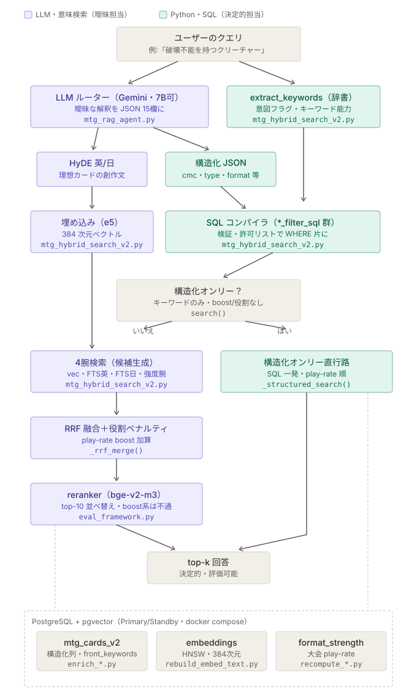
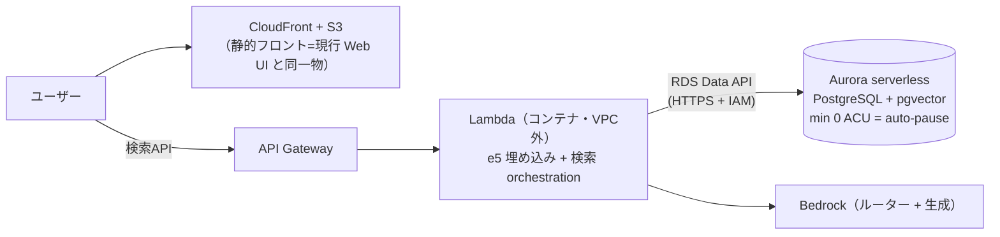

# MTG RAG System

**日本語の自然な文で検索できる Magic: The Gathering のカード検索エンジン。**「速攻を持たないクリーチャー」「パワーとタフネスが同じクリーチャー」「モダンの単体除去」——こうした条件を、AI の柔軟さと SQL の正確さを使い分けて、約 3.1 万枚のカードから正確に探す。

**デモ（AWS サーバーレスで稼働中）: https://d3hffmbxkbd0ie.cloudfront.net**
（維持費を月 1〜2 ドルに抑えるため、未使用時はデータベースを自動停止している。最初の 1 回だけ復帰に 20〜30 秒かかり、以後は温間 1.3 秒前後で返る）

技術的には、PostgreSQL + pgvector を中心にベクトル検索・全文検索・LLM クエリルーターを組み合わせたハイブリッド RAG で、**検索精度を人手採点の評価基盤で測りながら改善していく過程**そのものを主題にした個人プロジェクト。

| ドキュメント | 内容 |
| --- | --- |
| README（本書） | 現在地のスナップショット |
| [ARCHITECTURE.md](./ARCHITECTURE.md) | 設計判断・検索フロー詳細・ベンチマーク・技術課題の全記録 |
| [EVAL_SCORES.md](./EVAL_SCORES.md) | 評価スコアの系譜とクエリ別内訳 |
| [DATA_MODEL.md](./DATA_MODEL.md) | 全テーブルの列・型・索引 |
| [DEVLOG.md](./DEVLOG.md) | 時系列の開発記録（週次） |

---

## 一番見てほしい 3 つ

### 1. 評価方法論 — 検索品質 NDCG@10 **0.937**（2026-07-31 時点）を、緩い採点で盛らずに出す

34 クエリ・1,702 の人手採点ペアによる**決定的な評価基盤**を先に作り、検索のあらゆる変更を同一条件の A/B で判定してきた（初期ベースラインは 0.574）。採点基準は明文化し、構成変更のたびに現れる未採点カードは採点を広げて、混入率ほぼ 0% を維持している。

**評価基準そのものも監査対象**にしている。2026-07 には、経路 A/B が「未採点カードを 0 点扱いする系統誤差」で歪むことを実測して採点済みのみで測る近似指標を併記し、機能クエリの採点基準も「利用者が求める順位」と整合する形に再定義した（規約 R2'）。**「緩い採点なら高く出るが、その数字に意味はない」**が運用原則で、弱点クエリのスコアも隠さず記録している。

評価トラックは三本立てで、**分母を混ぜない**:

| トラック | NDCG@10 | 規模 | 位置づけ |
|---|---|---|---|
| 本線（構造化で解ける族） | **0.937**（2026-07-31） | 34 クエリ・1,702 ペア | 看板。初期 0.574 からの系譜が同一の物差しで追える |
| 統率者戦（EDH） | 0.963 | 10 クエリ・100 ペア | 別掲 GT。初値 0.975 → 採点基準の是正で一度 0.938 に下げてから回復（検索は変えず物差しを正直にした変化を系譜ごと公開） |
| 意味検索（構造化で解けない実ユーザークエリ） | **0.41** | 3 クエリ・60 ペア | **意図的に最難のクエリだけを集めた別掲トラック**。看板と混ぜれば平均は上がるが、そうしない。LLM とベクトル検索が本当に必要な領域の現在地を隠さず測る |

系譜と内訳は [EVAL_SCORES.md](./EVAL_SCORES.md)。

### 2. 設計思想 — 答えが一意に決まる条件は SQL で解き、曖昧な意味にだけ AI を使う

答えが一意に決まる条件（キーワード能力の有無・「持たない」の否定・カードタイプ・部族・P/T の関係・カード名・収録セット）は、LLM もベクトル検索も通さず**決定的な SQL ゲートで解く**（誤発動ゼロを必須とする安全試験付き。「embedding は否定文を原理的に理解できない」が出発点）。LLM の出力は「提案」として扱い、数値の幻覚・境界演算の揺れ・型の幻出を**コード側の検証層が裁可してから**使う。詳細は [ARCHITECTURE.md](./ARCHITECTURE.md)。

### 3. コスト設計 — 放置時 $232/月の構成案を $0.84/月へ再設計し、実測で答え合わせ

クラウド展開の前に AWS 公式料金表から全構成案の「放置時維持費」を算出し、2 つの罠——RDS Proxy は auto-pause と非互換（かつ最低 8 ACU 課金）・Interface VPC エンドポイントは稼働と無関係に毎時課金——を特定。Lambda を VPC 外に置き Data API で Aurora に入る構成へ再設計した（下表）。**作る前に、料金表で潰した。**

そして 2026-07-28 に実際にデプロイした。**初月（実質 4 日・デプロイ作業とデータ搬入を含む）の請求実測は $1.48**。設計見積りの「放置時 $1 前後」が実測で裏づけられた。

---

## その他の特徴

- 4 系統ハイブリッド検索（ベクトル + 英語 FTS + 日本語 KW + HyDE〔クエリから仮想の回答文を生成して検索に使う手法〕）+ RRF〔複数の検索結果の順位を融合する標準手法〕。**腕別アブレーションで「合議の管轄」を実測**し、均等重みが局所最適であることを確認
- 大会デッキの採用実績（play-rate）を、評価の機械採点と検索の候補生成の**両方**に接続（循環評価の回避策込み）
- **「引く」の構造化**: oracle テキストの命令文だけを数える draw 列を導出。誘発の条件文・置換文に現れる draw は数えない——「破壊不能」が destroy の字面で除去に紛れる問題の、ドロー版への対処。枚数ゲート単体の寄与 +0.011 は、同一 DB 状態でのゲート ON/OFF 対照走行で分離測定した
- **統率者名→固有色ゲート**: 「アトラクサで使える除去」の統率者名を、伝説のクリーチャー 3,125 枚の名前辞書で固有色の部分集合条件に解決する。敵対文脈（「〜対策」「相手の〜」）は名前の近傍で判定して発動を抑える非対称設計
- **収録セット検索**: 「灯争大戦のプレインズウォーカー」のようなセット指定を、日本語セット名辞書（人間レビューで育成）と全印刷履歴の配列列で解く。単一の代表印刷しか持たない設計だと再録のたびに元セットが上書きされ「強いカードほど検索から消える」偽陰性が起きる——全収録セットを配列で持つことで解消した
- カード画像（Scryfall CDN への URL 参照のみ・画像自体は保持しない）と、カード表記の日英切替
- **腕の切除実験（ablation）で各検索腕の貢献を実測**: 埋め込み検索を全て外すと本線 0.94 → 0.71 に落ちる（辞書に載らない言い回しの受け皿が消えるため）。逆に決定的ゲートが答えるクエリはほぼ無傷。「ベクトル検索がどこで必要か」を推測でなく数字で持っている
- ローカル 7B モデル（民生 GPU・$0）を本番スキーマのままルーターとして通し、開発と API サーバで稼働中
- Web UI + API サーバ + 全クエリの観測ログ（検索経路とレイテンシを記録・辞書拡張の候補抽出に使用）
- reembed 中も検索を止めない PostgreSQL Primary/Standby 検証構成
- 日英バイリンガル（「対抗呪文」と "counter spell" が同じカードに当たる）

---

## アーキテクチャ

クエリが「誰に渡され、どの経路で DB に到達するか」の行先マップ（紫 = LLM・意味検索が担う曖昧な仕事 ／ 緑 = Python・SQL が担う決定的な仕事）:



設計の要点は 2 つ。(1) **LLM は SQL を書かない**——LLM の出力は常に「データ」として扱い、検証層を通した決定的なコードだけが SQL を生成する。(2) **答えが一意に決まる条件は SQL の門で解く**——該当クエリは LLM を一切呼ばず数十 ms で返る。検索フローの全体・ゲートと検証層の仕様は [ARCHITECTURE.md](./ARCHITECTURE.md)。

---

## AWS サーバーレス構成（2026-07-28 デプロイ・稼働中）

全リソースを Terraform で定義し（32 リソース・9 ファイル）、デプロイ後に**クラウド側の Aurora を検索対象とした評価を走らせて受け入れ検収**した（Data API 経由 NDCG@10 0.929。ローカルとの残差はベクトル索引の新築による近似差と特定済み・27/34 クエリは完全一致）。実測レイテンシは温間 1.3 秒・コールド 20〜30 秒（自動停止からの復帰。維持費とのトレードオフとして許容する設計判断）:


```mermaid
flowchart LR
    user["ユーザー"] --> cf["CloudFront + S3<br>（静的フロント=現行 Web UI と同一物）"]
    user -->|検索API| apigw["API Gateway"]
    apigw --> lam["Lambda（コンテナ・VPC外）<br>e5 埋め込み + 検索 orchestration"]
    lam -->|"RDS Data API<br>(HTTPS + IAM)"| aurora[("Aurora serverless<br>PostgreSQL + pgvector<br>min 0 ACU = auto-pause")]
    lam --> bedrock["Bedrock（ルーター + 生成）"]
```

| 放置時の月額（東京・1 AZ） | A: Proxy + VPC 内 Lambda | B: 直結 + VPC 内 Lambda | **C: Data API 型（採用）** |
|---|---:|---:|---:|
| 設計時の見積り | ≈ $232 | ≈ $31.5 | **≈ $0.84** |
| 請求実測（2026-07・実質 4 日＋デプロイ作業込み） | — | — | **$1.48** |

構成の要点は「作らないもの」にある——NAT ゲートウェイ・Interface エンドポイント・RDS Proxy を意図的に作らない。パスワードは AWS が生成して Secrets Manager にのみ置き、Lambda は鍵を持たず実行ロールで動く。費目の内訳・判断根拠・運用詳細は [ARCHITECTURE.md](./ARCHITECTURE.md) 参照。

---

## プロジェクトステータス

| カテゴリ | 状態 |
| --- | --- |
| ハイブリッド検索 + RRF / LLM ルーター + 検証層 / HyDE | 実装済み |
| reranker（`bge-reranker-v2-m3`） | **測って不採用**（寄与 +0.006 まで縮小・採用率順の直行路には有害と実測。コードと再測定手順は残置） |
| 構造化オンリー直行路（決定的ゲート 9 系統: キーワード・型否定・P/T 関係・部族・カード名・収録セット・マナ加速・EDH 固有色/ブラケット・掘削×ドロー） | 実装済み（安全試験・誤発動ゼロ） |
| 役割直行路（除去 9 クエリ＋確定カウンター・SQL 直行＝LLM 不使用） | 実装済み（安全試験・誤発動ゼロ） |
| 評価フレームワーク（決定的・人手採点 GT・三トラック） | 実装済み・運用中 |
| 大会 play-rate のランキング接続（強度腕＋役割ゲート） | 実装済み |
| EDH（統率者戦）対応 | 固有色・ブラケット・統率者名ゲート実装済み。専用評価トラック NDCG@10 0.963（別掲 GT・10 クエリ） |
| Web UI + API サーバ + 観測ログ | 実装済み（本番 CloudFront + ローカル systemd の両輪） |
| DB アクセス層（`psycopg2` ⇔ Aurora Data API） | 実装済み・**実環境で検収済み**（Data API 固有の罠——jsonb が文字列で返る・配列パラメータ非対応・SET のセッション揮発——を潰した記録つき） |
| Primary/Standby 検証構成 | ローカル検証済み |
| AWS デプロイ（Terraform・32 リソース） | **2026-07-28 デプロイ済み・稼働中**（請求実測 $1.48/月） |
| 大会データの定期リフレッシュ | 夜間バッチ稼働中（毎日 03:00 に差分スクレイプ→採用率再集計。何度走っても結果が変わらない冪等設計） |

---

## 現在の制限と課題

実験段階のプロトタイプであり、すべてのクエリに安定した品質を保証するものではない。

- **既知の弱点クエリ（隠さず指標に残す）**: コンボ（0.45・本線トラック内の最下位。単カードの構造化では表現できない複数枚の相互作用が本質で、コンボデータベースとの接続が解決の候補）。意味検索トラックの 3 クエリ（別掲 0.41）も同種の未解決領域。一方、かつての弱点だった「ドローしながらフィルタリング」（0.60→0.91）と「1マナのマナクリーチャー」（0.70→0.94）は、構造化列の導出＋直行路＋採点補充で解決した。緩い採点なら高く出るが、その数字に意味はないと判断している。
- 検索結果の関連度が低い場合、LLM がもっともらしいが根拠の弱い回答を生成することがある（quality gate は今後の課題）。
- **ドメイン外クエリに「該当なし」と言えない**: ベクトル検索は距離がどれだけ遠くても top-k を返す。MTG スラングは日常語彙と重なるため（「釣り上げる」「サクる」等）、素朴なドメイン判定は正当クエリを誤爆するリスクがあり未対応。
- 多義的な部族語（「人間」「悪魔」等）は誤爆リスクがあるため辞書に未登録（人間のレビューを通して追加する運用）。
- カードデータの最新は Marvel Super Heroes（2026 年 6 月・日本語含め取り込み済み）まで。以降の新セットは未取り込み。

---

## セットアップ（開発者向け・暫定）

> Python 依存は `requirements.txt`、PostgreSQL（Primary/Standby）は `docker-compose.yml`。clone してそのまま全工程が通るワンコマンド化は未整備。カードデータ本体・API キーはリポジトリに含めない。

```bash
cp .env.example .env               # DB 接続情報（認証情報はコミットしない）
docker compose up -d               # PostgreSQL Primary/Standby
pip install -r requirements.txt

# データ取り込み（Scryfall 等の公式 API から各自取得）
python src/sync_oracle_cards.py
python src/extract_japanese.py
python src/rebuild_embed_text.py --reembed
python src/enrich_scryfall_meta.py

# 検索（CLI）
python src/mtg_hybrid_search_v2.py "純粋に強いカウンター呪文"

# Web UI + API サーバ（http://localhost:8000）
uvicorn --app-dir src api_server:app --host 127.0.0.1 --port 8000

# LLM 連携（CLI）
python src/mtg_rag_agent.py questions.txt
```

---

## データ規模

| 指標 | 数値 |
| --- | --- |
| 検索対象カード（embedding 済み） | 31,635（＋非リーガル 2,779 は別テーブルに退避） |
| 大会デッキ（MTGTop8・構築 6 フォーマット＋Duel Commander） | 14,796 件（夜間バッチで毎日成長） |
| 多人数 Commander デッキ（Moxfield・ブラケット別取得） | 4,046 件 |
| デッキ内カード行の card_id 解決率 | 100 万行中 99.95% |
| カード×フォーマット別 play-rate 集計 | 構築 6,421 行＋EDH 20,566 行（物理分離） |
| EDH カードペア共起集計（統率者との対を含む・供給元別） | 218 万行 |
| 評価 GT（3 段階 relevance・人手採点） | 本線 1,702 ペア / 34 クエリ＋EDH 100 ペア / 10 クエリ＋意味検索 60 ペア / 3 クエリ |

---

## 今後の展望

上から優先順。

- **意味検索トラックの改善**: 構造化で解けない実ユーザークエリ（別掲 0.41）が現在の主戦場。腕の切除実験で「埋め込みが支えている領域」と「品質信号が届いていない配線の穴」を分離済みで、後者から直す
- **コンボの表現**: 単カードの構造化では届かない複数枚の相互作用（現行最下位 0.45）。コンボデータベースとの接続が候補
- **「質の層」**: 定義に合うことの先にある「意図とのかみ合わせ」への適合（例: 打ち消しの副産物でマナが出るカードを「キナンで使えるマナ加速」の上位に出さない）。役割内の実勢データ・コミュニティ評価の構造化が候補
- 語彙学習の運用ループ（観測ログ → 人間のレビュー → 辞書昇格）
- 詳細な技術解説のブログ記事化（キューは [DEVLOG.md](./DEVLOG.md)）

---

## Disclaimer / 免責事項

This project is an unofficial fan-made research and engineering project and is **not affiliated with, endorsed, sponsored, or approved by Wizards of the Coast, Scryfall, MTGJSON, or any tournament data provider**. Magic: The Gathering and related names are trademarks of Wizards of the Coast LLC.

The MIT License in this repository applies only to the source code written for this project, and **does not grant any rights to Magic: The Gathering card data, names, images, mana symbols, trademarks, or third-party datasets**.

本プロジェクトは個人の研究・エンジニアリング目的の非公式ファンプロジェクトであり、Wizards of the Coast 等とは一切の提携・後援関係を持たない。カードデータ・API キーはリポジトリに含まれず、各自が公式 API から取得する。

---

## ライセンス

MIT License - 詳細は `LICENSE` を参照。ライセンスはソースコードにのみ適用され、カードデータ・名称・画像・商標等の権利は別である。
